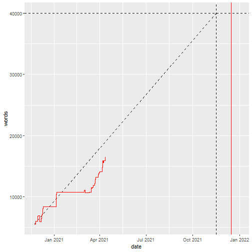

---
#########################################
# options for knitting a single chapter #
#########################################
output:
  bookdown::html_document2: default
  bookdown::word_document2: default
  bookdown::pdf_document2:
    template: templates/brief_template.tex
documentclass: book
---

# Covering material {-}

\adjustmtc 
<!-- For PDF output, we must include this LaTeX command after unnumbered headings, otherwise the numbers in the mini table of contents will be incorrect -->

Word count: 16504

Days: 140

Words behind: -2656

Words today: 33

&nbsp;  

&nbsp;  

