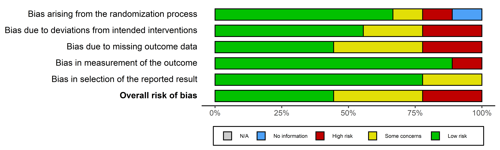

---
#####################
## thesis metadata ##
#####################
title: |
   Lipids and dementia:\
   An investigation of their relationship
   
author: Luke A McGuinness
college: 
degree: Doctor of Philosophy
degreedate: 2022
word-count: |
  `r read.csv("data/words/words.csv") %>% dplyr::pull(1) %>% dplyr::last()`
abstract: |
  `r paste(readLines("front-and-back-matter/_abstract.Rmd"), collapse = '\n  ')`
acknowledgements: |
  `r paste(readLines("front-and-back-matter/_acknowledgements.md"), collapse = '\n  ')`
declaration: |
  `r paste(readLines("front-and-back-matter/_declaration.Rmd"), collapse = '\n  ')`
dedication: For Brendan McHugh
covidStatment: |
  `r paste(readLines("front-and-back-matter/_covidStatment.Rmd"), collapse = '\n  ')`
abbreviations: "front-and-back-matter/abbreviations" # path to .tex file with abbreviations

#######################
## bibliography path ##
#######################
bibliography: [bibliography/references.bib, bibliography/packages.bib]
csl: bibliography/nature.csl
bibliography-heading-in-pdf: Bibliography

#####################
## PDF formatting  ##
#####################
abstractseparate: true  # include front page w/ abstract for examination schools?
bib-humanities: false   #set to true if you want in-text references formatted as author-year
doi-in-bibliography: true #set to true if you want DOI's to be shown in the bibliography
draft: false # add as DRAFT mark in the footer?
page-layout: twoside #'nobind' for PDF output (equal margins), 'twoside' for two-sided binding (mirror margins and blank pages), leave blank for one-sided binding (left margin > right margin)
hidelinks: true #if false, the PDF output highlights clickable links with a colored border - you will probably want to set this to true for PDF version you wish to physically print
toc-depth: 2 # depth of heading to include in table of contents
lof: true # list of figures in front matter?
lot: true # list of tables in front matter?
mini-toc: true  # mini-table of contents at start of each chapter? (this just prepares it; you must also add \minitoc after the chapter titles)
mini-toc-depth: 1
mini-lot: false  # mini-list of tables by start of each chapter?
mini-lof: false  # mini-list of figures by start of each chapter?

params:
  corrections: true # set false to stop applying blue background to blocks of corrections

#####################
## output options  ##
#####################
output:
  bookdown::pdf_book:
    template: templates/template.tex
    keep_tex: true
    citation_package: default 
    pandoc_args: ["--lua-filter=scripts_and_filters/correction_filter.lua", "--csl","bibliography/nature.csl"] #remove filter to stop applying blue background to inline corrections
  bookdown::gitbook:
    css: templates/style.css
    download: ["pdf"]
    output_dir: "docs"
    split_bib: false
    config:
      toc:
        before: |
          <li><a href="./">Thesis - Draft</a></li>
        after: |
          <li><a href="https://github.com/mcguinlu/thesis" target="blank">Associated repository</a></li>
      sharing:
        facebook: false
        twitter: yes
        all: false
  bookdown::word_document2:
    output_dir: "docs"
    toc: true
    toc_depth: 2
    reference_docx: templates/word-styles-reference-01.docx
    number_sections: false   
link-citations: true
documentclass: book

---

```{r create_chunk_options, include=FALSE, eval=knitr::is_latex_output()}
source('scripts_and_filters/create_chunk_options.R')
source("R/helper.R")
options(scipen=999)
```

<!--
Include the create_chunk_options chunk above at the top of your index.Rmd file
This will include code to create additional chunk options (e.g. for adding author references to savequotes)
If you need to create your own additional chunk options, edit the file R/create_chunk_options.R
-->

```{r introduction, child = 'front-and-back-matter/_00-introduction.Rmd'}
```

<!--chapter:end:index.Rmd-->

---
#########################################
# options for knitting a single chapter #
#########################################
output:
  bookdown::pdf_document2:
    template: templates/brief_template.tex
  bookdown::html_document2: default
  bookdown::word_document2: default
documentclass: book
---

```{block type='savequote', include=knitr::is_latex_output(), quote_author='(ref:intro-quote)', echo = FALSE}
Hold
```
(ref:intro-quote) --- Hold

# Introduction {#intro-heading}
\minitoc <!-- this will include a mini table of contents-->

## Additional ideas

### General

* Explore difference/similarities between the published and unpublished literature, potentially formally, using funnel plots and also by following up preprints to see if they are eventually published. Limit to the date we ran the original search and see if any study included in the study had not been published by the time the review was finished. 

* Compare and contrast the codes used to find the AzD cases in the previous study and in this study, potentially with a view to contrasting misclassification between the two.

* 

### Background

### medrxivr

### 

&nbsp;


<!--chapter:end:00-Chp-Introduction.Rmd-->

---
bibliography: bibliography/references.bib
csl: bibliography/nature.csl
output:
  bookdown::pdf_document2:
    template: templates/brief_template.tex
  bookdown::word_document2:
    reference_docx: templates/word-styles-reference-01.docx
    number_sections: false 
  bookdown::html_document2: default
documentclass: book
---

```{block type='savequote', include=knitr::is_latex_output(), quote_author='(ref:dara-quote)', echo = FALSE}
Science knows it doesn't know everything; otherwise, it'd stop.
```

(ref:dara-quote) --- Dara O'Briain

```{r, echo = FALSE, warning=FALSE, message=FALSE}
source("R/doc_options.R")
source("R/helper.R")
knitr::read_chunk("R/01-Code-Background.R")
doc_type <- knitr::opts_knit$get('rmarkdown.pandoc.to') # Info on knitting format
```

# Background, Theoretical framework, Aims & Objectives {#background-heading}

\minitoc <!-- this will include a mini table of contents-->

## Lay summary

[Note: see Section \@ref(thesis-structure) for details on the layout of each chapter.]

Around 850,000 people in the UK live with dementia, and by 2040, nearly twice as many will have the condition. Despite many promising candidates, no cure for dementia currently exists, meaning the focus is on finding ways to prevent the condition. The best way to do this is to find risk factors (characteristics that influence a person's chance of developing a disease) for dementia that we can easily change. Avoiding a risk factor does not guarantee that a person will not develop dementia but makes it less likely. A key risk factor for dementia may be the levels of lipids (fatty substances such as cholesterol) in a person's blood, though not all existing research agrees. The aim of this thesis is to use all available evidence to assess whether blood lipids levels are in fact a risk factor for dementia.

This introductory chapter provides background information on both dementia and blood lipids, and on the potential link between them. It introduces the theory used to frame the research presented here, and then maps the formal aims and objectives of the research project to the relevant chapters of this thesis. Finally, it summarises the outputs (journal articles, presentations and software) that were created as part of this thesis.

<!----------------------------------------------------------------------------->

## Introduction

This chapter provides an overview of the broad context of this thesis, introducing the core concepts used throughout and providing some background on each. It briefly discusses the underlying pathologies and diagnosis of dementia, its public health importance, and the current state of treatment and prevention research. It then provides background on blood lipids and lipid-modifying treatments, and summarises the types of evidence used to examine the effect of these exposures on dementia outcomes.

The chapter introduces evidence synthesis as the key framework used to guide the research presented in the remaining chapters. Finally, it outlines the aims, objectives and structure of this thesis, and briefly summarises the contributions to the scientific literature that arose from this research. 

<!----------------------------------------------------------------------------->

## Dementia

<!----------------------------------------------------------------------------->

### Definition and underlying pathologies {#underlying-pathologies}

Defined by the Diagnostic and Statistical Manual of Mental Disorders as a "major neurocognitive disorder", dementia is a progressive disease which impairs cognitive functions including speech, memory and executive reasoning.[@edition2013diagnostic] At advanced stage, the condition causes severe behavioral and personality changes,[@cerejeira2012] cumulating in reduced motor control that affects patients ability to swallow or breathe.[@kumar2013] The condition has several distinct underlying causes, including Alzheimer's disease and vascular dementia.[@burns2009]

Alzheimer's disease is the most common cause of dementia, accounting for approximately 60-80% of cases. Characterised by substantial cognitive impairment and difficulty with high level executive function to the extent that it interferes with, it is an insidious disease, within initial onset thought to occur up to 15 years prior to symptomatic presentation.[@robinson2015] Much remains unknown about Alzheimer's pathogenesis, despite research implicating the "amyloid hypothesis",[@robinson2015] as a potential mechanism of disease. Under this hypothesis, the build-up of amlyoid plaques (composed mainly of amlyoid-$\beta$ peptide) and neurofibrillary tangles (composed mainly of tau protein) triggers a range of physiological changes, including inflammation and cell death, that result in cognitive impairment.[@robinson2015]

Vascular dementia (VaD) is the second largest underlying pathology of dementia, accounting for ~10% of cases. Vascular dementia is caused by a range of cerebrovascular disorders, and as a result, presentation  of symptoms can vary widely.[@iadecola2013] Similarly, due to the varied underlying  pathophysiology, vascular dementia can onset either quite rapidly following a cerebrovascular event such as a stroke or over a long time-frame due to a series of small infarcts.[@venkat2015] Vascular dementia regularly co-occurs in patients with Alzheimer's disease.[@iadecola2013] This presentation is described as "mixed" dementia,[@custodio2017] and occurs in approximately 25% of cases.[@burns2009]

The remaining 10-30% of cases are caused by other dementia subtypes (e.g. Lewy body dementia, frontotemporal dementia) or by progression of other neurological diseases (e.g. Parkinson's disease).[@burns2009]

<!----------------------------------------------------------------------------->

### Diagnostic criteria {#diagnostic-criteria}

Dementia is difficult to diagnose, primarily due to its slow onset, in addition to the confusion of initial symptoms with normal ageing.[@robinson2015] Dementia is diagnosed on the basis of behavioral and cognitive changes as assessed by an experienced clinician, using one of several diagnostic criteria.

&nbsp;

<!----------------------------------------------------------------------------->
(ref:diagnosticCriteria-caption) Overview of the DSM-5 criteria for dementia and vascular dementia.[@edition2013diagnostic]

(ref:diagnosticCriteria-scaption) Overview of the DSM-5 criteria for dementia and vascular dementia.

```{r diagnosticCriteria-table, message=FALSE, results="asis", echo = FALSE}
```
<!----------------------------------------------------------------------------->

&nbsp;

One of the most commonly used criteria are those found in the Diagnostic and Statistical Manual of Mental Disorders (DSM) criteria (Table \@ref(tab:diagnosticCriteria-table)).[@edition2013diagnostic] These criteria are outlined in Table \@ref(tab:diagnosticCriteria-table), and form the broad definition of a dementia diagnoses, supported by a detailed patient history, evidence from carers and family members, and objective assessments of cognitive ability using neurocognitive tests. 

Many cognitive assessment tools exist for the purpose of informing a diagnoses of dementia,[@sheehan2012] with two of the best known of these being the Mini Mental State Exam (MMSE) and Montreal Cognitive Assessment (MoCA) scale. The distinction between these memory scales and diagnostic criteria presented above should be noted. For example, the MMSE is used to provide evidence for part A of the criteria presented in \@ref(tab:diagnosticCriteria-table). Taken alone, it does not indicate the absence or presence of dementia, instead merely indicating cognitive impairment which could be due to another cause (for example, temporary delirium as a result of an infection or surgery).

Differentiating between the underlying causes of a dementia diagnosis is challenging but necessary, as whether the patient has Alzheimer's disease or vascular dementia will affect expected progression and potential treatment options available (see Section \@ref(intro-treatments)). Cause-specific criteria exist for the diagnosis of dementia sub-types. For example, the NINCDS-ADRDA criteria are commonly used to assess patients for Alzheimer's disease,[@dubois2007] while vascular dementia is diagnosed using the NINCDS-AIREN criteria.[@roman1993vascular]

<!-- ### Differing risk by sex -->

<!-- Transparency guidelines that suggest sex should eb treated as biological variable and so results should be presented stratified t -->

<!-- Rate of dementia/AD differs in men and women <!--- Though is this just due to the different lifestyles and life expectancies --->

<!-- Previous studies have hinted that the relationship is dependent on individual-level characteristics such as age and sex [16,28]. -->

<!----------------------------------------------------------------------------->

### Public health importance

Dementia is quickly becoming a critically important public health issue. Despite the age-specific incidence and prevalence of dementia remaining relatively constant over time,[@prince2016] an ageing population is set to create a dementia epidemic, particularly in Westernised countries.[@flier2005] While approximately 525,000 patients have received a dementia diagnosis, the true number of people currently living with dementia in the UK is thought to be closer to 850,000, with this figure expected to double by 2040.[@baker2019] Globally, the prevalence of dementia is expected to reach 75 million by 2030.[@prince2016] Dementia is the leading cause of death in the UK, and the only one without a proven cure.

Dementia also has a substantial economic impact. In 2015, the estimated total cost of dementia in England was £24.2 billion. Health care costs alone were £3.8 billion,[@wittenberg2019] Globally, the cost of dementia care is expected to rise to $1tr by 2030.[@prince2014dementia]

As such, the urgent need to reduce the burden of dementia, both at the personal and system level, is clear. 

<!----------------------------------------------------------------------------->

### Treatments {#intro-treatments}

Developing treatments for dementia is regularly deemed to be one of the hardest markets in the pharmaceutical world, with trials of seemingly promising therapeutics being regularly abandoned due to futility.[@cummings2020]. At present, there are no known curative treatments for dementia, regardless of the underlying cause, though several available therapeutics can help alleviate the symptoms of Alzheimer's disease. 

The most common of these are acetylcholinesterase (ACE) inhibitors, which inhibit the degradation of the neurotransmitter acetylcholine by competitively binding the ACE enzyme. Acetylcholine plays a key role in controlling the cholingeric synapses, which are highly concentrated in regions of the brain (such as the neocortex) that control higher level brain functions such as memory and attention.[@hampel2018] Commonly prescribed ACE inhibitors include donepezil and galantamine.[@pariente2008] ACE inhibitors increase the availability of the neurotransmitter, and has shown clinical effect is easing the behavioural and memory-related symptoms of Alzheimer's disease.[@marucci2020] ACE inhibitors represent only a stop-gap treatment, treating the symptoms rather than the underlying pathology which may continue to progress.[@francis2010]

### Risk factors

Given the substantial burden that dementia represents and the absence of any curative therapies, as detailed in the above sections, the assessment of easily modifiable targets for their utility in the prevention of dementia should be prioritized.[@winblad2016a] To date, a substantial amount of research has been produced examining putative risk factors for dementia.[@feingold2000;@peters2019; @anstey2019]

The benefits of a prevention-based approach based on addressing these risk factors are well-studied. Reducing the prevalence of the seven most important risk factors for dementia (obesity, hypertension,[@hughes2020association] diabetes, smoking, physical inactivity, and low educational attainment) by 10-20% per decade is estimated to result in a reduction in dementia prevalence of 8-15% by 2050.[@norton2014potential]

In this context, lipid levels represent a promising target for preventative treatment, due to the ready availability of lipid-modifying treatments which could be repurposed.[@pushpakom2019a] Determining whether variations in lipid levels are causative for dementia may prove critical in reducing the future burden of the condition. 

This thesis will focus on blood lipids as the primary risk factor of interest. The next section provides an overview of blood lipid fractions and therapeutic interventions that modify them, while Section \@ref(evidence-association) provides an overview of the existing evidence for an association between lipids and dementia outcomes.

<!----------------------------------------------------------------------------->

## Serum lipids

<!----------------------------------------------------------------------------->

### Lipid fractions {#intro-lipid-fractions}

The blood lipid profile contains a range of component parts, or fractions. However, this thesis will only consider the two most important fractions, trigylcerides (TG) and cholesterol, which are either absorbed from food (exogenous lipids) or produced internally (endogenous lipids).[@feingold2000]

Triglycerides are the simplest and most common type of lipids found across the body. They are used to store unused calories from food, and to move energy around the body.[@laufs2020] In contrast, cholesterol is primarily used to create cell walls and certain sex hormones.[@zampelas2019] As lipids are not water soluble, within the blood stream, cholesterol is transported in lipoprotein structures of varying densities. Low-density-lipoprotein cholesterol (LDL-c), commonly know as the "bad" cholesterol, transports fat to cells, acting as an energy conveyor. In contrast, High density-lipoprotein cholesterol (HDL-c), transports cholesterol to the liver to be broken down and excreted.[@feingold2000]

In addition to the individual fractions, total serum cholesterol (TC) is a commonly-used summary measure to estimate the total amount of lipid present in the blood. The measure is derived from measurements of the individual HDL-c, LDL-c and TG levels using the Friedwald formula:[@friedewald1972]

\begin{equation}
  TC \approx LDLc + HDLc + kTG
  (\#eq:total-cholesterol-formula)
\end{equation}

where $k$ is 0.20 if measurements are in milligrams per decilitre (_mg/dl_) and 0.45 if measured in millimole per litre (_mmol/l_).

Widely-used ranges for the acceptable levels of different types of lipids are based on the National Cholesterol Education Program (NCEP)[@national2002third], and are outlined in Table \@ref(tab:lipidLevels-table).

&nbsp;

<!----------------------------------------------------------------------------->

(ref:lipidLevels-caption) Classification of blood lipid levels according to the National Cholesterol Education Program guidelines.[@national2002third]

(ref:lipidLevels-scaption) Classification of blood lipid levels

```{r lipidLevels-table, message=FALSE, results="asis", echo = FALSE}
```
<!----------------------------------------------------------------------------->

&nbsp;

Elevated LDL-c in the bloodstream, a condition also known as hypercholesterolaemia or hyperlipidaemia,[@nelson2013] can lead to atherosclerosis,[@libby2019] the build-up of fatty deposits in the blood vessels. These deposits constrict blood flow and can lead to vascular complications. Alternatively, part of the deposit can detach from the artery walls, forming a clot that can lead to a heart attach or stroke.[@libby2019] Globally, the prevalence of elevated cholesterol was estimated by the World Health Organization to be approximately 40%.

<!----------------------------------------------------------------------------->

### Statins {#intro-statins}

Statins are a commonly prescribed method of lipid regulation.[@collins2016] Statins inhibit the conversion of 3-hydroxy-3-methylglutaryl-coenzyme-A (HMG-CoA) into mevalonate, by competitively binding with HMG-CoA reductase (HMGCR). This conversion is a key rate-limiting step in the cholesterol biosynthesis pathway (see Figure \@ref(statin-mechanisam)), enabling statins to reduce effectively the production of LDL cholesterol.

&nbsp;

<!----------------------------------------------------------------------------->

(ref:statin-mechanisam-cap) Overivew of statins mechanism of action, inhibiting HMG-CoA reductase which controls the conversion of HMG-CoA to mevalonate, the rate-limiting step in cholesterol biosynthesis. 

(ref:statin-mechanisam-scap) Statin mechanism of action

```{r statin-mechanisam, echo = FALSE, results="asis",fig.pos = "H", fig.align = 'center', fig.cap='(ref:statin-mechanisam-cap)', out.width='50%', fig.scap='(ref:statin-mechanisam-scap)'}
knitr::include_graphics(file.path("figures/background/statinPath.png"))
```

&nbsp;

Several statin treatments have been widely available for some time (see Table \@ref(tab:statinOverview-table)). Depending on the statin and dosage prescribed, the average reduction in LDL-c concentrations ranges from 15% with low-intensity regimen (e.g. ravastatin 5 mg/day) up to 60% with a high-intensity regimen (e.g. rosuvastatin 80 mg/day).[@collins2016a; @law2003] Statins also vary with regard to their lipophilicity (the extent to which they are lipid soluble), affecting their localisation within the body, with hydophilic statins being concentrated in the liver and lipophilic statins circualting more widely.[@schachter2005] This may create a divide in the pleiotropic affects of statins with differing lipophilicity, particularly given the ability of lipophilic statins to permeate the blood brain barrier.[@sierra2011]

&nbsp;

<!----------------------------------------------------------------------------->
<!-- TODO Review the look and feel of this table -->

(ref:statinOverview-caption) Overview of commonly-prescribed statins, summarising their approval date (US), properties and lipid-lowering effect.

(ref:statinOverview-scaption) Overview of common statins

```{r statinOverview-table, message=FALSE, results="asis", echo = FALSE}
```
<!----------------------------------------------------------------------------->

&nbsp;

<!----------------------------------------------------------------------------->

### Other lipid regulating agents (LRA)

There are several other interventions that can be used to modify a persons lipid profile, which each acting in slightly different ways (Table \@ref(tab)). However, in general, these treatments are either used as adjunct (additional) treatments with statins therapy or are used in situations where statins are contra-indicated or not tolerated. 

<!-- see https://www.heart.org/en/health-topics/cholesterol/prevention-and-treatment-of-high-cholesterol-hyperlipidemia/cholesterol-medications for information on the indications for treatment - could present as a table -->

The most commonly used non-statin therapeutic is ezetimibe,[@kosoglou2005] which prevents intestinal absorption of cholesterol. However, when used alone, it has a limited LDL-c lowering effect, leading to the creation of combined statin/ezetimibe therapies (both compounds contained in a single pill, as opposed to complimentary treatments).[@genest2006]

Fibrates provide a second example of non-statin therapy. They are used to treat hypertriglyceridaemia by reducing production of triglyceride carrying compounds in the liver. They are commonly used in patients with mixed hyperlipidaemia if treatment with statins has failed to sufficiently control cholesterol levels. 

Finally, PCSK9 inhibitors (or PCSK9i) are a relatively new treatment with strong lipid lowering effects, lauded as a potential alternative to statins.[@chaudhary2017] Their mechanism of action is to bind to and inhibit PCSK9, which breaks down LDL-c receptors on the surface of the liver, thus allowing more LDL-c to be internalised and broken down.

Other therapies targeting triglycerides exist, including nicotinic acids[@mckenney2004new] and omega-3-fatty acids,[@skulas-rayannc.2019] but they far less effective in LDL-c lowering than the therapies described above.

&nbsp;

<!----------------------------------------------------------------------------->
(ref:lipidTreatments-caption) Summary of available treatments for hyperlipidaemia.

```{r lipidTreatments-table, message=FALSE, results="asis", echo = FALSE}
```
<!----------------------------------------------------------------------------->

&nbsp;

<!----------------------------------------------------------------------------->

## Evidence for the association between blood lipids and dementia {#evidence-association}

This section provides an overview of the varying sources of evidence on the relationship between blood lipid levels and dementia risk.

<!----------------------------------------------------------------------------->
### Basic science

A role for lipids in the aetiology of the dementia is supported by both genetic linkage studies and functional cell biology studies. The generation of the amyloid plaques found in the brains of Alzheimer's patients is cholesterol dependent,,[@burns2003; @mizuno1999] while the most established genetic risk factor for late-onset dementia, apolipoprotein E (ApoE), is involved in cerebral cholesterol transport. Several other genes involved in cholesterol transport have also been found to be associated with increased AD susceptibility.[@beecham2014; @harold2009; @meng2007]

Despite these results, evidence from the diverse range of epidemiological studies on this topic has been inconclusive.

<!----------------------------------------------------------------------------->
### Observational studies

By far the largest source of evidence on the relationship between comes from observational designs. Several studies have examined the relationships between concentrations of serum lipids (total cholesterol (TC), low density lipoprotein cholesterol (LDL-c), high density lipoprotein cholesterol (HDL-c) and triglycerides) and both Alzheimer's disease and vascular dementia and reported extremely varied results. In some studies, a high serum cholesterol concentration has been found to be associated with an increase in susceptibility to AD,[@kivipelto2002; @kivipelto2005; @schilling2017; @solomon2009; @whitmer2005] however others have shown no association,[@li2005a; @mainous2005; @mielke2010; @tan2003a] or a reduced susceptibility [@mielke2005; @reitz2004a]. With regards vascular dementia, decreased levels of HDL-c appear to be associated with increased risk [@reitz2004a], while for LDL-c, studies have reported both positive and negative associations.[@reitz2004a; @moroney1999]

Several previous systematic review of observational studies examining the effect of lipids[@anstey2015] and lipid-regulating agents[@chu2018;@poly2020c] on dementia outcomes have been performed. However, these reviews have several limitations. Many did not consider grey literature sources (see Section \@ref(diverse-sources-preprints)). Additionally, many of the reviews of observational studies did not perform any risk-of-bias assessment[@chu2018b] or used an outdated assessment tool.[@anstey2015;@poly2020c]

<!----------------------------------------------------------------------------->

### Randomised controlled trials

In terms of the central research of this thesis, RCTs of statin therapy can be used to provide indirect evidence for the effect of reducing blood LDL-c levels on dementia risk.

However, RCTs may be infeasible if the outcome of interest is one with a long prodomal period, such as dementia (see Section \@ref(underlying-pathologies)), as they would require extremely long and costly follow-up.[@ritchie2015] It is no surprise then that the two previous trials providing evidence on the effect of statins on dementia risk, identified by a recent Cochrane review,[@mcguinness2016a] are in fact trials of statins for the prevention of coronary related outcomes.

While being widely cited, these studies have major limitations that reduce their utility as a source of evidence on the effect of statin treatment on in assessing the impact of lipid-lowering treatment on dementia risk. Firstly, there was no clinical cognitive evaluation of patients to determine a dementia outcome. One of the trials, the Prospective Study of Pravastatin in the Elderly (PROSPER) trial,[@trompet2010] reported not on dementia outcomes but on the change in cognitive scores over a mean of 3.2 years. As highlighted in Section \@ref(diagnostic-criteria), a "change in score" alone is insufficient to diagnose a dementia outcome. The second trial, the Medical Research Council/British Health Foundation Protection Study,[@2002] found no effect of simvastatin on dementia (`r estimate(1, 0.61, 1.65)`), but did not report how the outcome was assessed/recorded within the trial.

Additionally, the two trials did not make any effort to assign an underlying pathology to each case, instead reporting an all-cause dementia outcome. As discussed in Section \@ref(underlying-pathologies), the different underlying pathology of dementia have different mechanisms of action, and so it is not gauranteed that the effect of statins would be consistent across them.

Both trials were also limited by the relatively short follow-up period examined, expected when the primary outcome of the trials were coronary related conditions rather than dementia.[@2002; @trompet2010] The PROSPER trial had a mean follow-up of 3.2 years, while the MRC/BHF Protection Study estimated risk at 5 years of follow-up. Given the long lag time between non-symptomatic onset of dementia and clinical presentation, it is likely that these durations are insufficient to fully capture the onset of dementia. Finally, as they included only patients at high vascular risk, their generalisability to other settings is limited.[@mcguinness2016b]

<!----------------------------------------------------------------------------->

### Mendelian randomisation

Newer methodological approaches, such as Mendelian randomisation (MR),[@daveysmith2014] have also been used to examine the effect of varying lipid levels on dementia risk in an effort to combat the risk of reverse causation and residual confounding inherent to observational studies.[@greenland2000] In brief, MR uses genetic variants that are both strongly associated with the exposure of interest and are independent from potential confounders to strengthen causal inference.[@daveysmith2014] The analytic method relies on several assumptions about the instrumental variable (IV),[@davies2018] namely that:

1. the IV is associated with the exposure of interest (the relevance assumption);
2. the IV and outcome do not share a common cause (the independence assumption); and
3. the IV does not affect the outcome other than via the exposure (the exclusion restriction assumption).

Recent MR studies indicated that genetically determined low levels of LDL-c may cause a reduction in AD risk.[@larsson2017c; @ostergaard2015] However, the effect was attenuated in sensitivity analysis that exclude the region surrounding the ApoE gene, the strongest known risk factor for Alzheimer's disease.[@kim2009] Inclusion of ApoE4 variants invalidates the exclusion restriction criteria (Assumption 3, above), as the risk reduction observed may be driven by variants in this region via a pathway independent of lipid levels. This was supported by further MR studies where _ApoE4_ variants were intentionally excluded.[@benn2017]

Despite the increasing number of MR studies examining this topic, no systematic review of this study design as a source of evidence has been performed.

<!----------------------------------------------------------------------------->

&nbsp;

In summary, multiple sources of evidence exist on the relationship between statins and dementia. In the next section, I introduce the synthesis of diverse sources of evidence as the theoretical framework used in this thesis.

<!----------------------------------------------------------------------------->

## Theoretical framework: Evidence synthesis 

Evidence synthesis is the process of finding and integrating information from several sources to examine a research question.[@donnelly2018a] A common tyoe of evidence synthesis is a systematic review, either with or without a meta-analysis.[@chandler2019chapter]

The results of an evidence synthesis exercise can be used to provide a more definitive answer to that question or, failing that, to highlight gaps in the existing evidence base. The ability to identify these gaps is particularly useful in guiding future research to address questions that have yet to be answered.

This thesis seeks to use an evidence synthesis framework to assess the effect of lipids, and treatments that influence lipid levels, on dementia outcomes. 
Specifically, this thesis considers three concepts within the umbrella term of evidence synthesis:

* Inclusion of preprints
* Triangulation across evidence sources
* Individual patient data meta-analysis

These three elements are expanded on below and are used to frame the research presented in the subsequent Chapters.

<!----------------------------------------------------------------------------->

### Inclusion of preprints  {#diverse-sources-preprints}

<!-- TODO Incorporate Julian's comments below -->


<!-- REVIEW [JH] I think, on general reflection, that portraying this as an issue around “grey literature” may not be particularly useful. Preprints are arguably some of the least “grey” of the very ambiguously defined family of grey sources, such that some definitions of “grey” might not include them.
It seems to me that preprints are such a big and important part of the landscape now that you can just portray the methodology as dealing with preprints rather than including grey literature.
Interesting debate as to whether preprints are grey literature, given that many of them are increasingly becoming findable in electronic bibliographic databases. We have no clear and widely used definition of grey literature.  -->


The importance of including grey (or gray) literature in systematic reviews is widely acknowledged. Meta-research studies have demonstrated that systematic reviews excluding grey literature sources overestimate the effect of interventions.[@conn2003; @mcauley2000; @hopewell2007] Common, well-accepted forms of grey literature include conference abstracts and theses.[@lefebvre2019searching]

A important developing source of grey literature are preprints. Defined by the Committee on Publication Ethics (COPE) as 'scholarly manuscript[s] posted by the author(s) in an openly accessible platform, usually before or in parallel with the peer review process'[@committeeonpublicationethicscope2018], preprints serve several purposes. They are used to establish primacy when submitting to a journal where the peer-review process may take several months,[@vale2016] to rapidly disseminate research findings, as occurred during the COVID-19 pandemic,[@fraser2020a] and to make available publications that may not have been accepted elsewhere in an attempt to combat publication bias or the "file-drawer" effect.[@rosenthal1979]

One of the major criticisms of using preprints as an evidence source is that they have not yet undergone formal peer review.[@maslove2018; @schalkwyk2020] However, this approach assigns substantial weight to peer-review as a indicator of "quality", and is at odds with the acceptance of non-reviewed conference proceedings as an evidence source.[@lefebvre2019searching; @mahood2014] The argument for including preprints as an evidence source is further strengthened by results that demonstrate preprinted studies seldom change following peer review. Meta-studies of the concordance between preprinted and published studies showed that results were broadly comparable between the two, indicating that while the numerical results may change, the overall interpretation of the results were consistent in the majority of cases.[@shi2021a; @klein2019; @nicholson2021] This indicates that preprints should be considered a reliable reflection of a given study.

In this thesis, preprints are considered an important source of evidence, in contrast to previous reviews on this topic. However, as with many sources of grey literature,[@mahood2014] there are several logistical issues with carrying out systematic searches in preprint repositories. As such, to enable the inclusion of preprints in the systematic review described in Chapter \@ref(sys-rev-heading), a new tool addressing these issues is presented in Chapter \@ref(sys-rev-tools). 

<!----------------------------------------------------------------------------->
### Triangulating across study designs {#intro-triangulation}

As illustrated in Section \@ref(evidence-association), several diverse epidemiological methods have been used to examine the effect of varying blood lipid levels on dementia risk. However, each method is limited by its own biases. Aetiological triangulation is a developing evidence synthesis method that seeks to exploit these inherent differences in study design, and as a result, in biases.[@lawlor2016a] If several sources of evidence are available and point towards identical conclusions about an exposure-outcome relationship, and these sources are at risk of unrelated biases, this strengthens our confidence in the result. The ideal scenario is where predicted sources of bias are likely to be in competing directions, strengthen the effect of the exposure and the other to attenuate it.[@lawlor2016a] As such, triangulating these results can provides us a middle-ground between the competing directions of bias. A triangulation approach can also prove useful in a prospective manner, helping to design new studies that are at risk of different sources of bias to that already available from the published literature.[@munafo2018]

This thesis seeks to apply a triangulation approach to provide the best available evidence on the effect of lipids, and lipid regulating agents, on dementia outcomes. 

All existing evidence, regardless of study design, is first identified by the by the systematic review presented in Chapter \@ref(sys-rev-heading). Risk-of-bias assessment using a domain-based tool is already a recommended part of the systematic review process, but is particularly important to a triangulation exercise. [@Pagen71; @sterne2019a; @mcguinness2018] As such, a core component of the review is a comprehensive domain-based risk-of-bias assessment for all included studies.

Finally all evidence, both pre-existing and produced as part of this thesis (Chapter \@ref(cprd-analysis-heading) and \@ref(ipd-analysis-heading)), are triangulated in Chapter \@ref(dicussion-heading). 

<!----------------------------------------------------------------------------->

### Individual patient data meta-analysis

Individual patient data meta-analyses are commonly held to represent the gold standard in evidence synthesis methodology.[@riley2010; @stewart1993] IPD methods seek to obtain the raw data from each study identified in a systematic review, rather than basing the meta-analysis on summary results extracted from the literature.[@riley2010]

In the context of this thesis, if lipids are found to have a causal role in development of dementia, evidence-based preventative strategies would be best informed by identifying the types of individuals who are most likely to receive benefit from treatment with lipid-modifying agents.[@arain2009; @clayton2018; @mccartney2016] However, if primary studies do not present results stratified by covariates of interest, meta-analyses of summary-level data on this topic often have limited ability to examine research questions related to exposure-covariate interactions.[@riley2010] In terms of this thesis, patient sex is considered to be of particular interest.[@arain2009; @letenneur1999]

An IPD meta-analysis of lipid levels on dementia outcomes would overcome this limitation of summary-level data, as access to the raw data allows for an analysis that investigates these interactions.[@riley2020] This approach has the added benefit of allowing a common set of inclusion criteria and statistical model to be applied across all datasets, potentially eliminating some important sources of heterogeneity.[@stewart2002]

Despite their advantages, IPD meta-analysis are rarely performed.[@tugwell2010] Factors limiting their uptake include the increased time and effort they require when compared to a summary-level analysis, and the low success rate associated with obtaining the raw data.[@nevitt2017a; @ventresca2020] The data underlying primary studies are frequently not publicly available,[@alsheikh-ali2011; @federer2018a] and the availability of data "available on request from authors" declines rapidly over time.[@vines2014] Several systematic barriers to open data sharing have been identified[@vanpanhuis2014a]. Of particular concern for biomedical IPD analyses are legal issues surrounding the sharing of medical data, motivated by concerns around patient privacy.[@wartenberg2010]

In response to these limitations, new collaborative initiatives have developed to enable rapid access to relevant data in a secure supported workshop. The most import in relation to this thesis is the Dementia Platform UK (DPUK),[@bauermeister2020] which aims to provide access to several dementia-related datasets via a single simplified application process.

I will will attempt to obtain the raw data from relevant primary studies identified by the systematic review in Chapter \@ref(sys-rev-heading). Any data obtained will be combined with that available from the DPUK portal as part of an individual participant data meta-analysis in Chapter \@ref(ipd-analysis-heading), enabling the assessment of the effect of lipids on dementia stratified by key variables such as sex.
<!----------------------------------------------------------------------------->

## Thesis overview

### Aims and objectives

The over-arching aim of this thesis is to explore the relationship between blood lipid levels, and by extension treatments that modify blood lipid levels such as statins, and the subsequent risk of dementia and related outcomes

The specific research objectives that this thesis seeks to address are:

* To create a tool that allows for the inclusion of health related preprints in evidence syntheses in a systematic and reproducible manner
* To review all available evidence across multiple diverse study designs to assess the effect of lipids and lipid regulating agents on dementia risk
* To examine whether there is evidence for an effect of lipid-regulating agents on dementia and related outcomes in a large scale population-based cohort, the Clinical Practice Research Datalink (CPRD)
* To meta-analyse raw dementia-related datasets as part of a individual participant data (IPD meta-analysis) to produce evidence on exposure-covariate interactions

### Structure {#thesis-structure}

Chapters are self-contained, presenting the methods and results of that specific research project. They are bookended by introductory and discussion sections which place the methods and results in context. Each chapter is prefaced by a "Lay" or plain English summary, developed with input from the Patient and Public Advisory Group (see Section \@ref(disc-PPI) for a discussion of the group's involvement and Appendix \@ref(appendix-ppi) for more detail on the group).

-   **Chapter \@ref(background-heading):** Background information on dementia and blood lipid levels. This chapter provides an introduction to the topics covered in this thesis to non-subject area experts, and discusses the motivation for the remainder of the thesis.
-   **Chapter \@ref(sys-rev-tools-heading):** This Chapter introduces a new tool, `medrxivr`, which was used to developed to allow for systematic searches of the health-related preprint repositories.
-   **Chapter \@ref(sys-rev-heading):** This Chapter describes a comprehensive systematic review and meta-analysis of all available evidence on the effect of blood lipids, and interventions that modified blood lipids, on dementia outcomes.
-   **Chapter \@ref(cprd-analysis-heading):** This Chapter examines the relationship between lipid-regulating agent use and dementia outcomes in the Clinical Practice Research Datalink, a large primary care electronic health record database.
-   **Chapter \@ref(ipd-heading):** This Chapter describes an individual patient data analysis of several longitudinal cohort studies to describe the relationship between blood serum lipids and dementia outcomes, stratified by important covariates such as sex.
-   **Chapter \@ref(discussion-heading)**: This Chapter integrates the diverse evidence identified by, and produced as part of, this thesis. The overall strengths and weaknesses of this project are discussed in detail, and further avenues of research are suggested.

An overview of how all research studies in this thesis can be found in Table \@ref(tab:thesisOverview-table)

\blandscape
<!----------------------------------------------------------------------------->
(ref:thesisOverview-caption) Summary of studies included in this thesis, and used as evidence sources in the triangulation exercise performed in Chapter \@ref(discussion-heading). Note, Chapter \@ref(sys-rev-tools-heading) is intentionally not included in this table, as it describes a tool rather than a research study.

(ref:thesisOverview-scaption) Summary of studies included in this thesis

```{r thesisOverview-table, message=FALSE, results="asis", echo = FALSE}
```
<!----------------------------------------------------------------------------->
\elandscape

## Outputs from this thesis {#thesis-output}

The outputs of this thesis are detailed below, and include peer-reviewed papers, presentations, and open-source evidence synthesis tools. 

### Contributions to the scientific literature

During the course of this thesis, I have made several contributions to the scientific literature. Those arising from or directly related to the contents of this submission are presented below.

<!-- TODO Ideally the two preprints for the CPRD and systematic review papers will go here -->

&nbsp;

_**McGuinness, L. A.**, and L Schmidt. (2020) medrxivr: Accessing and searching medRxiv and bioRxiv preprint data in R. Journal of Open Source Software 5.54 2651. DOI: [10.21105/joss.02651](https://doi.org/10.21105/joss.02651)_

A paper introducing the open-source preprint search tool described in Chapter \@ref(sys-rev-tools-heading). As is common for journal articles describing software, the paper is intentionally short providing only a broad overview of the tool while extensive documentation is available from the project website (see Section \@ref(sys-rev-tools-intro) for more details).

&nbsp;

_Hennessy, E. A., Acabchuk, R., Arnold, P. A., Dunn, A. G., Foo, Y. Z., Johnson, B. T., Geange, S. R., Haddaway, N. R., Nakagawa, S., Mapanga, W., Mengersen, K., Page, M., Sánchez-Tójar, A. Welch, V.,  **McGuinness L. A.** (2021). Ensuring Prevention Science Research is Synthesis-Ready for Immediate and Lasting Scientific Impact. Prevention Science . DOI: [10.1007/s11121-021-01279-8](https://doi.org/10.1007/s11121-021-01279-8)_

The experience of extracting data for the systematic review in Chapter \@ref(sys-rev-heading) inspired a practical guide for researchers. This piece was co-written with Dr. Emily Hennessy (see Author Declarations in the front materials). <!-- TODO Need to create author declarations section -->

&nbsp; 

_**McGuinness, L. A.**, and Higgins J. P. T. (2020) "Risk‐of‐bias VISualization (robvis): An R package and Shiny web app for visualizing risk‐of‐bias assessments." Research Synthesis Method). DOI: [10.1002/jrsm.1411](https://doi.org/10.1002/jrsm.1411)_
  
The tool used to visualise the risk-of-bias assessments in Chapter \@ref(sys-rev-heading) has been published in Research Synthesis Methods. See Appendix \@ref(appendix-robvis) for more details on this tool.

&nbsp; 

_**McGuinness, L. A.**, and Sheppard A. L. 2020. “A Descriptive Analysis of the Data Availability Statements Accompanying Medrxiv Preprints and a Comparison with Their Published Counterparts.”  PLOS ONE 16(5): e0250887. DOI: [10.1371/journal.pone.0250887](https://doi.org/10.1371/journal.pone.0250887)_

Using the tool described in Chapter \@ref(sys-rev-tools), I lead a "research-on-research" study to assess the concordance between the openness of data availability statements accompanying a sample of medRxiv preprints and their published counterparts.

&nbsp; 

For information on additional contributions to the scientific literature not directly related to this thesis, see Appendix \@ref(appendix-publications).

&nbsp;

### Presentations/Talks

<!--- Include links here for slides for each talk/poster --->

_"Identifying and triangulating all available evidence on the effect of blood lipids and statins on dementia outcomes"_: Poster presentation, Alzheimer's Association International Conference 2021.
&nbsp;

_"medrxivr: A new tool for searching for and retrieving records and PDFs from the medRxiv preprint repository"_: Accepted oral presentation abstract, Cochrane Colloquium 2020 (note: event was cancelled due to the COVID-19 pandemic)

&nbsp;

_"On the shoulders of giants": advantages and challenges to building on established evidence synthesis packages, using the {robvis} package as a case study"_: Oral presentation, Evidence Synthesis and Meta-Analysis in R Conference (ESMARConf) 2021.

&nbsp;

_"RoB 2.0: A revised tool to assess risk of bias in randomized trials"_: Webinar, co-presented with Dr. Theresa Moore as part of the Evidence Synthesis Ireland Methods Series.


### Software {#outputs-software}
**`medrxvir`**

An R package that allows users to easily search and retrieve bibliographic data from the medRxiv[@rawlinson2019] and bioRxiv[@sever2019] preprint repositories. See Chapter \@ref(sys-rev-tools-heading) for more details. Install a stable version of the package from the Comprehensive R Archive Network (CRAN), or alternatively install the development version from GitHub, using:

```{r, eval = FALSE}
# CRAN version
install.packages("medrxivr")

# Development version
devtools::install_github("ropensci/medrxivr")
```

&nbsp;

**`robvis`**

An R package and associated `shiny` web application that allows users to easily visualize the results of the risk-of-bias assessments performed as part of a systematic review. See Appendix \@ref(appendix-robvis) for more details. Install a stable version of the package from CRAN, or alternatively install the development version from GitHub, using:

``` {r, eval = FALSE}
# CRAN version
install.packages("robvis")

# Development version
devtools::install_github("mcguinlu/robvis")
```

&nbsp;

## Summary

This Chapter has provided background information on the core elements of the central research question, framed the research presented in this thesis in the context of an evidence synthesis framework, and described the contributions of this thesis to the scientific literature.

\newpage

## References

<!--chapter:end:01-Chp-Background.Rmd-->

---
bibliography: bibliography/references.bib
csl: bibliography/nature.csl
output:
  bookdown::pdf_document2:
    template: templates/brief_template.tex
  bookdown::word_document2: 
      toc: false
      toc_depth: 3
      reference_docx: templates/word-styles-reference-01.docx
      number_sections: false 
  bookdown::html_document2: default
documentclass: book
---

```{block type='savequote', include=knitr::is_latex_output(), quote_author='(ref:sys-rev-tools-quote)', echo = FALSE}
Why are open source statistical programming  
languages the best?

Because they R.
```

(ref:sys-rev-tools-quote) --- Bealy, 2013 [@bealy2013]

# medrxivr: an R package for systematically searching biomedical preprints {#sys-rev-tools-heading}

\minitoc <!-- this will include a mini table of contents-->

```{r setup, include=FALSE}
source("R/doc_options.R")
source("R/helper.R")
library(medrxivr)
doc_type <- knitr::opts_knit$get('rmarkdown.pandoc.to') # Info on knitting format
```

<!----------------------------------------------------------------------------->

<!-- TODO I might need to make it clearer thatthe tool was always intended to search both databases, as medRxiv grew out of bioRxiv categories, and no relevant records identified by the search in medRxiv -->

## Lay summary

Preprints are copies of academic manuscripts that are posted online in advance of being formally published by an academic journal. They represent an important source of scientific literature. A new software program called `medrxivr` was created to allow researchers to find preprints related to their research in a transparent and reproducible way. Development of this tool was an essential part of this thesis, as preprints represent a key source of information needed for the research reported in future chapters.

<!----------------------------------------------------------------------------->

## Introduction {#sys-rev-tools-intro}

Preprints represent an increasingly important source of scientific information (see Section \@ref(diverse-sources-preprints)). As a result, repositories of preprinted articles should be considered a distinct but complementary information source when reviewing the evidence base as part of a systematic review. The two key repositories in the health science are bioRxiv, established in 2013,[@sever2019] and medRxiv, which launched in 2019 and was designed to replace the "Epidemiology" and "Clinical Trial" categories of bioRxiv.[@rawlinson2019]

Searching these preprints as part of the systematic review described in Chapter \@ref(sys-rev-heading) was a necessity, as many of the existing reviews on the topic of lipids and dementia have not considered this important source of evidence. At the time of writing, however, the bioRxiv and medRxiv websites allow only simple search queries as opposed to the often complex Boolean logic (AND/OR/NOT) that information specialists use to query other major databases.[@bramer2018a;@gusenbauer2020] Additionally, the best available extraction mechanism for obtaining references for all records returned by a search were to go through each record, one-by-one, downloading individual citations. As the scale of these preprint databases increase, particularly in light of the massive expansion of the medRxiv repository as a result of COVID, this already time-consuming and error-prone method is no longer feasible.

This chapter outlines the development and key functionality of `medrxivr` (version 0.0.5), a tool I created to facilitate the systematic searching of medRxiv and bioRxiv preprints. The factors that necessitated the development of this tool in the context of this thesis are outlined, and the use of `medrxivr` in my own projects and by other researchers is discussed. As the majority of work on this aspect of my thesis is represented by lines of code or online documentation (available at [https://github.com/ropensci/medrxivr](https://github.com/ropensci/medrxivr) and [https://docs.ropensci.org/medrxivr/](https://docs.ropensci.org/medrxivr/) respectively), this chapter is an intentionally short, high-level summary of my work on this project. The GitHub repository for the `medrxivr` contains a complete record of the development of this tool, including discussion with other members of the systematic review community.[@zotero-15029]

&nbsp;

<!----------------------------------------------------------------------------->

<!-- IDEA Could remake this using Diagrammr? -->  

(ref:medrxivr-sr-cap) **Role of `medrxivr` in a systematic review workflow** - `medrxivr` allows for systematic searching of biomedical preprints as part of the initial literature searching. Following title and abstract screening, reviewers can then programmatically retrieve a copy of the PDF of included records to facilitate the full-text screening stage (similar to Endnote's "Find Full Text" feature).

(ref:medrxivr-sr-scap) Role of `medrxivr` in a systematic review workflow

```{r medrxivr-sr, echo = FALSE, fig.align='center',results="asis", fig.cap='(ref:medrxivr-sr-cap)', out.width='65%', fig.scap='(ref:medrxivr-sr-scap)'}
knitr::include_graphics(file.path("figures","sys-rev-tools","medrxiv-role.png"))
```

<!----------------------------------------------------------------------------->

## Development

<!-- IDEA Add timeline chart as seen here: https://bookdown.org/alecri/thesis/4-methods.html#sec:dosresmeta -->  

### Success criteria {#success-criteria}

I developed the tool to meet three success criteria,[@wateridge1995] influenced both by the functionality required to perform systematic searches as part of the review in Chapter \@ref(sys-rev-heading), discussion with information specialist colleagues, and an informal survey of the evidence synthesis and health librarian communities on Twitter. The criteria were as follows:

1.  reliable, reproducible and transparent search functionality, allowing for Boolean (AND/OR/NOT) operator logic;

2.  support for bulk export of references returned by the search to a file type that can be readily imported into a reference manager (e.g., *.bib* or *.ris*); and

3.  automated retrieval of the full-text PDFs of relevant records, similar to the Find Full Text feature offered by EndNote.

&nbsp;

<!----------------------------------------------------------------------------->

### Alternative medRxiv/bioRxiv interfaces

Prior to development of this tool, I conducted an audit of existing tools for accessing medRxiv and bioRxiv metadata. While none address the success criteria described above, two of these tools are useful to consider to highlight the additional functionality that `medrxivr` contributes.

The first, a platform called Rxivist[@abdill2019], allows users to search preprints using keywords. However, the core functionality of the Rxivist platform is focused around exploring the number of times a preprint has been downloaded and/or shared on Twitter, to allow researchers to find the most popular papers related to their topic. The search interface[@zotero-15027] does not allow for complex search strategies using Boolean operators and there is no option to batch-export the results of a search.

The second tool, `search.bioPreprint`, allows users to search for terms across a range of preprint servers, including medRxiv and bioRxiv, but also journals which use a post-publication peer-review process such as F1000Research.[@iwema2016] However, similar to the Rxivist platform, this tool is designed for researchers aiming to keep up to date with recent developments in their fields rather than systematically assess the entirety of the available literature. As such, the platform only returns the most recent `r comma(1000)` records by publication date.

Finally, neither tool provides an easy way to programmatically download a copy of the PDF of relevant preprints as part of the preparation for the full-text screening stage of a systematic review.

&nbsp;

<!----------------------------------------------------------------------------->

### Early versions

Work on the `medrxivr` tool began in Summer 2019, and initially consisted of a development of set of R scripts to allow for searching medRxiv and bioRxiv as part of the systematic search outlined in Chapter \@ref(sys-rev-heading). Following interest from other researchers in using the *ad-hoc* web-scraping scripts, additional development work took place in 2019/2020, allowing for improved searching and exporting functionality and I released the initial version of the `medrxivr` R package in February 2020.

Early versions of the tool had a reliance on scraping data directly from the repository website. Web-scraping is a fragile mechanism for extracting data, as it is entirely dependent on consistent website design and underlying code structure remaining unchanged.[@shaw2002; @laprie1992]. In the case of `medrxivr`, as the medRxiv/bioRxiv websites are regularly updated, ensuring the web-scraping performed as expected required me to regularly update or fix the script.

However, an Application Programming Interface (API) for the medRxiv and bioRxiv repositories was made public in early 2020 by the institution responsible for managing these preprint repositories, the Cold Springs Harbor Laboratory. This allowed for newer versions of the `medrxivr` package to engage in active "fault prevention" and provide a more robust interface to the data by removing the reliance of web-scraping.[@laprie1992]

&nbsp;

<!----------------------------------------------------------------------------->

### Package infrastructure

I wrote the `medrxvir` package in R using RStudio,[@rcoreteam2019] and followed development best-practice, including development of detailed documentation, a robust unit testing framework (99% of all code lines within the package are formally tested across multiple platforms including Windows, MacOS, and Linux), and in-depth code review by two experienced, independent reviewers.

&nbsp;

<!----------------------------------------------------------------------------->

## Usage

The `medrxivr` R package is split into two component parts:

-   an interface to the Cold Springs Harbor Laboratory API, which imports medRxiv and bioRxiv metadata into R; and
-   a collection of functions for working with the imported metadata, with an explicit focus on searching this data as part of a systematic review or evidence synthesis project.

The standard workflow is to download a copy of all metadata contained in the repository, and then to perform searches on this local copy. This is a workaround as the Cold Springs Harbor Laboratory API does not provide any functionality to search the database.

While the package allows users to interact with and search both medRxiv and bioRxiv metadata, as the process is identical for both, searching the medRxiv database is used as an illustrative example throughout this chapter.

&nbsp;

<!----------------------------------------------------------------------------->

### Installation

`medrxivr` has been released to the Comprehensive R Archive Network (CRAN), and can be installed with the following code:

&nbsp;

```{r, eval = FALSE}
install.packages("medrxivr")
```

&nbsp;

Alternatively, the development version of the package can be installed from GitHub: 

&nbsp;

```{r, eval = FALSE}
# install.packages("devtools") 
devtools::install_github("ropensci/medrxivr")
```

&nbsp;

<!----------------------------------------------------------------------------->

### Importing preprint metadata

<!-- TODO Clean up this section -->

<!-- REVIEW Not clear why there are two, or what are advantages or disadvantages of each. There’s a hint below (“can become unavailable during peak usage times”), but perhaps add some more -->

Prior to searching the metadata, it must first be imported in R. In `medrixvr`, I have provided two separate but related methods for users to import the data (Figure \@ref(fig:medrxivr-data-sources)). The first of these methods, accessed via the `mx_api_content()` function, creates a local copy of all data available from the medRxiv API at the time the function is run. 

&nbsp;

```{r, eval = FALSE}
# Get a copy of the database from the live medRxiv API endpoint
mx_data <- mx_api_content()
```

&nbsp;

This provides an up-to-the-minute reflection of the medRxiv preprint repository. However, this approach has two limitations. Firstly, as the API returns results as a series of pages limited to 100 records per page, downloading the entire database  <!-- TODO Get numbers here, at a given date --> requires a time-intensive process of cycling through multiple pages. Secondly, the API can become unavailable, either during peak usage times or planned maintainence windows.

To address these limitations, I provide a second method of accessing medRxiv data, called via the `mx_snapshot()` function, which allows users to access a maintained static snapshot of the database. 

&nbsp;

```{r, eval = FALSE}
# Import a copy of the medRxiv data from the snapshot
mx_data <- mx_snapshot()
```

&nbsp;

This snapshot is created each morning at 6am using a process known as "git-scraping",[@zotero-15031] whereby the entire database is downloaded using the `mx_api_content()` function and saved as a comma separated value (CSV) file to an online server (Figure \@ref(fig:medrxivr-data-sources)). Calling `mx_snapshot()` imports this CSV into R, and has the advantage of both faster loading of the data into R (as it is imported as a single file and does not require cycling through the output of the API) and an absence of any reliance on the API. 

The one limitation of this approach is that the snapshot (by its nature) will not contain details of records added to the database since it was taken. However, given that the number of records added each day is relatively low, this should pose minor issues.

&nbsp;

<!----------------------------------------------------------------------------->

(ref:medrxivr-data-sources-cap) **Overview of `medrxivr` data sources** - Users can either access the API directly via `mx_api_content()`, or can import a maintained snapshot of the database, taken each morning at 6am, via the `mx_snapshot()` function. Note: due to the size of bioRxiv, only a maintained snapshot of the medRxiv repository is available via `mx_snapshot()`.

(ref:medrxivr-data-sources-scap) Overview of `medrxivr` data sources

```{r medrxivr-data-sources, fig.pos="H", echo = FALSE, results="asis", fig.cap='(ref:medrxivr-data-sources-cap)', out.width='100%', fig.scap='(ref:medrxivr-data-sources-scap)'}
knitr::include_graphics(file.path("figures","sys-rev-tools","data_sources.png"))
```

&nbsp;

<!----------------------------------------------------------------------------->

&nbsp;

### Performing a search

Once a local copy of the metadata is created, the first step in searching it is to create a search strategy. Search terms to be combined with the OR operator are contained in vectors (`c(...)`), while topics to be combined with the AND operator are contained in lists (`list(...)`).

&nbsp;

```{r, eval = TRUE}
# Create the search query
topic1  <- c("dementia","alzheimer's")  # Combined with OR
topic2  <- c("lipids","statins")        # Combined with OR

myquery <- list(topic1, topic2)         # Combined with AND
```

&nbsp;

For example, when written in standard syntax, the search contained in the `myquery` object above would be: "((dementia **OR** alzheimer's) **AND** (lipids **OR** statins))". There is no limit to the number of search terms that can be included in each topic, nor in the number of topics that can be search for. Search terms can also contain common syntax used by systematic reviewers and health librarians, including the use of NEAR statements which allows for identification of co-localised terms, and wild-cards, which allow for alternate spellings, e.g. "randomi*s*ation" vs "randomi*z*ation".

Once a strategy has been defined, it is passed along with the local copy of the database to the `mx_search()` function.

&nbsp;

```{r, eval = FALSE}
# Run the search
results <- mx_search(mx_data,
                     myquery)
```

&nbsp;

<!----------------------------------------------------------------------------->

### Refining a search

An important argument of the `mx_search()` is `report`, which outputs a structured table with each search strategy presented on an individual line and the number of records associated with this strategy.[@rethlefsen2021prisma]

&nbsp;

```{r, eval = FALSE}
results  <- mx_search(mx_data,
                      myquery,
                      report = TRUE)
```

```{r, eval = FALSE}
## Found 1 record(s) matching your search.
## 
## Total topic 1 records: 224
## dementia: 224
## alzheimer's: 0
## 
## Total topic 2 records: 119
## lipids: 90
## statins: 33
```

&nbsp;

This allows users to discover which terms in their search are contributing most to the total number of results returned. This is important as part of developing a search strategy,[@bramer2018] as it allows for the key terms related to each topic to be discovered. It also aids in identifying misspelled or case-sensitive search terms, which will frequently return no results. As an example, in the search presented above, the term "alzheimer's" returns no records. This is expected, as "Alzheimer" is a proper noun and so should be capitalised, but serves to illustrate the usefulness of the reporting function.

<!-- TODO Add some text to this section about the challenges of defaults, and the fact that the autocaps option exists -->

<!-- REVIEW Can you not just make the search case insensitive? It means you often need to include capitalized and non-capitalized versions in case a word appears at the start of a sentence or is capitalized for some other reason? (I find a lot of people these days pseudo-randomly capitalize words for no good reason (like you did in “Application Programming Interface” on page 4 above!!)) -->


&nbsp;

<!----------------------------------------------------------------------------->

### Exporting to a bibliography file

In line with my second success criteria (Section \@ref(success-criteria)), one of the key features of the `medrxivr` is the ability for users to easily export the results of their systematic search to a reference manager. While it is a seemingly simple request, this is is one of the key ways in which `medrxivr` is set apart for other preprint search tools, including the native medRxiv/bioRxiv website search functionality.

For example, the results of our simple search above can be exported to the `"medrxiv_export.bib"` file using the following code:

&nbsp;

```{r, eval = FALSE}
mx_export(results, 
          file = "medrxiv_export.bib",
          report = TRUE)
```

&nbsp;

<!----------------------------------------------------------------------------->

### Downloading the PDFs of relevant records

`medrxivr` alos allows users to download the full text papers for records that are deemed eligible for full-text screening (see Figure \@ref(fig:medrxivr-sr)). `mx_download()` takes the list of included records and saves the PDF for each to a folder specified by the user. This functionality is similar to the "Find Full Text" feature offered by EndNote.

&nbsp;

```{r, eval = FALSE}
mx_download(results,  # Search results, less excluded records
            "pdf/")   # Directory to save PDFs to 
```

&nbsp;

<!----------------------------------------------------------------------------->

## Discussion

### Reception and future plans

```{r, echo = FALSE, warning=FALSE}

medstats <- cranlogs::cran_downloads("medrxivr", from = "2019-11-22", to = "2021-12-01")

medrxivr_downloads <- plyr::round_any(sum(medstats$count), 100, f = floor)

date <- format(as.Date("2021-12-01"),"%B %Y")
```

The tool has been well received by the community (as of `r date`, `medrxivr` has been downloaded more than `r medrxivr_downloads` times), and several use cases have been reported. It has been used to investigate the role of preprints in the response to the 2019 coronavirus outbreak,[@kodvanj2020] perform searches of preprints as part of a systematic review,[@noone2020; @grassly2020] and examine how data-sharing behaviour is affected by journal policies (see \@ref(thesis-output)).[@mcguinness2020c]

The package has been accepted into the rOpenSci suite of packages, a collection of "carefully vetted, staff- and community-contributed R software tools that lower barriers to working with scientific data sources on the web".[@boettiger2015] As part of this process, following rigorous peer-review, an associated article introducing the tool was published by the Journal of Open Source Software.[@mcguinness2020a] The entire review discussion is publicly available and can be viewed online.[@zotero-15016] The tool has also been well received by the open-source community, demonstrated by the engagement of other developers in contributing to important new functionality and suggesting bug-fixes.

Lobbying of the Cold Springs Harbor Laboratory to develop the API to allow for direct searching of the database has been ongoing. This would negate the current need to download a local copy of the relevant preprint database before searching it, which is currently the rate limiting step for performing searches. For example, as of January 2021, downloading a copy of the bioRxiv database takes approximately an hour.

<!----------------------------------------------------------------------------->
&nbsp;

### Use case

In addition to being used to search systematically search health-related preprint servers, as illustrated in the systematic review presented in Chapter \@ref(sys-rev-heading), `medrxivr` has other uses. For example, I led a descriptive analysis of the change in data availability statements between preprinted and published versions of the same manuscript, stratified by journal data sharing policy access, underpinned by preprint meta-data provided by `medrixvr`.

By comparing the preprinted and published versions of the data availability statement, I could examine the same manuscript (same content, authors and funders) under two differnt publication policies, and examine whether stricter policies which require data sharing as a condition of publication actually result in increased data availability. We found some evidence that data availability statements more frequently described open data on publication when the journal mandated data sharing compared to when the journal did not mandate data sharing. This study has since been published in PLOS One, and a copy is included in Appendix \@ref(published-papers). Author contributions are discussed in the 

In short, this use case illustrates that easy access to medRxiv/bioRxiv metadata has applications beyond systematic searching of preprints as a part of evidence synthesis exercises.

<!----------------------------------------------------------------------------->

### Limitations of `medrxivr` {#medrxivr-limitations}

While searching of the medRxiv and bioRxiv databases was crucial for the systematic review element of my thesis presented in Chapter \@ref(sys-rev-heading), there are some important limitations to note here. A key example is that the tool only searches the available metadata of preprint records (the title, abstract and keywords), rather than the full text of preprints, meaning some relevant records might be missed. However, this approach echoes that used by other search platforms such as OvidSP, and while some relevant records may be missed (reduced sensitivity), limiting the search to the metadata fields prevents non-relevant records from being returned (high specificity). A key example of the reduced specificity when searching the full text, identified during development of `medrxivr`, is that a search for "dementia" would return a record where the only occurrence of this term is in the title of one of the references.[@bong2019]

There is also the potential that the cross-section of literature posted on medrxiv/bioRxiv is substantially different those suffering from publication bias (studies or analyses that are not published for a range of reasons including results that are not deemed "novel" or are not statistically significant).[@song2010] This is because simply lowering the barriers to publication may well encourage authors to published "null" results, but due to the effort involved in writing up a distributable manuscript, it is unlikely to completely address the "file drawer" effect.[@rosenthal1979]

<!-- TODO Clean-up this section -->

<!-- REVIEW I don’t think anyone would assume that preprints would help much here… I’d have thought the main argument is getting hold of evidence in a more timely manner.-->

```{r, include=FALSE}
med_res <-
  # Use snapshot from July 2021
  medrxivr::mx_search(medrxivr::mx_snapshot("ccedfb8a44304b9fba4e3ba518a8ce4ed2294770"),
                      "*",
                      from_date = "2019-07-01",
                      to_date = "2019-08-01") %>%
mutate(pub_ind = ifelse(published == "NA", 0, 1)) %>%
  group_by(pub_ind) %>%
  count() 

published <- med_res$n[2]
publication_n <- sum(med_res$n)
publish <- paste0(num_to_text(published,T)," (", round(published/publication_n*100,1),"%)")
```

<!-- TODO Need to finish this bit and move it to the use-case section! -->

Using `medrxivr` an analysis of the publication rate for medRxiv preprints was performed (see Appendix \@ref(appendix-sys-rev-tools)). `r publish` of the `r publication_n` records posted on medRxiv in July 2019 were published by 30th July 2021 (i.e. allowing for a two-year lag between preprint posting and publication). This finding agrees with previous work demonstrating that two-thirds of bioRxiv preprints are published in a peer-reviewed journal within two years of posting,[@abdill2019b] indicating that a non-insignificant number of preprints are never formally published but remain accessible as preprints.

<!-- TODO replicate this analysis -->

It is likely too early (and likely too methodologically difficult) to tell whether the increased popularity and acceptance of preprint repositories will have any effect of the availability of research that was not considered "publishable" at other venues.

&nbsp;

<!----------------------------------------------------------------------------->

### Role of open source tools in evidence synthesis

Part of the motivation for creating the `medrxivr` tool was a belief that the development and distribution of open source scripts and tools should be a fundamental part of evidence synthesis research.[@goldacre2019b; @mckiernan2016c] In the case of `medrxivr`, it is likely that several other evidence synthesists had written personal scripts that have a similar, or related, functionality - in fact, following development of the tool, I identified one other researcher that has done so (Nicholas Fraser, author of the `rbiorxiv` package, which allows for importing medRxiv metadata into R but does not provide search functionality).[@rbiorxiv] If these scripts continue to be developed in private and are never shared or publicised, this will inevitably hamper the efforts of evidence synthesis community, not only in terms of duplication of time and effort but also due to lost opportunities for collaboration.[@mckiernan2016c] Creating and sharing well-documented packages, the recognised standard for sharing code in R, represents one way to reduce this inefficiency.[@vuorre2020]

<!----------------------------------------------------------------------------->

## Summary

-   In this Chapter, I have introduced a new tool, `medrxivr`, for performing complex systematic searches of the medRxiv and bioRxiv preprint repositories.

-   I have outlined the motivation for developing this tool in relation to this thesis - more specifically, that it was used to perform systematic and reproducible searches of a key literature sources used in the comprehensive systematic review described in Chapter \@ref(sys-rev-heading).

-   I have contrasted `medrxivr` with other available interfaces to medRxiv/bioRxiv data to highlight the added functionality it offers. I have also discussed the tools reception to date, its limitations, and the important role of open-source tools like `medrxivr` in evidence synthesis.

\newpage

## References

<!--chapter:end:02-Chp-Systematic-Review-Tools.Rmd-->

---
bibliography: bibliography/references.bib
csl: bibliography/nature.csl
output:
  bookdown::pdf_document2:
    template: templates/brief_template.tex
  bookdown::word_document2: 
      toc: false
      toc_depth: 3
      reference_docx: templates/word-styles-reference-01.docx
      number_sections: false 
  bookdown::html_document2: default
documentclass: book
---
```{block type='savequote', include=knitr::is_latex_output(),quote_author='(ref:sys-rev-quote)', echo = FALSE}
"It is surely a great criticism of our profession that we have not organised a critical summary by speciality or sub-speciality, up-dated periodically, of all relevant RCTS."  
```

(ref:sys-rev-quote) --- Archibald Cochrane, 2000 [@cochrane1979]

# Systematic review of all evidence available on the association between blood lipids and dementia outcomes {#sys-rev-heading}

\minitoc <!-- this will include a mini table of contents-->

```{r, echo = FALSE, warning=FALSE, message=FALSE}
source("R/doc_options.R")
source("R/helper.R")
knitr::read_chunk("R/03-Code-Systematic-Review.R")
doc_type <- knitr::opts_knit$get('rmarkdown.pandoc.to') # Info on knitting format
```

<!-- ## To Do -->

<!-- TODO Extra studies to include: -->
<!-- * Larsson - 10.1136/bmj.j5375 [@larsson2017b] -->

```{r prisma-flow-setup, include = FALSE}
```

## Lay summary

Systematic reviews are a type of research study that aim to collect and combine all existing evidence to provide the best possible answer to an important research question. Well-performed reviews involve multiple steps including: searching of existing studies; assessment of the studies against predefined inclusion criteria; collection of data from each study; and assessment of each study's methods. 

This chapter presents a systematic review of primary studies that have examined the relationship between the levels of blood lipids (such as cholesterol and triglycerides), and treatments that change these levels such as statins, and dementia outcomes.

My review included `r n_included` primary studies that contained information on this relationship. I found that statins appear to reduce the risk of Alzheimer's disease, but had no effect of vascular dementia. Lipid levels were not associated with any outcome. The methods used in some of the primary studies meant that I was less confident in the accuracy of their results.

The use of the results of this review in subsequent chapters is dicussed.

<!-- TODO Search for MCI -->

&nbsp;

<!----------------------------------------------------------------------------->
## Introduction {#sys-rev-intro}

In this chapter, I describe a comprehensive systematic review of the relationship between blood lipid levels, and treatments that modify them, and the subsequent risk of dementia and related outcomes. 

This analysis sought to address two specific aims. Firstly, as discussed in the Introduction to this thesis (Section \@ref(evidence-association)), several diverse forms of evidence on the relationship of lipids and dementia exist. These include randomised controlled trials, observational studies of different analytical design, and Mendelian randomisation studies. However, based on a scoping review of existing literature, no previous evidence synthesis exercise has attempted to examine the association of lipids/statins with dementia outcomes across these distinct evidence types. Collating these diverse evidence sources is important, as if the observed association between lipids and dementia is constant across them, it increases our confidence in the association. As such, the primary aim of this analysis was to systematically review all available literature describing prospective analyses, regardless of study design.

Secondly, I explicitly sought to include health-related preprint servers as a potential evidence source in this review, as they are infrequently considered by evidence synthesists but  report relevant unpublished analyses. As a sensitivity analysis to this review presented in this chapter, I sought to quantify the additional evidential value of including preprints, making use of the preprint search tool presented in Chapter \@ref(sys-rev-tools-heading).

The results of this review are used to guide the primary analysis presented in Chapter \@ref(cprd-analysis-heading) and \@ref(ipd-heading), in addition to forming a key evidence source used in the triangulation exercise presented in Chapter \@ref(tri-heading).

&nbsp;
<!----------------------------------------------------------------------------->

## Methods

### Protocol

A pre-specified protocol for this analysis was registered on the Open Science Framework platform and is available for inspection.[@mcguinnessluke2020] Deviations from this protocol are detailed in the relevant sections.

<!----------------------------------------------------------------------------->
&nbsp;

### Contributions

In line with best-practice guidance, secondary reviewers were used to check the accuracy of screening, data extraction and risk-of-bias assessment processes. Due to the scale of the project, this review was performed in conjunction with a team of secondary reviewers (see Acknowledgements and Author Declaration in the front matter). <!-- TODO add the following to acknowledgements These included Alexandra MacAleenan, Athena Sheppard, and Matthew Lee.  In addition, Sarah Dawson, an information specialist, provided input to the design of the search strategy.-->

<!-- TODO Double check this list at the end of the project. -->

<!----------------------------------------------------------------------------->
&nbsp;

### Search strategy

I systematically searched several electronic bibliographic databases to identify potentially relevant entries (hereafter referred to as "records"). The following databases were searched from inception onwards: Medline, EMBASE, Psychinfo, Cochrane Central Register of Controlled Trials (CENTRAL), and Web of Science Core Collection. As the contents of the Web of Science Core Collection can vary by institution,[@gusenbauer2020a] the specific databases and date ranges for each database searched via this platform are listed in Appendix \@ref(appendix-wos-databases). The search strategy used in each database was developed in an iterative manner using a combination of free text and controlled vocabulary (MeSH/EMTREE)[@lefebvre2019searching] terms to identify studies which have examined the relationship between blood lipids levels and dementia, incorporating input from an information specialist. The strategy included terms related to lipids, lipid modifying treatments, and dementia, and was designed for MEDLINE before being adapted for use in the other bibliography databases listed. A high-level outline of the strategy is presented in the Table \@ref(tab:searchOverview-table) below and the full search strategies for each database are presented in Appendix \@ref(appendix-search-strategy). <!-- TODO Need to actually attach each search strategy. Should be able to loop through search strategy results. -->

&nbsp;

<!----------------------------------------------------------------------------->
(ref:searchOverview-caption) Summary of systematic search by topic. The full search strategy including all terms and the number of hits per term is included in Appendix \@ref(appendix-search-strategy).

(ref:searchOverview-scaption) searchOverview

```{r searchOverview-table, message=FALSE, results="asis", echo = FALSE}
```
<!----------------------------------------------------------------------------->

&nbsp;

When searching the bibliographic databases, study design filters were employed to try and reduce the screening load. To ensure that the study design filters were not excluding potentially relevant records, a random sample of 500 records identified by the main search but excluded by the filters (defined as "8 NOT 12" in Table \@ref(tab:searchOverview-table)) was screened.

<!-- TODO need to comment on this feed-back process, or remove -->

I also searched clinical trial registries, for example ClinicalTrials.gov, to identify relevant randomized controlled trials. In addition, I searched the bioRxiv and medRxiv preprint repositories using the tool developed in Chapter \@ref(sys-rev-tools-heading) to identify potentially relevant preprinted studies (see Appendix \@ref(appendix-medrxivr-code) for the code used to search these preprint repositories).

Grey literature was searched via ProQuest, OpenGrey and Web of Science Conference Proceedings Citation Index, while theses were accessed using the Open Access Theses and Dissertations portal. In addition, the abstracts list of relevant conferences (e.g. the proceedings of the Alzheimer's Association International Conference, published in the journal Alzheimer's & Dementia) were searched by hand. <!-- TODO how were these searched? Date and other range --> Finally, the reference lists of included studies were searched by hand while studies citing included studies was examined using Google Scholar (forward and reverse citation searching or "snowballing"<!-- TODO CITATION NEEDED -->).

&nbsp;
<!----------------------------------------------------------------------------->

### Study selection

Records were imported into Endnote and de-duplicated using the method outlined in Bramer et al. (2016).[@bramer2016] In summary, this method uses multiple stages to identify potential duplicates, beginning with automatic deletion of records matching on multiple fields ("Author" + "Year" + "Title" + "Journal"), followed by manual review of less similar articles (e.g. those identified as duplicates based on the "Title" field alone).

Following de-duplication of records, screening (both title/abstract and full-text) was performed using a combination of Endnote, a citation management tool,[@hupe2019] and Rayyan, a web-based screening application.[@ouzzani2016] Title and abstract screening to remove obviously irrelevant records was performed primarily by me, with a random ~10% sample of excluded records being screened in duplicate to ensure consistency with the inclusion criteria. Additionally, I re-screened the same ~10% sample with 3 month lag to assess intra-rater consistency.

Similarly, I completed all full-text screening, with a random ~20% being screened in duplicate by a second reviewer, in addition to any records identified I identified as being difficult to assess against the inclusion criteria were screened in duplicate. Reasons for exclusion at this stage were recorded. Disagreements occurring during either stage of the screening process were resolved through discussion with a senior colleague. A PRIMSA flow diagram was produced to document how records moved through the review.[@page2021]

The criteria against which records were assessed for eligibility are presented in the subsequent sections.

<!----------------------------------------------------------------------------->
&nbsp;

#### Inclusion criteria

I sought to include studies that examined blood lipid levels as a risk factor for demenita outcomes, defined either as binary hypercholesterolemia variable or by category/1-standard-deviation increase of a specific lipid fraction (total cholesterol, high- and low-density lipoprotein cholesterol and triglycerides). I also aimed to include studies examining the effect of treatments that modify lipids levels as a source of indirect evidence. Eligible study designs included randomized controlled trials and non-randomized observational studies of lipid modifying treatments, longitudinal studies examining the effect of increased/decreased blood lipid levels, and genetic instrumental variable (Mendelian randomization) studies examining the effect of genetically increased/decreased blood lipid levels.

Eligible studies screened participants for dementia at baseline and excluded any prevalent cases. Alternatively, where no baseline screening was employed, participants were assumed to be dementia free if less than 50 years of age at baseline. Studies of any duration were included to allow for exploration of the effect of length of follow-up on the effect estimate using meta-regression. No limits were placed on the sample size of included studies.

Eligible studies defined dementia outcomes according to recognised criteria, for example the International Classification of Diseases (ICD),[@organizationwho1993] National Institute of Neurological Disorders and Stroke Association-Internationale pour la Recherche en l'Enseignement en Neurosciences (NINDS-AIREN),[@roman1993] or Diagnostic and Statistical Manual of Mental Disorders (DSM) criteria.[@edition2013] Studies utilising electronic health records were the exception to this, as it was assumed that a valid criteria was employed when entering used when entering the outcome into the EHR.

Conference abstracts with no corresponding full-text publication were eligible, and where required, I contacted authors to obtain information on the study's status. No limitations were imposed on publication status, date, venue or language.

<!-- TODO Cite Peter Tennant's piece here on the problems with causal inference from analysis of change scores -->

<!-- TODO Any study using EHR - go back and extract codelists -->


<!----------------------------------------------------------------------------->
&nbsp;

#### Exclusion criteria

Due to the significant impact of a memory-related outcome such as dementia on exposure recall, case-control studies were excluded, though nested case-control studies, where historical records are used to determine the exposure status, were eligible for inclusion. Cross-sectional studies, qualitative studies, case reports/series and narrative reviews were also excluded, as were studies that measure change in continuous cognitive measures (e.g. MoCA score) without attempt to map these scores to ordinal groups (e.g. no dementia/dementia). Previous systematic reviews were not eligible for inclusion, but their reference lists were screened to identify any potentially relevant articles. 

Studies with outcomes not directly related to the clinical syndrome of dementia (e.g., neuroimaging), studies implementing a "multi-domain intervention" where a lipid-regulating agent is included in each arms (e.g. for example, a study examining exercise + statins vs statins alone, but a study examining exercise + statins vs exercise alone would be included), and studies where there was no screening for dementia at baseline except if the sample was initially assessed in mid-life (i.e. below the age of 50) were excluded. Finally, studies using a dietary intervention, for example omega-3 fatty acid enriched diet, were excluded as it is difficult to disentangle the effect of other elements contained within the diet. Note, this is distinct from studies which delivered a simple tablet-based omega-3 intervention, which would have been eligible for inclusion.

<!----------------------------------------------------------------------------->
&nbsp;

### Validation of screening process

Inter- and intra-rater reliability during the screening stages were assessed for a 10% sub-sample of records. Intra-rater reliability involved a single reviewer applying the inclusion criteria to the same set of records while blinded to their previous decisions (i.e. assessment of consistency), while inter-rater reliability involved two reviewers independently screening the same set of records (i.e. assessment of accuracy).

Rater reliability was assessed using Gwet's agreement coefficient (AC1).[@gwet2008] This measure was chosen over other methods such as percent agreement (number of agreements divided by total number of assessments), as it accounts for chance agreement between reviewers but does not suffer from bias due to severely imbalanced marginal totals in the same way that Cohen's $kappa$ value does. [@cohen1960: @gwet2008; @wongpakaran2013] Given the small number of included studies in this review as a proportion of the total number screened, this is a useful characteristic.

How to interpret agreement co-efficients is widely debated, and while arbitary cut-off values may mislead readers,[@brennan1992] they provide a useful rubric by which to assess inter-rater agreement. Here, I used guidelines based on a stricter interpretation of the Cohen's $kappa$ coefficient,[@mchugh2012] presented in Table \@ref(tab:gwet-table).

&nbsp;

<!----------------------------------------------------------------------------->
(ref:gwet-caption) Suggested ranges to aid in interpretation of Gwet's AC1 inter-rater reliability metric

(ref:gwet-scaption) Ranges for Gwet's AC1

```{r gwet-table, message=FALSE, results="asis", echo = FALSE}
```
<!----------------------------------------------------------------------------->

&nbsp;

Intra- and inter-rater reliability was assessed against these cut-offs. If this assessment demonstrated issues with the screening process (defined as an AC1 of less than .9), a larger proportion of records would have been dual-screened.

&nbsp;
<!----------------------------------------------------------------------------->

### Data extraction

Data extraction was performed using a piloted data extraction form. Extracted items included: article metadata (year of publication, author list, journal), study characteristics (study location, data source, exposure, outcomes, outcome criteria used), patient characteristics (age, sex, baseline cognition scores, baseline education scores), and results (exposure-outcome pairing, effect measure, effect estimate, error estimate, p-value). I extracted all data in the first instance, which was subsequently checked for accuracy by a second member of the review team.

#### Grouping multiple reports into studies

As part of the data extraction process, multiple records resulting from the analysis of the same data were included and grouped into single units, hereafter called studies. This was common in cases where multiple papers report results on the same cohort but at different time points. This process builds out the most comprehensive account of a given studies possible by incorporating information from all available records.

This was particularly relevant to preprints and published papers reporting the same study, which were not considered to be duplicate records but instead different reports of the same study. This is due to the potential for the published version to offer some information that the preprint did not, and vice versa.

<!----------------------------------------------------------------------------->
&nbsp;

#### Combining across groups

Following best practice, where summary data was presented across two groups (e.g. age at baseline stratified by hypercholesterolemia status), the following approach was used to combine the groups:[@higgins2019]

\begin{equation}
N = N_1 + N_2
  (\#eq:combiningGroups1)
\end{equation}


\begin{equation}
Mean = \frac{(N_1M_1 + N_2N_2)}{(N_1 + N_2)}
  (\#eq:combiningGroups2)
\end{equation}


\begin{equation}
SD = \sqrt{\frac{(N_1-1)SD_1^2 + (N_2-1)SD_2^2 + \frac{N_1N_2}{N_1 + N_2}(M_1^2 + M_2^2 - 2M_1M_2)}{N1 + N2 -1}}
  (\#eq:combiningGroups3)
\end{equation}

This was implemented in a systematic manner, with the raw group data being extracted and a cleaning script employed to combine the groups for analysis.

<!----------------------------------------------------------------------------->
&nbsp;


#### Harmonisation of cholesterol measures

<!-- TODO This might not be as accurate now given the focus on dose response --> <!-- TODO Cross reference with the data extraction issues here - i.e. not providing qratile cut-off values, not poviding numbers per group, etc. --> Where necessary, lipid levels reported in _mmol/L_ were converted in _mg/dL_ using the following formula:

\begin{equation} 
  mg/dL = mmol/L \times{} Z
  (\#eq:lipidConversion)
\end{equation} 

where $Z = 38.67$ for total cholesterol, LDL-c and HDL-c, and $Z = 88.57$ for triglycerides. For widely-used categorises of lipids levels on the _mg/dL_ scale, see Table \@ref(tab:lipidLevels-table) in Section \@ref(intro-lipid-fractions). 

<!----------------------------------------------------------------------------->
&nbsp;


#### Following up with authors {#contacting-authors}

Where additional data points not included in the report of an analysis were required either for the analysis or risk-of-bias assessment, the corresponding author of the study was contacted. This approach was taken due to the potentially large impact of following up with authors on the results of the review.[@reynders2019] 

&nbsp;<!----------------------------------------------------------------------->  

#### Analysis of varying effect measures

<!-- TODO Include formulae and informed assumptions  -->

The range of effect measures presented by studies (odds ratios, risk ratios, hazard ratios, etc) are not directly interchangeable in the context of systematic review.  As such, different effect estimates can be one potential problem that precludes a meta-analysis of all studies.[@mckenzie2019] If the outcome is rare, as is the case for dementia outcomes, the estimated prevalence of  odds and risk ratios will approximate each other.<!-- TODO CITATION NEEDED --> However, hazard ratios provide a very different interpretation, taking into account person-time-at-risk in each treatment group.

Several existing reviews do not distinguish between the types of effect measures and include all existing studies in a single meta-analysis to produce an overall effect estimate. However, in this review, the small subset of studies reporting odds/risk ratios and synthesised separately to those reporting hazard ratios.

<!----------------------------------------------------------------------------->
&nbsp;

### Risk-of-bias assessment {#risk-of-bias}

A key aim of the review presented in this chapter is to identify different sources of evidence at risk of a diverse range of biases, and to contrast and compare findings across them (see Section \@ref(triangulation-overview) for an overview of triangulation and Chapter \@ref(tri-heading) for the results of this analysis). To enable this triangulation exercise, a detailed and structured risk-of-bias assessment formed an important part of this review.

There has been a recent movement within the evidence synthesis community away from examining _methodological quality_ to assessing _risk of bias_,[@mcguinness2018; @sterne2016] and thus directly evaluating the internal validity of a study. Internal validity is defined here as the absence of systematic error (or bias) in a study, which may influence its results.[@campbell1957; @juni2001] 

This move was prompted by a unclear definition of "methodological quality" which could include facets such as unclear reporting, in addition to challenges in the comparison of results from different tools. <!-- TODO CITATION NEEDED --> As part of this shift, the focus shifted from checklist or score based tools towards domain-based methods, in which different potential sources of bias in a study are assessed in order. <!-- TODO CITATION NEEDED -->
Finally, tools movide from assessing bias at the study level to considering each indivudal result reported seperately. For example, a study may report on the efficacy of an intervention at six months and two years follow-up. In this case, missing outcome data that is not an issue at six months may introduce bias after two years of follow-up, and assigning a single risk-of-bias judgement to the study as a whole masks the different biases applicable to each unique result.

In this review, domain-based tools were used to assess the risk of bias for each result in each included study. The study design-specific tools are introduced and discussed in more detail in the following sections. 

<!----------------------------------------------------------------------------->
&nbsp;

#### Randomised controlled trials

Randomized controlled trials were assessed using the RoB 2 tool.[@sterne2019] The tool assess the risk of bias across five domains: bias arising from the randomization process, bias due to deviations from intended intervention, bias due to missing outcome data, bias in measurement of the outcome, bias in selection of the reported result. Acceptable judgements for each domain include: "low risk", "some concerns", "high risk". Each of the five domains contains a series of signalling questions or prompts which guide the user through the tool. Once a domain-level judgement for each domain has been assigned, an overall judgement, using the same three levels of risk of bias, is assigned to the result.

<!----------------------------------------------------------------------------->
&nbsp;

#### Non-randomised studies of interventions/exposures {#rob-tools-nrse}

For non-randomised studies of interventions (NRSI), I used the ROBINS-I (Risk Of Bias In Non-randomised Studies - of Interventions) tool.[@sterne2016] This tool assess the risk of bias across seven domains: bias due to confounding, bias due to selection of participants, bias in classification of interventions, bias due to deviations from intended interventions, bias due to missing data, bias in measurement of outcomes, and bias in selection of the reported result. Similar to RoB 2, it has a number of prompting questions per domain, with acceptable judgements including “low risk”, “moderate risk”, “serious risk” and “critical risk”. In the context of the tool, observational studies are assessed in reference to an idealised randomised controlled trial. Under this approach, the (rare) overall judgement of "Low" indicates that the results should be considered equivalent to produced by a randomised controlled trial.

While a risk-of-bias tool for non-randomised studies of exposures (NRSE) is currently under development,[@morganr2020] but was insufficiently developed at the time the risk-of-bias assessments for this review were performed. Instead, I used a version of the ROBINS-I tool informed by the preliminary ROBINS-E tool (Risk of Bias In Non-randomised Studies – of Exposure), which I had previously applied in a published review.[@french2019] The version had no signalling questions and so judgements, using the same four levels of bias as ROBINS-I, were made at the domain level. The motivation using this tool above other established tools such as the Newcastle-Ottowa scale (NOS)[@wells2000] was two-fold. In the first instance, as mentioned in the introduction to this section, using a domain-based tool has distinct advantages over better-developed checklist-type tools including the NOS. Additionally, using a domain-based tool for non-randomised studies of exposures enabled better comparison with risk-of-bias assessments performed for the other study designs as part of this review.

<!----------------------------------------------------------------------------->
&nbsp;

#### Mendelian randomisation studies

At present, no formalised risk-of-bias assessment tool for Mendelian randomization studies is available. Assessment of the risk of bias in Mendelian randomisation studies was informed by the approach used in a previous systematic review of Mendelian randomisation,[@mamluk2020] as identified by a review of risk-of-bias assessments in systematic reviews of Mendelian randomisation studies (advance results from this review were obtained from contact with the review authors.). <!-- TODO CITATION NEEDED - add once published as a preprint --> A copy of this tool is available in Appendix \@ref(appendix-mr-rob), but in summary, results were assessed for bias arising from weak instruments, genetic and other confounding, pleiotropy and population stratification. Acceptable judgements for each fo the 5 domains in the tool included "low", "moderate" and "high" risk of bias.

<!----------------------------------------------------------------------------->
&nbsp;

#### Risk of bias due to missing evidence {#methods-rob-me}

In addition to assessing the risk of bias within each result contributing to a synthesis, I also assessed risk of bias due to missing evidence at the analysis level. This assessment examines evidence missing due to selective non-reporting - as distinct from the selective reporting of a single result from multiple planned - and was performed using the forthcoming RoB-ME (Risk of Bias due to Missing Evidence in a synthesis) tool.[@zotero-15123] <!-- TODO Need more here describing missing evidence --> The tool is in development stages, and as part of this review, I piloted the tool, and provided feedback to the developers. <!-- TODO Cite Ben's work on effect of missing study versus choice of analysis method -->

This additional appraisal marks a departure from the registered protocol, as there was initially no intention to try and examine the risk of bias due to missing evidence. This is largely because the tool did not exist when the protocol was originally registered.

<!----------------------------------------------------------------------------->
&nbsp;

### Analysis methods

An inital qualiatative synthesis of evidence was performed, summarising the data extracted from studies stratified by study design. Where individual studies were deemed comparable, they were incorporated into a quantitative analysis or "meta-analysis". <!-- TODO CITATION NEEDED --> 

Results were not combined across different study designs (i.e. RCTs were not combined in a meta-analysis with results from observational studies). The summary effect estimates produced by meta-analysis of individual study designs are discussed, but are compared and contrasted more fully as part of the triangulation exercise presented in Chapter \@ref(discussion-heading)


&nbsp;
<!----------------------------------------------------------------------------->

#### Standard meta-analysis

For 

A random-effects meta-analysis model was employed to combine the different included studies. <!-- TODO Need more information on the difference between the two approaches, and their formula here, and description of different methods and quarrels regarding distinction fixed effect vs random effects meta-analyses. --> The fixed-effect method was implemented as:

<!-- TODO Check these against those in Ben's thesis paper -->

Results were stratified into subgroups on the basis of the overall risk of bias assessment, and summary estimates for each subgroup, in addition to an overall effect estimate, are displayed. Additional descriptive statistics are presented, while prediction intervals are shown as a dotted line around the overall effect estimate. Finally, a test subgroup differences between studies at different levels of risk of bias was performed (see subsequent Section \@ref(sys-rev-visualising-results)). 

Random-effects analyses assume that differences in study design and execution mean that the study effects are normally distributed around a common treatment effect ($\mu$) with a variance of $\tau^2$

\begin{equation}
  \theta_i \sim \mathcal{N}(\mu, \tau^2) (\#eq:eq9)
\end{equation}

<!-- Random-effects methods estimate $\tau^2$ to estimate the common effect ($\mu$). There are many estimators of $\tau^2$ with varying assumptions [@Veroniki2016; @Bakbergenuly2020], the details of which are beyond the scope of this article. The estimate of $\tau^2$ is incorporated into the weighting of each study -->

\begin{equation}
  w_i = \frac{1}{v_i + \hat{\tau^2}} (\#eq:eq10)
\end{equation}


<!-- A random-effects meta-analysis allows for study-specific effects, and assumes that the true effect estimated by each study varies and is assumed to be randomly and normally distributed on the transformed scale (e.g. log-ORs) between studies, with a variance of 𝜏2. The between-study variance is estimated (usually using the “method of moments” or DerSimonian and Laird estimate), and used to modify the weights of studies when calculating the summary effect estimate and variance. The weight of each study is 1𝑣𝑖+𝜏2 where 𝑣𝑖 is the variance of the 𝑖𝑡ℎ study and 𝜏2 is the estimate of the between-study variance. So long as the between-study variance is larger than 0, smaller studies will be given more weight in random-effects meta-analysis than in a fixed-effect meta-analysis. If the between-study variance is 0, then the random-effects model is equivalent to the fixed-effect model. -->
<!-- In both fixed-effect and random-effects inverse-variance meta-analysis, the summary effect estimate and variance are estimated in the same way. The effect estimates (𝜃𝑖) from each study can be (transformed) ORs, relative risks (RRs), standardised mean differences (SMDs) or other types of estimates: -->
<!-- 𝜃̂𝑆𝑢𝑚𝑚𝑎𝑟𝑦=⁡Σ𝑤𝑖𝜃𝑖Σ𝑤𝑖 -->
<!-- (2) -->
<!-- 𝑉𝑎𝑟𝑖𝑎𝑛𝑐𝑒⁡𝑜𝑓⁡𝜃̂𝑆𝑢𝑚𝑚𝑎𝑟𝑦=⁡1Σ𝑤𝑖 -->
<!-- (3) -->
<!-- where 𝜃𝑖 is effect estimate and 𝑤𝑖 is the weight from the 𝑖𝑡ℎ study on an approximately normal scale. -->

<!-- \begin{equation} -->
<!--   \theta_i = \mu + u_i -->
<!--   (\#eq:meta-analysis-random) -->
<!-- \end{equation} -->

<!-- \begin{equation} -->
<!--   $weighted\ average = \frac{\sum Y_i (1/SE_i^2)}{\sum(1/SE_i^2)}$ -->
<!--   (\#eq:meta-analysis-fixed) -->
<!-- \end{equation} -->

<!-- where ... -->

<!-- TODO Need equation for random effects too. See Sean's thesis here. -->

#### Dose-response analyses

<!-- Will also need description of dose-response meta-analysis here, with reference to forthcoming book Julian sent on. -->

Several of the included studies presented data on multiple categories of lipid levels, but provided an overall effect estimate based on a comparison of only two of these categories (e.g. for example, highest vs lowest quartile). <!-- TODO Question: if I look at highest vs lowest, and also at top dose vs lowest dose, am I double counting results? --> While this allows for easy interpretation of the resulting effect estimate, it ignores any potential non-linear relationships between the exposure and outcome, in addition to discarding useful information contain in the interim groups. In order to address this limitation, I performed a dose-response meta-analysis in those studies reporting more than two categories for lipid levels. This marks a departure from the published protocol, as I was unaware that such a large number of studies would report dementia risk across multiple lipid categories.

Studies were excluded from this analysis if the number of categories was less than three or if the necessary information for synthesis (cut-off points, number of participants and number of events per category) was not available. A restricted cubic spline model was fitted to allow for a non-linear relationship, for example a U or J-shaped relationship, where low and high levels of the exposure can have different effects versus a "normal" reference dose. <!-- TODO CITATION NEEDED --> The locations of the knots in the model wer identified using fixed percentiles (25th, 50th, 75th) of the exposure data. Reference doses were defined _a priori_ as the cut-off of the "Normal"/"Optimal" categories for each fraction, as detailed in Table \@ref(tab:lipidLevels-table). Under this approach, the reference dose was defined as 200 mg/dL for total cholesterol, 100 mg/dL for LDL-c, 40 mg/dL for HDL-c, and 150 mg/dL for triglycerides. 

When the highest reported category was open ended (e.g LDL-c $\geqslant$ 200 mg/dL), I calculated the category midpoint by assuming the width of the highest category was the same as the one immediately below it. Similarly, when the lowest category was open-ended (e.g LDL-c $\leqslant$ 100 mg/dL), I set the lower boundary for this category to zero (though this is unlikely to occur naturally).

&nbsp;
<!----------------------------------------------------------------------------->

#### Additional analyses

Where there was evidence of heterogeneity between results included in a meta-analysis, I investigated this further using meta-regression against reported characteristics. _A priori_, I was interested in the effect that the age at baseline, sex and risk-of-bias judgement had on the results. Syntheses with greater than 10 studies were assessed for heterogeneity across these covariates. <!-- TODO Need more here -->

Finally, I investigated the potential for small study effects, which may be caused by publication bias, both visually using funnel plots and formally using Egger's regression test. <!-- TODO CITATION NEEDED - cite Jonathon on interpreting small study effects, and whatever citation is needed for  -->


&nbsp;
<!----------------------------------------------------------------------------->

#### Visualisation of results {#sys-rev-visualising-results}

Evidence maps are useful way to explore the distribution of research cohorts included in a systematic review.[@saran2018] As part of the initial descriptive synthesis, the location of each individual study contributing to the evidence base was quantified and visualised on a world map.

One of the limitations of current risk-of-bias assessments in systematic reviews is that they are often divorced from the results to which they refer, and are infrequently incorporated into the analysis. <!-- TODO CITATION NEEDED --> In response to this criticism, I developed a new visualisation tool was designed to allow for the production of "paired" forest plots, as recommended by the ROB2 publication, where a risk-of-bias assessment is presented alongside it's corresponding numerical results.[@sterne2019] This tool was developed as an adjunct to this thesis to aid in creating standardised risk-of-bias figures,[@mcguinness2020robvisPaper] and the "paired" forest plot functionality grew out of a collaboration with other researchers to design a modular method for creating custom forest plots.[@zotero-14999] <!-- Apparently collaboration is a big thing they want to see --> A summary of this tool is contained in Appendix \@ref(appendix-robvis), and all forest plots presented in this Chapter were created using this tool.


&nbsp;
<!----------------------------------------------------------------------------->

#### Assessment of added value of including preprints

_[Note: Julian, I am particularly interested in your feedback on this section, and the corresponding results section (Section \@ref(sys-rev-including-preprints)), as I am not convinced on the language I am using]_

Preprints are considered a valuable evidence source within this thesis (see Introduction, Section \@ref(diverse-sources-preprints)). As an adjunct analysis to this review, I explored the additional evidential value of including preprints in each meta-analysis performed, assessed using the fixed effect weight from a standard meta-analysis.

Additionally, I followed identified preprints up after a two-year lag to investigate whether they had been subsequently published (in which case preprints provide a snapshot into the future, and a systematic review update would capture these reports) or not (in which case preprints provide a distinct evidence source to conventional bibliographic databases).

&nbsp;
<!----------------------------------------------------------------------------->

## Results 

<!-- TODO Compare findings for two papers from Rantanen - not sure why? -->

### Initial search and validation of search filters

The database search identified `r num_to_text(23447)` records, of which `r comma(7338)` were duplicated records. Of the random sample of 500 records screened to ensure the accuracy of the study design filters, no eligible records were identified. Many of those excluded by the filters were basic science studies, commentaries or educational articles, as expected. <!-- TODO include some example citations here -->


&nbsp;
<!----------------------------------------------------------------------------->

### Screening results

Following de-duplication, the titles and abstracts of `r num_to_text(16109)` records were assessed for eligibility. `r num_to_text(387)` were deemed potentially eligible, and the full text records for these were accessed and screened. 

The PRISMA flow diagram <!-- TODO CITATION NEEDED - cite PRIMSA flow paper here, if published --> presented in Figure \@ref(fig:prisma-flow-fig), illustrates the movement of articles through the review. To highlight the contribution of preprint archives to the review, the flow diagram delineates between those records captured through databases searches (presented on the left of the diagram) and those captured by the search tool described in the previous chapter (presented in grey on the right of the diagram).

Common reasons for exclusion at the full text-stage included studies that reported on the wrong exposures (n = `r n_wrong_exposure` ; most commonly a ineligible lipid fraction), used the wrong study design (n= `r n_study_design`), or reported on a wrong outcome (n=24; e.g. change in cognitive scores).

<!----------------------------------------------------------------------------->

\blandscape{}

&nbsp;

(ref:prisma-flow-cap) PRISMA flow diagram illustrating how records moved through the systematic review process. The different contributions of standard bibliographic databases and preprint servers to the review are indicated.

(ref:prisma-flow-scap) PRISMA flow diagram

```{r prisma-flow-fig, echo = FALSE, results="asis", fig.pos="H", fig.cap='(ref:prisma-flow-cap)', out.width='100%', fig.scap='(ref:prisma-flow-scap)'}
knitr::include_graphics(file.path("figures/sys-rev/prismaflow.png"))
```

\elandscape{}

<!----------------------------------------------------------------------------->

### Validation of screening

```{r agree-setup, include = FALSE}
```

For the assessment of the intra-/inter-rater reliability, the estimated values of $AC1$ were interpreted against the categories presented in Table \@ref(tab:gwet-table). For the inter-rater reliability, agreement was "almost perfect" ($AC1$ = `r agreeInter_coeff[1]`, $kappa$ = `r agreeInter_coeff[2]`, Table \@ref(tab:agreeInter-table)). Similarly for intra-rater reliability, agreement was "almost perfect" ($AC1$ = `r agreeIntra_coeff[1]`, $kappa$ = `r agreeIntra_coeff[2]`, Table \@ref(tab:agreeIntra-table)). The discrepancy between the $AC1$ and $kappa$ coefficients illustrates the sensitivity of $kappa$ to imbalanced marginals, caused in this sample by a large imbalance  towards exclusion.[@feinstein1990]

&nbsp;

<!----------------------------------------------------------------------------->
(ref:agreeInter-caption) Inter-rater agreement on a subset of records, indicating high accuracy. 

<!-- TODO Include AC1 result in caption above -->

(ref:agreeInter-scaption) Inter-rater agreement

```{r agreeInter-table, message=FALSE, results="asis", echo = FALSE}
```
<!----------------------------------------------------------------------------->

<!----------------------------------------------------------------------------->
(ref:agreeIntra-caption) Intra-rater agreement on subset of records, indicating high consistency.

(ref:agreeIntra-scaption) Inter-rater agreement

```{r agreeIntra-table, message=FALSE, results="asis", echo = FALSE}
```
<!----------------------------------------------------------------------------->

&nbsp;

Those records which were excluded in the initial screening, but were included by the second reviewer (n=`r discrepancy_Inter`, Table \@ref(tab:agreeInter-table)) were investigated. This discrepancy between the two reviewers was explained in all cases by differing interpretations of the inclusion criteria, most commonly around the definition of cognitive decline versus dementia and the definition of eligible lipids fractions. 

&nbsp;
<!----------------------------------------------------------------------------->

### Characteristics of included studies {#sys-rev-characteristics}

```{r characteristicsSetup, message=FALSE, results="asis", echo = FALSE}
```

Following full-text screening, `r n_included` unique studies (described across `r n_reports_included` reports) met the criteria for inclusion in the review.`r get_all_citations()` Table \@ref(tab:studyCharacteristics-table) presents a summary of the characteristics of each study.

The majority of included studies described non-randomised analyses, with the sole two included randomised controlled trials (the Heart Protection Study/British Heart Foundation trial[@heartprotectionstudycollaborativegroup2002] and the JUPITER trial[@ridker2008]) both reporting on the effect of statin use on all-cause dementia in older adults. A similarly small number of Mendelian randomisation studies were identified, several of which employed a two-sample approach using the identical summary statistics from published genome wide association studies (GWAS) leading to complications in the synthesis (see Section \@ref(sys-rev-res-AD)). 

Of the `r n_nrsi_included` non-randomised studies examining treatments that modify lipid levels, all examined statin use (`r n_statins`), while a small number also reported on other non-statins agents such as fibrates (`r n_fibrates`). In the `r n_nrse_included` non-randomised studies of exposure, hypercholesterolemia (`r n_hyperchol`) and total cholesterol levels (`r n_TC`) were the most frequently reported risk factors.

In terms of outcomes, the vast majority of studies examined either all-cause dementia (`r n_Dementia`) or Alzheimer's disease (`r n_AD`), with only a small proportion examining vascular dementia `r n_VaD`. Some rarer outcome classifications such as vascular-component or mixed dementia were also investigated, but were myc rarer.

<!-- Many studies using electronic health records as their data source did not accurately report the diagnostic codes used to identify cases. -->

<!-- Midlife cholesterol levels were of particular interest, with several studies examining this age-range.  -->

<!--- TODO Talk a little bit more about age here --->

Three included reports were preprints (denoted in the Table \@ref(tab:studyCharacteristics-table) using an asterisk),[@ridker2008; @so2017;@zhu2017] one of which had subsequently been published and was captured by the primary literature search.[@zhu2018] All three included preprints were obtained from the bioRxiv preprint server and all described a Mendelian randomisation analysis.

<!-- As discussed in Section \@ref(rev-discussion-MR), the choice was not material, as the results from all studies using these data sources were comparable. -->

<!-- TODO Figures and tables to include here: -   Summary of risk of bias (not done) -->

<!-- TODO Also need to extract the codes used in each study -->

<!-- TODO Need to add abbreviations to table -->

\blandscape{}
<!----------------------------------------------------------------------------->
(ref:studyCharacteristics-caption) Characteristics of included studies, stratified by study design. Note that three studies reported on multiple analytical designs within a single study, and these have been duplicated across the relevant sub-sections.

(ref:studyCharacteristics-scaption) Characteristics of included studies

```{r studyCharacteristics-table, message=FALSE, results="asis", echo = FALSE}
```
<!----------------------------------------------------------------------------->
\elandscape{}

```{r cohortLocationsSetup, include = FALSE}
```

As illustrated in Figure \@ref(fig:cohortLocations), the majority of reports described studies conducted in high-income countries, with the most high represented region being North America. Of interest, several of the included studies were conducted in Taiwan (`r n_taiwan`), all but one of which made use of the Taiwan National Health Insurance database.

<!----------------------------------------------------------------------------->

(ref:cohortLocations-cap) Geographical distribution of study cohorts

(ref:cohortLocations-scap) Geographical distribution of study cohorts

```{r cohortLocations, echo = FALSE, results="asis", fig.pos = "H", fig.cap='(ref:cohortLocations-cap)', out.width='100%', fig.scap='(ref:cohortLocations-scap)'}
knitr::include_graphics(file.path("figures/sys-rev/cohortLocations.png"))
```
<!----------------------------------------------------------------------------->
&nbsp;

Finally, there were several eligible studies reported as conference abstracts that did not present numerical results. These reports were included in the analysis to enable assessment of risk of bias due to missing evidence (see Section \@ref(methods-rob-me)).

&nbsp;<!----------------------------------------------------------------------->  

### Risk of bias {#risk-of-bias-res}

```{r riskOfBias, include = FALSE, message=FALSE, warning=FALSE}
```

As discussed above, the results of the risk-of-bias assessments are presented alongside their corresponding result. A more detailed discussion of the sources and directions of bias is presented in Chapter \@ref(tri-heading), and so this section presents a brief summary of the biases at play.

Following best practice, studies judged to be at critical risk of bias should be excluded from any quantitative analyses. <!-- TODO CITATION NEEDED --> `r num_to_words(n_critical,T)` observational studies were excluded on this basis, predominantly due to a lack of adjustment for any confounders (i.e. the study reported unadjusted estimates).`r critical_citations`

<!-- Both randomised controlled trials were considered to be at low risk of bias.  -->

<!-- For NRSI, common biases include immortal time (where participants in the exposure group are followed up) -->
<!-- For NRSE  -->

<!-- For MR studies, concerns over potential genetic pleiotropy -->

<!-- Additionally, several synthesis were also assessed to be at risk of bias due to missing evidence.  -->

<!-- A key issue identified relating to bias due to missing data was the potential for the search to miss relevant Mendelian randomisation studies which had examined the association between Alzhiemer's disease and multiple risk factors. This is discussed further in Section \@ref(rev-discussion-MR). -->

<!-- Several eligible studies included in the analysis did not have available results, either due to selective reporting of significant results in conference abstracts,[@su2017; @yamada2009b] or due to the unavailability of supplementary materials containing the relevant results.[@haag2009] -->

<!----------------------------------------------------------------------------->

### All-cause dementia {#sys-rev-res-Dementia}

#### Statins

```{r rctStatinDementia, include = FALSE, message=FALSE, warning=FALSE}
```

```{r Hypercholesterolemia, include = FALSE, message=FALSE, warning=FALSE}
```

```{r mrLipidsAD, include = FALSE, message=FALSE, warning=FALSE}
```

```{r LipidsSD, include = FALSE, message=FALSE, warning=FALSE}
```

```{r lipidFrationsSetup, include = FALSE, message=FALSE, warning=FALSE}
```

The two randomised controlled trials provided very weak evidence (`r rct_statin_acd`) of an effect on statin use on all-cause dementia risk (Figure \@ref(fig:rctStatinDementiaFig)).

<!-----------------------------------------------------------------------------> 

(ref:statinsRCT-cap) Random effects meta-analysis of randomised controlled trials examining statin statins on all-cause dementia

(ref:statinsRCT-scap) Random effects meta-analysis of statins on all-cause dementia

```{r rctStatinDementiaFig, echo = FALSE, results="asis", fig.pos = "H", fig.cap='(ref:statinsRCT-cap)', out.width='100%', fig.scap='(ref:statinsRCT-scap)'}
knitr::include_graphics(file.path("figures/sys-rev/fp_rct_statins_Dementia.png"))
```

&nbsp;<!----------------------------------------------------------------------->  

```{r obsStatins, include = FALSE, message=FALSE, warning=FALSE}
```

In contrast, a meta-analysis of `r obsStatins$Dementia$n` prospective observational studies provided some evidence of a protective effect of statins use on all-cause dementia risk (`r obsStatins$Dementia$estimate`, Figure \@ref(fig:obsStatinDementiaFig)).

<!----------------------------------------------------------------------------->
(ref:obsStatinDementia-cap) Random effects meta-analysis of non-randomised studies examining the effect of statin use on all-cause dementia

(ref:obsStatinDementia-scap) Random effects meta-analysis of statins on all-cause dementia

```{r obsStatinDementiaFig, echo = FALSE, results="asis", fig.pos = "H", fig.cap='(ref:obsStatinDementia-cap)', out.width='100%', fig.scap='(ref:obsStatinDementia-scap)'}
knitr::include_graphics(file.path("figures/sys-rev/fp_obs_Statin-Ever_Dementia.png"))
```
<!----------------------------------------------------------------------------->

```{r mrStatins, include = FALSE, message=FALSE, warning=FALSE}
```

Finally, a single Mendelian randomisation analysis was identified examining the effect of  lowered LDL-c levels on the risk of all-cause dementia via genetic inhibition of the 3-hydroxy-3-methylglutaryl-coenzyme A reductase (HMGCR), emulating statin treatment (see Section \@ref(intro-statins) for more details of the statin mechanism of action). This analysis provided weak evidence for an effect (`r mrStatin$Dementia$estimate`). 

&nbsp; <!---------------------------------------------------------------------->

#### Fibrates

```{r obsFibrates, include = FALSE, message=FALSE, warning=FALSE}
```

`r num_to_text(obsFibrates$Dementia$n,T)` studies examined the effect of fibrate use on all-cause dementia and found very weak evidence for an effect (`r obsFibrates$Dementia$estimate`, Figure \@ref(fig:obsFibrateDementiaFig)).

<!----------------------------------------------------------------------------->
(ref:obsFibrateDementia-cap) Random effects meta-analysis of non-randomised studies examining the effect of fibrate use on all-cause dementia

(ref:obsFibrateDementia-scap) Random effects meta-analysis of statins on all-cause dementia

```{r obsFibrateDementiaFig, echo = FALSE, results="asis", fig.pos = "H", fig.cap='(ref:obsFibrateDementia-cap)', out.width='100%', fig.scap='(ref:obsFibrateDementia-scap)'}
knitr::include_graphics(file.path("figures/sys-rev/fp_obs_Fibrate_Dementia.png"))
```
<!----------------------------------------------------------------------------->


#### Lipids

Across all outcomes, lipid levels were categorised in a number of ways. The most common categorisation was hypercholesterolemia at baseline, defined most frequently as a total cholesterol measurement of greater than 6.5 mmol/L. 

`r obsHyperchol$Dementia$n` studies reported on the association of hypercholesterolemia with all-cause dementia and provided weak evidence for an effect (`r obsHyperchol$Dementia$estimate`, Figure \@ref(fig:obsHyperDementia)).

<!----------------------------------------------------------------------------->
(ref:obsHyperDementia-cap) Random effects meta-analysis of non-randomised studies examining the effect of hypercholesterolemia on all-cause dementia

(ref:obsHyperDementia-scap) sMeta-analysis of hypercholesterolemia on all-cause dementia

```{r obsHyperDementia, echo = FALSE, results="asis", fig.pos = "H", fig.cap='(ref:obsHyperDementia-cap)', out.width='100%', fig.scap='(ref:obsHyperDementia-scap)'}
knitr::include_graphics(file.path("figures/sys-rev/fp_obs_hyperchol_Dementia.png"))
```
<!----------------------------------------------------------------------------->

Several studies analysed individual lipid fractions by estimating the risk of dementia per 1 standard deviation increase in that fraction (Figure \@ref(fig:lipidFractionsDementia)). Very weak evidence for an effect on all-cause dementia was found for total cholesterol (`r n_effect(obsLipids$Dementia_TC)`), LDL-c (`r n_effect(obsLipids$Dementia_LDL)`), HDL-c (`r n_effect(obsLipids$Dementia_HDL)`) and triglycerides (`r n_effect(obsLipids$Dementia_TG)`). 

<!----------------------------------------------------------------------------->
(ref:lipidFractionsDementia-cap) Random effects meta-analysis of four lipid fractions (total cholesteol, HDL, LDL, and triglycerides) on all-cause dementia risk, standardised per 1-SD increase in the lipid fraction.

(ref:lipidFractionsDementia-scap) Random effects meta-analysis of four lipid fractions on all-cause dementia
```{r lipidFractionsDementia, echo = FALSE, results="asis", fig.pos = "H", fig.cap='(ref:lipidFractionsDementia-cap)', out.width='100%', fig.scap='(ref:lipidFractionsDementia-scap)'}
knitr::include_graphics(file.path("figures/sys-rev/fp_lipids_composite_Dementia.pdf"))
```
<!----------------------------------------------------------------------------->

Finally, there were no identified Mendelian randomisation analysis examining the effect of lower lipid levels, as determined by any genetic instrument, on all-cause dementia risk.

&nbsp;<!----------------------------------------------------------------------->  

### Alzheimer's disease {#sys-rev-res-AD}

#### Statins

There were no randomised trials of the use of statins or any other lipid regulating agents  on Alzheimer's disease, though several observational studies reported on this outcome and provided evidence for a protective effect (`r n_effect(obsStatins$AD)`; Figure \@ref(fig:obsStatinADFig)).

<!----------------------------------------------------------------------------->
(ref:obsStatinAD-cap) Random effects meta-analysis of non-randomised studies examining the effect of statin use on Alzheimer's disease

(ref:obsStatinAD-scap) Random effects meta-analysis of statins on Alzheimer's disease

```{r obsStatinADFig, echo = FALSE, results="asis", fig.pos = "H", fig.cap='(ref:obsStatinAD-cap)', out.width='100%', fig.scap='(ref:obsStatinAD-scap)'}
knitr::include_graphics(file.path("figures/sys-rev/fp_obs_Statin-Ever_AD.png"))
```
<!----------------------------------------------------------------------------->

Two Mendelian randomisation studies looked at specifically as a result of HMGCR inhibition, mediated by SNPs in the gene (rs172338484 and rs12916).`r mrStatin$AD$citations` The first used a one sample approach (SNP-exposure and SNP-outcome associations are estimated using the same dataset) in a large Copenhagen-based cohort, while the second made use of summary level data obtained from the Global Lipids Genetic Consortium (SNP-exposure) and the International Genomics of Alzheimer's Project (SNP-outcome). Meta-analysis of these estimates provided weak evidence of an effect (`r mrStatin$AD$estimate`, Figure \@ref(fig:mrStatinADFig)).

<!----------------------------------------------------------------------------->
(ref:mrStatinAD-cap) Random effects meta-analysis of genetically lowered LDL-c via HMGCR inhibition on Alzheimer's disease

(ref:mrStatinAD-scap) Random effects meta-analysis of genetically lowered LDL-c via HMGCR inhibition on Alzheimer's disease

```{r mrStatinADFig, echo = FALSE, results="asis", fig.pos = "H", fig.cap='(ref:mrStatinAD-cap)', out.width='100%', fig.scap='(ref:mrStatinAD-scap)'}
knitr::include_graphics(file.path("figures/sys-rev/fp_MR_HMGCR_AD.png"))
```
<!----------------------------------------------------------------------------->

&nbsp;

#### Lipids

`r obsHyperchol$AD$n` studies reported on the association of hypercholesterolemia with all-cause dementia and provided weak evidence for an effect (`r obsHyperchol$AD$estimate`, Figure \@ref(fig:obsHyperAD))

<!----------------------------------------------------------------------------->
(ref:obsHyperAD-cap) Random effects meta-analysis of non-randomised studies examining the effect of hypercholesterolemia on Alzheimer's disease

(ref:obsHyperAD-scap) Meta-analysis of hypercholesterolemia on Alzheimer's disease

```{r obsHyperAD, echo = FALSE, results="asis", fig.pos = "H", fig.cap='(ref:obsHyperAD-cap)', out.width='100%', fig.scap='(ref:obsHyperAD-scap)'}
knitr::include_graphics(file.path("figures/sys-rev/fp_obs_hyperchol_AD.png"))
```
<!----------------------------------------------------------------------------->

Similarly to all-cause dementia, several studies analysed individual lipid fractions by estimating the risk of dementia per 1 standard deviation increase in that fraction (Figure \@ref(fig:lipidFractionsAD)). Very weak evidence for an effect on all-cause dementia was found for total cholesterol (`r n_effect(obsLipids$AD_TC)`), LDL-c (`r n_effect(obsLipids$AD_LDL)`), HDL-c (`r n_effect(obsLipids$AD_HDL)`) or triglycerides (`r n_effect(obsLipids$AD_TG)`).

<!----------------------------------------------------------------------------->
(ref:lipidFractionsAD-cap) Random effects meta-analysis of four lipid fractions (total cholesteol, HDL, LDL, and triglycerides) on Alzheimer's disease risk, standardised per 1-SD increase in the lipid fraction.

(ref:lipidFractionsAD-scap) Random effects meta-analysis of four lipid fractions on Alzheimer's disease

```{r lipidFractionsAD, echo = FALSE, results="asis", fig.pos = "H", fig.cap='(ref:lipidFractionsAD-cap)', out.width='100%', fig.scap='(ref:lipidFractionsAD-scap)'}
knitr::include_graphics(file.path("figures/sys-rev/fp_lipids_composite_AD.pdf"))
```
<!----------------------------------------------------------------------------->


Finally, there were several identified Mendelian randomisation studies examining the effect of genetically lowered LDL-c on Alzheimer's disease risk (Figure \ref(fig:mrDuplication)). However, all of these studies used a two-sample approach, making use of summary statistics from the GLGC and IGAP consortia. Due to this overlap, which would result in a falsely precise estimate caused by multiple counting of the same participants, no meta-analysis of these studies was performed. However, across all analysis, using varying number of SNPS, no evidence for an effect was observed (Figure \ref(mrDuplication)).

<!----------------------------------------------------------------------------->
(ref:mrDuplication-cap) Summary of duplication of Mendelian randomisation studies which used summary statistics from the Global Lipid Genetics Consortium (GLGC) and the International Genomics of Alzheimer's Project (IGAP). Note that the Alzheimer’s Disease Genetics Consortium (ADGC) is a sub-cohort within IGAP.

(ref:mrDuplication-scap) Summary of duplication across two sample Mendelian randomisation studies

```{r mrDuplicationSetup, include=FALSE}
```

```{r mrDuplication, echo = FALSE, results="asis", fig.pos = "H", fig.cap='(ref:mrDuplication-cap)', out.width='100%', fig.scap='(ref:mrDuplication-scap)'}
knitr::include_graphics(file.path("figures","sys-rev","mrDuplication.png"))
```
<!----------------------------------------------------------------------------->

&nbsp;

### Vascular dementia {#sys-rev-res-VaD}

#### Statins

As noted in Section \@ref(sys-rev-characteristics) above, there was substantially less literature available on the association of my risk factors of interest and vascular dementia. There were no available randomised trials for this outcome. `r num_to_text(obsStatins$VaD$n,T)` prospective cohort studies examined statin use and vascular dementia, though meta-analysis of these studies provided very weak evidence for an effect (`r n_effect(obsStatins$VaD)`; Figure \@ref(fig:obsStatinVaDFig)). 

<!----------------------------------------------------------------------------->
(ref:obsStatinVaD-cap) Random effects meta-analysis of non-randomised studies examining effect of statin use on vascular dementia

(ref:obsStatinVaD-scap) Random effects meta-analysis of statins on vascular dementia

```{r obsStatinDVaDFig, echo = FALSE, results="asis", fig.pos = "H", fig.cap='(ref:obsStatinVaD-cap)', out.width='100%', fig.scap='(ref:obsStatinDVaD-scap)'}
knitr::include_graphics(file.path("figures/sys-rev/fp_obs_Statin-Ever_VaD.png"))
```
<!----------------------------------------------------------------------------->

A single Mendelian randomisation analysis was identified that examining the effect of genetically lowered LDL-c levels via HMGCR inhibition on the risk of vascular dementia, which provided weak evidence for an effect (`r mrStatin$VaD$estimate`).

&nbsp;<!----------------------------------------------------------------------->  

#### Lipids

`r num_to_words(obsHyperchol$VaD$n,T)` studies reported on the association of hypercholesterolemia with vascular dementia and provided weak evidence for an effect (`r obsHyperchol$VaD$estimate`, Figure \@ref(fig:obsHyperVaD))

<!----------------------------------------------------------------------------->
(ref:obsHyperVaD-cap) Random effects meta-analysis of non-randomised studies examining the effect of hypercholesterolemia on vascular dementia

(ref:obsHyperVaD-scap) Meta-analysis of hypercholesterolemia on vascular dementia

```{r obsHyperVaD, echo = FALSE, results="asis", fig.pos = "H", fig.cap='(ref:obsHyperVaD-cap)', out.width='100%', fig.scap='(ref:obsHyperVaD-scap)'}
knitr::include_graphics(file.path("figures/sys-rev/fp_obs_hyperchol_VaD.png"))
```
<!----------------------------------------------------------------------------->

Few studies investigated the effect of individual lipid fractions. Only for total cholesterol was there greater than one result reported (Figure \@ref(fig:lipidFractionsVaD)), and a meta-analysis of these found very weak evidence for an effect (`r n_effect(obsLipids$VaD_TC)`). A single study provided evidence on the other three fractions,[@yoshitake1995] and similar found minimal evidence of an effect LDL-c (`r n_effect(obsLipids$VaD_LDL)`), HDL-c (`r n_effect(obsLipids$VaD_HDL)`) or triglycerides (`r n_effect(obsLipids$VaD_TG)`).

<!----------------------------------------------------------------------------->
(ref:lipidFractionsVaD-cap) Random effects meta-analysis of total cholesterol on vascular dementia, standardised per 1-SD increase in the lipid fraction.

(ref:lipidFractionsVaD-scap) Random effects meta-analysis of total cholesterol on vascular dementia

```{r lipidFractionsVaD, echo = FALSE, results="asis", fig.pos = "H", fig.cap='(ref:lipidFractionsAD-cap)', out.width='100%', fig.scap='(ref:lipidFractionsAD-scap)'}
knitr::include_graphics(file.path("figures/sys-rev/fp_obs_VaD_TC_.png"))
```
<!----------------------------------------------------------------------------->

Finally, there were no identified Mendelian randomisation analysis examining the effect of genetically determined lipid levels on vascular dementia risk.

&nbsp;

### Dose response meta-analysis of lipid levels {#dose-response-results}

<!-- TODO Cite excluded studies and list exclusion reasons -->

<!-- TODO Use the example of getting the cut-off points from the authors as an illustration of how reporting sucks -->

Several studies were excluded from the dose-response meta-analysis, as the number of cases/controls per dose group could not be calculated and the corresponding author for the study did not respond to clarification requests. The results from the dose response analysis can be seen in Figure \@ref(fig:lipidsDoseResponse).

&nbsp;

&nbsp;<!----------------------------------------------------------------------->  

### Sources of heterogeneity 

Data on another potentially important source of heterogeneity
Plus other such as education level and baseline cognitive scores, but data were either not reported for most studies or when reported, were too diverse to synthesize.

<!-- TODO Can only do meta-regression in analysis with 10 studies, so statins and hypercholesterolemia should -->

Across all analysis with 

<!-- Detail that some of these are exploratory, in particular the effect of different scales on the association between the groups. **[CROSS]** -->

<!-- Important here to examine effect of risk of bias (due to immortal time in observational studies). -->

<!-- Also important to examine the effect of: -->

<!-- * age at baseline -->
<!-- * sex (percentage) -->
<!-- * education -->
<!-- * baseline cognitive scores (how to group) -->

<!-- ### Sensitivity analyses -->

&nbsp;
<!----------------------------------------------------------------------------->

### Small study effects {#sys-rev-pub-bias}

<!--    Check if there are protocols available for any of the published reports (unlikely for non-randomised controlled trials), and whether there were -->
<!--    Vascular dementia has substantially less published reports. Many (reference Smeeth et al 2010 here) simply group into AD and non-AD making comparison between published studies difficult -->

There was little evidence of small study effects across the evidence base (Figure \@ref(fig:funnelStatinsAny)).

<!-- One particularly interesting meta-bias potentially applicable in this review is the definition of code lists across -->

<!-- Many studies using large observational electronic health records (n=?) did not report the code-lists used define the outcome events in their analysis. Depsite attempts to obtain this additional information through contact with a -->

&nbsp;

<!----------------------------------------------------------------------------->
(ref:funnelStatinsAny-cap) Funnel plot of results examining the relationship between statins and any dementia

(ref:funnelStatinsAny-scap) Funnel plot of results examining the relationship between statins and any dementia

```{r funnelStatinsAny, echo = FALSE, results="asis", fig.pos = "H", fig.cap='(ref:funnelStatinsAny-cap)', out.width='100%', fig.scap='(ref:funnelStatinsAny-scap)'}
knitr::include_graphics(file.path("figures/sys-rev/fp_rct_statins_Dementia.png"))
```

<!----------------------------------------------------------------------------->
&nbsp;

### Missing evidence

The risk of bias due to missing evidence in each synthesis is shown beside the overall summary diamond in each forest plot presented above. For randomised controlled trials and non-randomised studies of interventions, the risk of missing. However, there was substantial evidence that results were selectively reported in studies examining the effect of lipid fractions on dementia outcomes (as shown in Figures \@ref(fig:lipidFractionsDementia), \@(lipidFractionsAD) and lipidFractionsAD). A key example is 

&nbsp;<!----------------------------------------------------------------------->  

### Added evidental value of including preprints {#sys-rev-including-preprints-res}

As show in Figure \@ref(prisma-flow-fig), the number of hits returned by the preprint searching was not substantial (bioRxiv = 256, medRxiv = 0). From these hits, three preprinted reports of eligible studies were included in the review, of which two described unique studies not captured by the main search.[@andrews2019; @so2017]

All identified preprinted studies were. However, including preprints did provide useful additional evidence value in a number of meta-analysis. For example, re-analysing the results of available for the effect of HMGCR SNPS on Alzheimer's disease (Figure \@ref) in Mendelian randomisation studies, illustrates that the result only available from a preprint contributed `r mrStatinPreprintWeight` of the weight in a fixed-effect meta-analysis.

&nbsp;

<!----------------------------------------------------------------------------->
(ref:preprintWeights-caption) Amount of information added by inclusion of preprinted results, estimated from the weight assigned to the study in a random-effect meta-analysis 

(ref:preprintWeights-scaption) Added information due to inclusion of preprints

```{r preprintWeights-table, message=FALSE, results="asis", echo = FALSE}
```
<!----------------------------------------------------------------------------->

<!-- TODO Add extra column with details of Figure showing met-analysis -->

&nbsp;

Investigation of the publication status of the two unique preprints indicated that one has since been published (in late 2019 date),[@andrews2019; @andrews2021]. The final preprint has not yet been published.[@so2017]

&nbsp;
<!----------------------------------------------------------------------------->

## Discussion

<!-- TODO Check inclusion of Rockwood 2002:  -->
This review has presented a summary of the available evidence on the association between lipids, and treatments that modify lipids such as statins, and the subsequent risk of dementia. 

The discussion seeks to  to summarise the key findings in terms of literature sources and results as reported. A detailed comparison across the evidence sources, exposure measures and sources of bias reported here is presented as part of the triangulation exercise (Chapter \@ref(tri-heading)).

<!----------------------------------------------------------------------------->
&nbsp;

### Summary of findings

There was some evidence of protective effect of statins on all-cause and Alzheimer's disease dementia when looking at solely at observational studies. This finding was not supported by evidence from the two available RCTs, or by studies that emulated statin treatment using a genetic proxy, suggesting that these findings may be a result of heterogenity in exposure (e.g. mid-life in studies of lipids with late-life lipid reduction in RCTs) or alternatively due to biases within the non-randomised studies. 

Some evidence that age has impact on observed lipid-dementia relationship - use to link 

The majority of studies were non-randomised studies of lipids, or treatments that affect lipid levels such as statins. This distribution of evidence between analytical designs is to be expected. Randomised controlled trials of dementia are particularly challenging, as the long follow-up, necessary due to the long latent period of the condition, makes trials logistically challenging and financial expensive. Similarly, Mendelian randomisation is a comparatively new study design (as illustrated in Figure \@ref(fig:typeByYear)), and so only appears in the literature in recent years, driven by the availability of Alzheimer's disease summary genome wide association studies (GWAS) that form the basis of two-sample Mendelian randomisation approach.

<!-- TODO Talk about problems with including Hippsley-Cox re double-counting -->


<!----------------------------------------------------------------------------->
(ref:typeByYear-cap) __Study designs by year of publication__ - 

(ref:typeByYear-scap) Study designs by year of publication

```{r typeByYear, echo = FALSE, results="asis", fig.pos = "H", fig.cap='(ref:typeByYear-cap)', out.width='100%', fig.scap='(ref:typeByYear-scap)'}
knitr::include_graphics(file.path("figures/sys-rev/type_by_year.png"))
```
<!----------------------------------------------------------------------------->

A common theme across the evidence base was a lack of data on the association of vascular dementia. This is particularly interesting given that lipids and statins are primarily related to vascular disease. __Can't look forward to other chapter__ There is the potential that studies encountered similar difficulties in address the unexpected results observed in the CPRD analysis in Chapter \@ref(cprd-analysis-heading), likely due to confounding by indication, and so may suffer from the "file-drawer effect".[@rosenthal1979] For vascular dementia, few Mendelian randomisation studies examined this outcome, primarily because of the absence (until recently) of GWAS of this outcome.

<!--- 
QUESTION
This does introduce some conflicts with other studies where a change score has been dichotomised in order to have a binary dementia or not dementia outcome. - No these studies should not be included, as not recognised criteria.
-->

<!-- __Exclusion of the PROSPER trial__ Will need to have a good bit here on the exclusion of this RCT, particularly as it is included in the Cochrane review on the topic. Cross-reference with the meta-bias section in the early section, on the impact of only included studies that sought to make a definitive diagnosis, rather than using change in cognitive assessment scales. -->

Of note, this review did not include the commonly cited PROSPER study, which examined the effect of pravastatin on CVD risk,[@shepherd2002a] reporting on cognitive outcomes as one of several secondary outcomes. While widely cited in relation to the effect of statins on dementia and included in the Cochrane review of RCTs on this topic,[@mcguinness2016] the trial only reported on the change in a range of cognitive measures (MMSE, Stroop test, Picture-Word Learning test and others) over follow-up. Though an useful indicator of general cognitive decline, it is not equivalent to a dementia diagnosis using recognised criteria, as cognitive tests should feed into a broader diagnostic pathway (see Section \@ref(diagnostic-criteria)). As such, this trial did not met the inclusion criteria for this review.

<!-- The findings on high TC in midlife being associated with increased risk of late-life AD are still limited to the few studies that report relevant data from Scandinavia and the United States. The wider literature shows that level of TC in populations varies according to diet, urbanization, ethnicity, and income [56, 57]. from Anstey 2017 -->

Questions over missing results - evidence from one of the conference abstract analysis pairs that a non-significant results are being suppressed.[@yamada2009; @yamada2009a] In addition, there were some concerns over the potential for estimates to be missing from the meta-analysis of observational studies not at random, given the preferential reporting of significant results observed in a number of analysis (see Section \@ref(risk-of-bias-res)).


Generalisability was aided by the large number of studies performed using the Taiwan health database, which represents a good sources of evidence on non-Caucasian populations


<!----------------------------------------------------------------------------->
&nbsp;

### Comparison with previous reviews {#rev-previous-reviews}

<!-- TODO This section will be informed by the review published as a preprint -->

__This section will be completed once Georgia has completed her analysis, and can also be cross-references with the meta-meta analysis published is Brain Sciences recently.__

While conducting this review, I identified several previous systematic reviews of this topic.[@chu2018; @yang2020; @muangpaisan2010; @poly2020;@kuzma2018a; @kuzma2018a] However, this review is the first to use established domain based assessments tools (for example, the RoB 2 tool for randomized controlled trials)[@sterne2019] to assess the risk of bias in included studies, and explore the heterogeneity of results across different levels of risk of bias levels. Some previous reviews did assess risk of bias, but used non-domain based assessment tools, such as the Newcastle-Ottowa scale.[@anstey2015; @poly2020] 

Similar the on previous review of Mendelian randomisation studies examining risk factors for Alzhiemer's disease was conducted prior to the majority of MR studies included in this review being published, and extracted results including SNPs in APoE4 (see the following section for a discussion of the bias this introduces).

However, despite these differences in timescales and methodology, the duplication of work across reviews (including this review) is substantial. In retrospect, an alternative approach to conducting a further systematic review from scratch could have been employed. Known as an umbrella review, or review-of-reviews, these studies use other systematic reviews rather than primary studies as the unit of analysis.[@aromataris2015; @smith2011] This approach would have enabled more efficient identification of relevant primary studies to which the methods which sets this review apart from other published reviews could have been applied.

<!----------------------------------------------------------------------------->
&nbsp;

### Inclusion of Mendelian randomisations studies {#rev-discussion-MR}

One of the strengths of this review is it's inclusion of Mendelian randomisation studies as a source of evidence.

Mendelian randomisation is a powerful analytical technique, using natural variation in participants genomes to (assuming the assumptions of the method are valid), though it's inclusion as an acceptable study design in this review was complicated by a number of factors. 

<!----------------------------------------------------------------------------->
```{r mrAssumptionsSetup, include = FALSE}
```

(ref:mrAssumptions-cap) Summary of the assumptions in Mendelian randomisation analyses: (I) _relevance_ - the genetic variant associates with the risk factor of interest; (II) _independence_ - the variant-exposure association has no unmeasured confounders; and (III) _exclusion restriction_ - variants affect the outcome only through their effect on the risk factor of interest (i.e. there is no horizontal pleiotropy).

(ref:mrAssumptions-scap) Overview of assumptions in Mendelian randomisation analyses

```{r mrAssumptions, echo = FALSE, results="asis", fig.pos = "H", fig.cap='(ref:mrAssumptions-cap)', out.width='100%', fig.scap='(ref:mrAssumptions-scap)'}
knitr::include_graphics(file.path("figures/sys-rev/mrAssumptions.png"))
```
<!----------------------------------------------------------------------------->

Firstly, this study design is relatively new, particularly when compared to randomised trials or cohort studies. Figure \@ref(fig:typeByYear) demonstrates that Mendelian randomisation studies only begin to appear in the evidence base much later than NRSE/NRSI. As such, the process and tools for systematically assessing them are not as well developed, likely due to the limited availabilt of large scale GWAS datasets needed for two sample MR. A key example of this is in the absence of validated search filters for Mendelian randomisations studies. This limitation is further complicated by the varying terminology used to describe the method, particularly in the early years of it's application.

Additionally, there is currently no widely used risk-of-bias assessment tool for Mendelian randomisation studies. A recent commentary provided a checklist  interpreting Mendelian randomisation studies, this guide includes reporting items in their quality checklist. While reporting quality is important, it is a separate consideration to internal validity, as discussed in Section \@ref(). Similarly, a previous review of Mendelian randomisation studies used the Q-Genie tool, which was validated to assess the quality of genetic association studies in meta-analysis.[@sohani2015] While this tool addresses the studies used, it does not access the additional methodological considerations of the analysis of the Mendelian randomisation analysis itself. <!-- TODO Read this tool. --> For this review, I utilised the best available author-devised tool, sourced on a recent review of systematic reviews of Mendelian randomisation studies. 

<!-- TODO Need to add some text to the ROB section of this chapter on distinction between reporting and quality -->

<!-- Problems with overlapping samples in reviews of Mendelian randomisation studies in that may be double counting participants -->
<!-- TODO Check discussion on this point from Matt Lee thesis, in email -->
<!-- TODO Email George with query on dual counting, following review of email with Julian -->

As a further stumbling block, Mendelian randomisation, particularly when using a two-sample summary data design, is a form of analysis that lends itself to multiple exposure-outcome comparisons. This is particularly relevant to the consideration of bias due to missing evidence. As an example, through snowballing and other measures, I identified at least one relevant Mendelian randomisation study that had not been identified by the search strategy.[@larsson2017b] On review of this paper, the search would not have been expected to find it given the absence of any lipid-related keywords in the title and abstract. The study examined the association between lipid fractions with Alzheimer's disease as one of many risk factors for the condition. Studies such as this can introduce bias into a systematic review, as it is commonly only those risk factors that show a statistically significant result that are reported in the abstract and so are captured by the search. This may bias systematic reviews, including this one, as the analysis of multiple risk factors against a single outcome within a single publication becomes more common. These studies are described as "unknown unknown's" in the context of the RoB-ME tool, and are particularly challenging (as opposed to an analysis that was insufficiently reported to be included in the statistical analysis, or the "known unknown's").

Useful future work to improve the methodology for inclusion of Mendelian randomisation studies in systematic reviews should involve the development of a validated search filter for this study design.[@waffenschmidt2020; @wagner2020] Alternatively, in better-resourced reviews, a dedicated search for "risk factors" and "dementia" and "Mendelian randomisation", followed by manual review of studies that look across multiple risk factors, would be advisable. This was not feasible in the context of this review, given the large number of records to be screened, even when using study design filters (n=`r comma(16109)`). Additionally, the value of methods that supporting the traditional bibliographic database search, such as snowballing (forwards and backwards citation chasing) and communication with relevant topic experts should not be underestimated. Finally, development of a risk-of-bias assessment tool by a panel of methodologists and analysts would be of substantial benefit. 

<!-- TODO Ask Matt Page whether he has done any work on this? Studies looking at many risk factors don't report null results in abstract and so do no -->

Talk about problem with studies sharing underlying datasets in two sample Mendelian randomisation frameworks - c.f. EHR databases, which contain the same underlying sample but use different sub-samples on account of the distinct codes/conditions and timepoints used to defined the study cohorts, Mendelian randomisation analysis can be multiple studies using the exact same summary statistics from the same cohorts

One item of particular interest is the attenuation of any effects observed by Mendelian randomisation studies following the adjustment for/exclusion of genetic variation in the Apoe4 gene region. As covered in the introduction (see Section \@ref()), increasing number of ApoE4 alleles is a major independent risk factor for Alzheimer's disease, and so violates the exclusion restriction criteria of .

Introduce assumptions underlying Mendelian randomisation (with image). Higlight that most if not all included analysis initially describing a protective effect of LDL-c, which attenuates to the NULL once ApoE4 gene regions are removed. Note the region must be quite wide - talk about controversy surrounding Benn paper

Additionally many of the studies suggested a link between, but then in the sensitivity analyses or in the Discussion disclaim that when adjusted for ApoE4, any association was attenuated to the null. This point is important given one of the core assumptions of 

MR are limited by the need for SNP to be present in both datasets (for TSMR).

<!-- TODO Talk about discrepancies between results of different methods, but highlight that it is a problem as the information is being contributed by the same people. -->


Recommend future large scale GWAS of other dementia outcomes, notably vascular dementia, or the use of existing GWAS to  <!-- TODO At least one vascular dementia GWAS exists - find it and cite it here. -->

A key example of the importance of . In almost all cases, Mendelian randomisation studies examine. A clear exampe of this is Ben et al, 2017, where the ApoE variants were not sufficient identified and excluded, and the published paper detailed evidence for a protective effect of LDL-c was identified (`estimate(0.83, .75,.92,"RR")`).[@benn2017] Following several rapid responses, the data was re-analysed excluding a larger area around ApoE4 which attenuated this finding towards the null.[@benn2017a]


<!----------------------------------------------------------------------------->
&nbsp;

### Inclusion of preprints

```{r preprintGrowthSetup, include=FALSE}
```

As highlighted in Section \@ref(diverse-sources-preprints), this review explicitly sought to synthesize evidence across different publication statuses (preprinted vs. published). Using the tool described in Chapter \@ref(sys-rev-tools-intro), two preprint serves related to health and biomedical sciences were search as part of this review.  The small number of studies return by the searches (or the absence of any hits in the medRxiv database - see Figure \@ref(fig:prisma-flow-fig)) is due to the timing of the preprint searches. The searches for this review were performed in mid-July 2019, but the medRxiv repository, an offshoot of the Epidemiology and Clinical Trials categories of the bioRxiv preprint server, only registered its first preprint 25th June 2019. As such, at the point it was searched, the medRxiv database contained only a very small number of records (n=`r n_at_search["med"]`).

<!----------------------------------------------------------------------------->
(ref:preprintGrowth-cap) __Growth of preprint repositories over time__ - Given the relative sizes of the preprint repositories at the time the searches for this review were conducted (bioRxiv n= `r n_at_search["bio"]`, medRxiv n = `r n_at_search["med"]`), the number of hits returned by each is expected.

(ref:preprintGrowth-scap) Growth of preprint repositories over time

```{r preprintGrowth, echo = FALSE, results="asis", fig.pos = "H", fig.cap='(ref:preprintGrowth-cap)', out.width='100%', fig.scap='(ref:preprintGrowth-scap)'}
knitr::include_graphics(file.path("figures/sys-rev/preprint_growth.png"))
```
<!----------------------------------------------------------------------------->

Three relevant preprints from the bioRxiv hits were identified. The added evidential value of including these preprints was described in Section \ref(sys-rev-including-preprints-res), and indicated that results available only via preprinted reports can contribute substantially to a meta-analysis. Of note, all three included preprints described Mendelian randomisation analysis, potentially indicating that more biologically-focused study designs are over-represented in the bioRxiv repository.

Of the three identified preprints, two were subsequently published as of September 2020. This fits well with the analysis presented in Section \@ref(medrxivr-limitations) that, allowing for a two-year lag, approximately two-thirds of preprints are published, and nicely illustrates the dual advantages of preprinted reports to evidence syntheses. Firstly, preprints provide an advance snapshot of the literature, capturing preprinted articles that are subsequently published but were not . Secondly, inclusion of preprints allows for results that may never be formally published to be included in an evidence synthesis exercise.

Consider the example of one of the Mendelian randomisation analyses of the effect of LDl-c on Alzheimer's disease, which found no impact of LDL-c on AD following removal of APOE4. The manuscript was initially published in bioRxiv in July 2017[@zhu2017] which was subsequently published in Nature Communications in January 2018, following peer-review.[@zhu2018] While this study was captured by both the preprint and published searches in this review, had the searches been run within this window, the preprint would have contributed unique data to the review. This illustrates that while it may not have aided this review, if the aim is to find the current state of the art in the topic area at the time of searching, inclusion of preprints is a necessity.

More recently, inclusion of preprints in systematic reviews has become significantly more widespread. This is largely due to the role of preprint servers, in particular medRxiv, as a key evidence dissemination venue during the early stages of the COVID-19 pandemic. How well this adoption of preprints will transfer to other less-urgent topics, where the speed of research does not put the same focus on preprinted articles, is currently unknown.

&nbsp;
<!----------------------------------------------------------------------------->

<!-- ### Comments on the process -->

<!-- As part of the reflective element of this thesis, I collated my experiences on performing a systematic review. -->

<!-- &nbsp; -->

<!-- #### Protocol registration -->

<!-- While the protocol was registered on the Open Science Framework largely to allow for the sharing of associated documents such as the proposed search strategy, anecdotal evidence from colleagues and collaborators suggested that the findability of the protocol was limited. In hindsight, I should also have cross-posted the protocol on PROSPERO, the international prospective register of systematic reviews,[@booth2011] (which does not allow for the uploading of related files). -->

<!-- &nbsp; -->

<!-- #### Workload -->

<!-- Systematic reviews should not be performed as part of a thesis, without suitable support and resourcing guaranteed. Assumption that everyone does a systematic review (without risk-of-bias assessments, inclusion of all literature, searching for other reviews) is foolish. -->

<!-- Average time to complete a s -->

<!-- However, new developments such as automated screening would allow for a reduced need for personnel to work on these things. [@pham2021] -->

<!-- &nbsp; -->

<!-- #### People management -->

<!-- This review provide an excellent opportunity to gain experience in managing a team of researchers. However, due to the need for dual screening and data extraction over a long period of time, a number of external researchers became involved in this review. I found the people-management aspect particularly challenging, and in retrospect could definitely have improved the process through better communication of expectations and deadlines. -->

<!-- &nbsp; -->
<!----------------------------------------------------------------------------->

<!-- ### Validation against recent umbrella review -->

<!-- In summer 2020, an umbrella review (also known as a review-of-reviews) of the impact of lipids levels of Alzheimer's disease risk -->


<!-- The study included XXX reviews and YYY primary studies, and I used this list of primary studies as an extra validation step to assess the accuracy of my work. -->

<!-- Umbrella reviews follow a systematic review approach, but their unit of interest is other systematic reviews rather than primary studies. In fields where there is a lot of existing reviews, they -->

<!-- All studies identified by reviews included in te -->

<!-- In hindsight, this approach ma -->


&nbsp;

<!----------------------------------------------------------------------------->

### Open data sharing {#sys-rev-open-data}

As discussed in Section \@ref(dose-response-results), many primary studies did not report important elements, and so these could not be extracted. This limiation was compounded by the expected low response rate to requests for further information from primary authors (although, in hindsight, the form of contact used (email) has been shown to be less successful in eliciting responses from authors when compared with telephoning[@danko2019]).

While contacting authors is worthwhile, as it can substantially change the conclusion of a systematic review[@meursingereynders2019] and is not too costly to systematic reviewers,[@cooper2019] a far preferable option is that the authors of primary studies readily deposit all relevant study data at the point of publication. 

Based on my experience of extracting data for this review, I co-wrote an guidance article to aid primary prevention scientists in preparing and sharing their data so that it can easily be incorporated into a evidence synthesis exercise, using a trial of mindfulness interventions as an case study.[@hennessy2021]

Similarly, a substantial amount of time and effort has gone into making the data obtained by this review openly available to other researchers. __[Zenodo repository will be cited here]__

&nbsp;<!----------------------------------------------------------------------->

### Strengths and limitations

<!-- TODO Cross reference with other discussion sections to ensure material isn't being repeated. -->

#### Strengths

I believe there are four aspects where this review is distinct from those reviews already available in the published literature. While several reviews of this research topic exist,[@chu2018; @yang2020; @muangpaisan2010; @poly2020] the overlap between the list of studies included in each is not 100%. As part of this review, I have not only performed a original search of primary literature databases, but have also screened the reference lists of comparable reviews to ensure no study has been omitted. <!-- TODO Though this could --> In addition

In addition, this review employed a structured approach to risk-of-bias assessment using a domain-based tool. The majority of the highly cited reviews on this topic either do not formally consider risk of bias in the observational studies they include[@chu2018;@power2015] or do not use an appropriate domain-based assessment tool (e.g. ROBINS-I/E).[@poly2020]

This is important strength of this review, and a necessary art of the thesis, as the detailed risk of bias assessments are used in 


, as based on the risk-of-bias assessments I have performed to date, several primary studies are at high risk of bias and this should be reflected in the findings of any review on this topic.

-   *Inclusion of preprints:* Unlike other available reviews and enabled by the tool described in Chapter \@ref(sys-rev-tools-heading), this review systematically searched preprinted health-related manuscripts as a source of grey literature. As part of this chapter, I plan to examine the extent of the additional information provided to the review by the inclusion of preprints.

<!-- TODO Comment on the fact that several of the studies identified through the search of preprints, were subsequently published, but much later than the cut-off point for the search (e.g. they would not have been captured by the search for published papers) -->

- *Contribution to methods work:* A large part of this review was the associated work on improving research synthesis methods. This work is detailed as relevant throughout the Chapter, often referring to additional work detailed in the . In addition this review was used to pilot an upcoming risk of bias tool

<!----------------------------------------------------------------------------->
&nbsp;

#### Limitations

The primary limitation of this review is that several included studies used data from EHR databases, which come with serious concerns regarding validity [@hsieh2019] [@mcguinness2019validity; @wilkinson2018] Relatedly, several  studies which made use of electronic health record database did not report the specific code lists used, potentially introducing substantial heterogeneity between effect estimates. An empirical example of the effect of differing EHR code list is presented as part of the analysis in Chapter 4 (see Section \@ref(comparing-codelists)).

In addition, the fact that only a sample of records were dual screened at the title/abstract and full-text stages is a potential limitation, as there is a chance that some eligible records could have been excluded. However,  evidence from assessments of inter- and intra-rater reliability indicate that is is not a major concern.

One particular limitiation with regards to the risk-of-bias assessment is the fact that the ROBINS-E assessments were performed without the tool being finalised. This meant that there were no signalling questions to guide the domain-level risk-of-bias assessment, which may have influenced the accuracy with which domain-level judgements were assigned. However, there is no published empirical evidence supporting the need for signalling questions, and assessment of inter-rater reliability across the different tools did not indicate a specific problem with the ROBINS-E assessments. In fact, low agreement was common across the tools, though this is expected based on the available literature.[@jeyaraman2020]

One further limitation is the fact that the risk of bias due to missing evidence assessment, combined with some empirical evidence that some studies were missed by the search but contained relevant studies is a definite limitation of this review (see Section \@Ref(rev-discussion-MR) above for a fuller discussion of this issue with respect to Mendelian randomisations studies). Unfortunately, this is probably a common limitation across all reviews, based on the way in which increased sensitivity must be balanced with a reasonable workload.

<!----------------------------------------------------------------------------->
&nbsp;

## Conclusions

In this chapter I have presented a comprehensive systematic review of the different sources of evidence available which examined the relationship between lipid levels and dementia use. 

This work built on the tool introduced in the preceeding chapter (Chapter \ref(sys-rev-tools-heading)), and findings from this review are used though out the subsequent chapters: in Chapter \@ref(cprd-analysis-heading),  summary of the evidence guided the choice of analysis approach, ensuring that the new analysis was at risk of a different source of bias; while in Chapter \@ref(ipd-heading), prospective cohorts identified by the review were contacted in an attempt to obtain individual participant data; finally, the cumulative effect measures calculated here are used as a key source of evidence for the triangulation exercise presented in Chapter \ref(discussion-heading).

<!-- IDEA Link here to IPD, talking about how the meta-regression on key variables suggested the use of sex and age as key variables-->

\newpage 

## References


<!--chapter:end:03-Chp-Systematic-Review.Rmd-->

---
bibliography: bibliography/references.bib
csl: bibliography/nature.csl
output:
  bookdown::pdf_document2:
    template: templates/brief_template.tex
    pandoc_args: !expr rmdfiltr::add_wordcount_filter()  
  bookdown::word_document2: 
      toc: false
      toc_depth: 3
      reference_docx: templates/word-styles-reference-01.docx
      number_sections: false 
  bookdown::html_document2: default
documentclass: book
---

```{block type='savequote', include=knitr::is_latex_output(), quote_author='(ref:cprdquote)', echo = FALSE}
When dealing with human beings controlled experiments frequently prove to be impracticable, so for a scientific basis for our assumptions we turn to past history to reconstruct the suspected causal chain of events - and then our statistical troubles may begin.
```
(ref:cprdquote) --- Harold F. Dorn, 1953 [@dorn1953]

# Primary analysis of lipid regulating agents and dementia outcomes {#cprd-analysis-heading}

\minitoc <!-- this will include a mini table of contents-->

<!-- Include the early analysis we did here, that did not work as a result of limited scope. Could include some of the genetic work also. Will additionally need to put the relevant materials from the paper in the  -->

```{r, echo = FALSE, warning=FALSE, message=FALSE}
source("R/doc_options.R")
source("R/helper.R")
library(dplyr)
options(scipen = 99)
knitr::read_chunk("R/04-Code-CPRD-Analysis.R")
doc_type <- knitr::opts_knit$get('rmarkdown.pandoc.to') # Info on knitting format
```

```{r load-files, echo = FALSE}
```

<!-- ## Additional ideas -->

<!-- TODO Need to add some information on the generation and use of propensity scores -->


<!-- One of the problems I'll point out with the trials in the systematic review chapter (Chapter \@ref(sys-rev-heading)) is that they only included people with a high cardiovascular risk - we are kind of doing the same by using elevated test cholesterol results as the index event. -->

<!-- Might be able to get around this by pointing out that you need some index event to be able to do this analysis (?) -->

<!-- __Things we tried__ -->

<!-- - Conditioning entry to the cohort on QRISK score (as defined by codes) rather than by . Need to be able to demonstrate here that not many meeting our original entry criteria actually go on to have a statin quickly. Need total number of those starting and average time to start. -->
<!-- - Positive controls. Need to be able to explain why these controls have such wildly increased results. Cross-reference these results with the Hernan paper. -->
<!-- - Competing risk analysis, with death as a competing risk. Need numbers of deaths in each group, and preliminary results -->
<!-- - Allowing for time-varying confounders for binary covariates. -->

<!-- __Things we could try__ -->

<!-- - Work through data using positive control to see if the way it is being added is what is causing the issues. -->
<!-- - Examine Cramer et al. thesis and see what they did -->
<!-- - Marginal structural models approach (a la J. Sterne) -->

<!--------------------------------------------------------------------------->

<!-- TODO Check lipid-regulating vs lipid regulating -->

<!-- TODO Check all fig/table cross-references evaluate -->


## Lay summary

Electronic health record (EHR) databases are large collections of patients data, used to manage patient administration and care. Under these systems, whenever a patient attends their GP, their clinical data is recorded in a central database using a standard set of codes. These databases have several advantages over traditional methods of data collection, including the number of people they contain and the length of time for which participants are followed. This is particularly important when studying diseases such as dementia, which may begin to develop in patients long before symptoms are seen. 

This analysis makes use of the Clinical Practice Research Datalink (CPRD), which contains the electronic medical records of more than 3 million people from general practices across the UK. Using this data, the analysis presented in this chapter examined the effect of treatment which lower cholesterol levels, such as statins, on the risk of dementia and related outcomes.

Little evidence for an effect of lipid regulating agents effect on the risk of Alzheimer's disease was found, with the exception of a slightly increased risk in those prescribed a certain type of drugs called fibrates. In contrast, I found an increased risk of vascular and other (i.e. non-Alzheimer's) dementia with lipid regulating agent use. 

This increased risk is unexpected, and is very likely to be due to the presence of bias in the analysis. This bias, called "confounding by indication", is caused when those who are prescribed a statin are more at risk of vascular dementia for a range of reasons, and so it appears as if statins are harmful. However, despite this limitation, the analysis presented provides an important source of information which will be used in later chapters.

<!--------------------------------------------------------------------------->

&nbsp;

## Introduction

In this Chapter, I present the results of an analysis of a large population-based electronic health record dataset to investigate the relationship between lipid regulating agent (LRA) use and dementia outcomes. 

The analysis aims to address important two limitations of the current evidence base as identified by the systematic review presented in Chapter \@ref(sis-rev-heading).

Firstly, it explicitly examines vascular dementia as an outcome. The systematic review presented in the previous chapter identified an evidence gap around the effect of lipid regulating agents on the risk of vascular dementia. As triangulation exercises require as many diverse sources of evidence as possible, this analysis provides a source of information on this outcome. 

Secondly, and in a similar vein, the analysis intentionally takes a different analytical approach to that most commonly used to examine the effect of statins on dementia (as identified by the systematic review). Specifically, this involved a concerted effort to address immortal time bias though use of a Cox Proportional time-varying treatment indicator. This approach provides a evidence source at risk of a distinct set of biases due to the alternative analytical strategy that will be incorporated into the triangulation exercise presented in Chapter \@ref(discussion-heading).


<!--------------------------------------------------------------------------->

&nbsp;

## Methods

### Study protocol

An *a priori* protocol for this study was published, [@walker2016] and amendments to this are recorded in Appendix \@ref(appendix-cprd-amendments).[@vonelm2008]

<!-- QUESTION If protocol was written by Venexia, how do I reference this? -->

<!-- TODO Add amendments to Appendix -->

<!--------------------------------------------------------------------------->

&nbsp;

### Data source {#cprd-data-source}

Previously known as the General Practice Research Database (GPRD), the Clinical Practice Research Datalink (CPRD) is a large population-based, electronic health record (EHR) database.[@herrett2015] The database has been collecting primary care data from participating practices across England since 1987.[@williams2012; @wood2001revitalizing] It contains the primary care records for more than 10 million primary care patients in England, and is broadly representative of the UK population in terms of age, sex and ethnicity.[@herrett2015; @mathur2014]

To avoid the ambiguity of interpreting free-text clinical notes and to allow for easy analysis of the resulting data, the CPRD primarily collects data using a predefined coding system known as Read codes.[@booth1994] All clinical events, included clinical test results and diagnoses, can be identified by a specific Read code. The codes use a nested approach (see Table \@ref(tab:readExample-table)), with the initial characters defining broad diagnostic topics (e.g. Eu... - Mental and behavioural disorders), while subsequent characters provide additional information on the specific condition diagnosed (e.g. Eu001 - Dementia in Alzheimer's disease with late onset).

&nbsp;

<!--------------------------------------------------------------------------->
(ref:readExample-caption) Example of CPRD Read code hierarchy, showing how "Dementia in Alzheimer’s disease with late onset" (_Eu001_) is nested under the top-level of "Mental disorders" (_Eu..._). Broad topics are specified using the initial two alpha-numeric characters of the Read code, while subsequent characters are used to define specific conditions and context.

(ref:readExample-scaption) Example of CPRD Read code hierarchy

```{r readExample-table, message=FALSE, results="asis", echo = FALSE}
```
<!--------------------------------------------------------------------------->

&nbsp;

Lists of relevant codes for each of the index events, exposures and outcomes used in the analysis were created. Each of these are described in more detail in the following sections.

&nbsp;

### Cohort definition

This analysis included all participants registered at a participating practice between 1 January 1995 and 29 February 2016 who had a flag for "research quality" data. Records pre-dating the 1995 cutoff were included in the original CPRD extract obtained for this analysis. However, these were excluded from the analysis as data quality and reliability is thought to be higher after this date.[@wolf2019] Additionally, individuals with less than 12 months of continuous records prior to cohort entry were excluded, making the effective start date of the cohort 1 January 1996. 

Participants were included in the study cohort if their record contained any of the following index events: a Read code for a diagnosis of hypercholesterolemia or related condition; a Read code for prescription of a lipid-regulating agent (such as statins); a total cholesterol test result of >4 mmol/L; or an LDL-c test result of >2 mmol/L. These index events allowed me to define a population of participants who were either at risk of hypercholesterolemia, as indicated by the elevated total or LDL cholesterol test results, or had already been diagnosed with it, as indicated by a diagnostic code/related prescription.

All events of interest were identified using predetermined code lists, which are available for inspection from the archived repository accompanying this analysis (data/code availability is discussed in Section \@ref(cprd-data-avail)).

The index date for a participant was defined as the date where the first relevant code or test result was recorded on their clinical record, and participants were followed up until the earliest of: an outcome of interest; death; end of follow-up (29 February 2016); or last registration date with their GP practice. Participants were removed from the sample if they were less than 40 years of age, had less than 12 months of "research quality" data, were simultaneously prescribed more than one lipid-regulating agent (due to the difficult of assigning these to a single exposure group), or were diagnosed with an outcome of interest before or on the date of the index event (i.e. had less than one full day of follow-up). 

<!--------------------------------------------------------------------------->

&nbsp;

### Exposures

We considered seven lipid-regulating drug classes based on groupings in the British National Formulary (BNF),[@wishart2017] namely: statins, fibrates, bile acid sequestrants, ezetimibe, nicotinic acid groups, ezetimibe and statin (representing one treatment containing both drugs, rather than the two classes being prescribed concurrently), and omega-3 fatty acid groups.  
 
A participant’s drug class was assigned based on their first recorded prescription, and any drug switching was ignored in an effort to mimic an intention-to-treat approach. We did however examine how often the initial drug class altered according to one of three criteria:

- __stopped__: defined as the last prescription of the primary class being followed by at least six months of observation; 
- __added__: defined as a second drug class being prescribed before the last prescription of the initial class; and 
- __switched__: defined as a second drug class being prescribed after the last prescription of the initial class.

<!--------------------------------------------------------------------------->

&nbsp;

### Outcomes {#cprd-outcomes}

We considered five outcomes as part of this analysis: probable  Alzheimer’s disease, possible Alzheimer’s disease, vascular dementia, other dementia, and a composite all-cause dementia outcome. When two or more outcomes were coded in a participant’s clinical record, a decision tree was used to differentiate between them (see Figure \@ref(fig:decisionTreeFig)). The diagnosis date of the outcome was determined by the first record of a relevant code.

<!----------------------------------------------------------------------------->
(ref:decisionTreeFig-cap) Decision tree for assigning dementia subtypes, based on the presence of Read codes in the patient's record. Note that an outcome of "Probable" or "Possible" Alzheimer's disease (AD) requires the absence of any vascular outcome codes.

(ref:decisionTreeFig-scap) Decision tree for assigning dementia subtypes

```{r decisionTree, include = FALSE}
```

```{r decisionTreeFig, echo = FALSE, results="asis", fig.pos = "H", fig.cap='(ref:decisionTreeFig-cap)', out.width='100%', fig.scap='(ref:decisionTreeFig-scap)'}
knitr::include_graphics(file.path("figures","cprd-analysis","decision_tree.png"))
```
<!----------------------------------------------------------------------------->

Participants were censored at the earliest of date of: diagnosis; death; transfer out of the study cohort; or end of follow-up (29th February 2016).

&nbsp;

### Covariates

A range of additional variables were included in the analysis, intended to address the different distributions of potential confounding variables between those who were prescribed an lipid-regulating agent and those who were not.

Demographic covariates adjusted for included age and gender. Age was calculated at date of entry into the cohort. Socioeconomic status was proxied using the Index of Multiple Deprivation (IMD) 2010, which draws on seven domains (income; employment; education, skills and training; health and disability; crime; barriers to housing and services; living environment) to create an overall deprivation score for each of 32844 statistical geography areas in England. To help preserve patient privacy, IMD score is only available from the CPRD in twentiles, with 1 indicating the least deprived and 20 indicating the most deprived.  Smoking and alcohol use was determined at index, and participants were categorised as current, former, or never users of each. 

Body mass index (a summary measure calculated as $weight/height^2$), baseline total cholesterol and baseline LDL cholesterol measures were obtained, using the last recorded value prior to the index date. A variable indicating grouped year of entry into the cohort (<2000, 2000-2004, 2005-2009, >2010) was included to allow for changes in prescribing trends across the lifetime of the cohort. To assess healthcare utilisation, I adjusted for the average annual number of consultations between the beginning of a patients data and their entry into the cohort.

Finally, presence of a range of related conditions at baseline were accounted for, including cardiovascular disease, coronary bypass surgery, coronary artery disease, peripheral arterial disease, hypertension, chronic kidney disease, and Type 1 and Type 2 diabetes. In addition to adjusting for these covariates individually, a Charlson co-morbidity index (CCI) score was calculated for each participant. The CCI is a weighted index that uses presence and severity of a number of conditions to enable adjustment for the general health of a participant in terms of their mortality risk.[@charlson1987new] Inclusion of this index allowed me to attempt to adjust for the general health of patients included in the analysis.

Codelists for all covariates can be found in the archived data repository accompanying this analysis (see Section \@ref(cprd-data-avail)).

&nbsp; 

<!--------------------------------------------------------------------------->

### Missing data 

Missing data are a recognised issue in electronic health records databases,[@wells2013strategies] given that they contain administrative data, collected primarily for the purposes of patient management and care rather than academic research.

<!-- IDEA Add more detail here on the missing data approach -->

In this analysis, missing data were handled using a multiple imputation approach. Variables with missing observations were identified, and 20 imputed datasets were created.[@sterne2009] Nominal variables with missing values were modelled using multinomial logistic regression, while continuous variables were modelled using linear regression. As per best practice, all variables used in the analytic model, including the outcome, were included in the imputation model.[@moons2006using] Imputation was performed using the MICE (Multiple Imputation by Chained Equations) command in STATA16.

Missing data was only considered an issue for variables where a numerical test result was expected (e.g. BMI), or where a code existed for the absence of the condition (e.g. categorical smoking status). This approach was necessary, as absence of a code for other treatments or conditions (e.g. statin use or dementia) was assumed to indicate absence of the treatment/condition, rather than being considered missing.[@wells2013strategies]

Using multiple imputation to handle missing data is an alternative to a "complete case" approach,[@pigott2001review] where participants missing any covariate are dropped from the dataset. As a sensitivity analysis, I preformed and compared the results of both methods,[@hughes2019] to investigate the impact of multiple imputation on the results.

&nbsp;
<!--------------------------------------------------------------------------->

### Estimation methods

A Cox proportional hazards (PR) model was used to estimate the effect of statins on dementia outcomes. Cox PR models are defined, in general terms, as:


\begin{equation}
  h(t) = h_o(t) \times exp(b_1x_1 + b_2x_2 + ... +b_px_p)
  (\#eq:cox-model)
\end{equation}

where:

* $t$ is the survival time;
* $h(t)$ is the hazard function; and
* $x_1,x_2,...,x_p$ are the covariates which determine the hazard function, while $b_1,b_2,...,b_p$ are the coefficients for each covariate.
* $h_o(t)$ is the baseline hazard - when all $x_i$ are zero, the $exp()$ function resolves to 1.

As the values of $b_i$ increases, value of $exp(b_i)$ (i.e. the hazard ratio) increases in tandem, thus reducing the survival time, $t$.

A Cox PR model was chosen for this analysis as it inherently accounts for the length of time participants spend in each exposure group. Using this approach, time-at-risk can be properly attributed, thus mitigating the impact of immortal time bias. This is discussed in detail in the following section.

<!-- IDEA Bit on why Cox models are slightly different from others, due to proportional hazards assumptions. Test for non-proportionality are therefore very important, as models which fail-->

<!-- IDEA Need to describe accounting for clustering here: id it somethings I did? See other thesis for clustering by practice -->

<!----------------------------------------------------------------------------->
&nbsp;

### Immortal time bias and time-varying treatment indicators {#cprd-immortal-time-bias}

Immortal time bias covers two distinct but related types of bias. The first presentation, the selection bias aspect (Panel A, Figure \@ref(fig:immortalTimeBias)), occurs when time prior to the exposure is excluded leading to the exposed and control groups being followed up from different time points.[@levesque2010] For example, if the unexposed group are followed from a cholesterol test result, while the exposed group is followed from date of LRA prescription, any events that occur in the exposed group prior to the exposure event will be inappropriately excluded from the analysis.

The second presentation of immortal time bias is as a type of misclassification bias (Panel B, Figure \@ref(fig:immortalTimeBias)). It occurs when the exposure time prior to the exposure date, and any events occurring within it, is inappropriately assigned to the exposed group. This second presentation appears to be common in the existing literature, as several of the studies included in the systematic review presented in Chapter \@ref(sys-rev-heading) were identified as being at risk of immortal time bias following formal risk of bias assessment using the ROBINS-I tool (see Section \@ref(risk-of-bias-subheading)).

This analysis is primarily concerned with the second presentation of immortal time bias, as all participants were followed from a common index date (earliest of: date of raised cholesterol test results; hypercholesterolemeia diagnosis; or LRA prescription). To address the potential for this second form of immortal time bias in the analysis, I employed a time-varying indicator of treatment status to correctly allocate time-at-risk to the exposed and unexposed groups.[@levesque2010] 

Under this approach, all patients start in the unexposed group, & contribute time-at-risk until they are prescribed a lipid regulating agent and move into the exposed group. Note, patients for whom prescription of a lipid regulating agent was the index event only contribute time to the exposed group (i.e. they enter the cohort and move into the exposed group on the same day). 

<!--------------------------------------------------------------------------->
(ref:immortalTimeBias-cap) Diagram illustrating the two presentations of immortal time bias, as a selection bias (Panel A) and a misclassification bias (Panal B).

(ref:immortalTimeBias-scap) shortcap

```{r, immortalTime, include = FALSE}
```

```{r immortalTimeBias, echo = FALSE, results="asis", fig.pos = "H", fig.cap='(ref:immortalTimeBias-cap)', out.width='100%', fig.scap='(ref:immortalTimeBias-scap)'}
knitr::include_graphics(file.path("figures","cprd-analysis","immortal_time.png"))
```
<!--------------------------------------------------------------------------->  

### Time axis

<!-- IDEA Finish paragraph from fragments below -->

<!-- In Cox models, there is the option to -->

<!-- Age vs time-since entry -->

<!-- Expand on use of age as the time scale, but describe the problems this introduced -->

As part of a Cox proportional hazard model, there is the option to use either absolute time in cohort or participants age as the time scale of interest.[@lamarca1998; @gail2009; @pencina2007] A model using age as the time axis inherently accounts, or adjusts, for participants age as a potential confounder of the exposure-outcome relationship. As such, the main analyses presented all used age as the time axis.

<!-- TODO Will need to expand on choice of time axis here -->

<!-- IDEA In order to explore whether the choice of time axis affects the results of the analysis,I ran two simple models, one using participants age as the time-scale and a second using absolute time-since-entry and adjusting for participant age. -->

&nbsp;
<!--------------------------------------------------------------------------->

### Sensitivity analyses

The primary analysis examined the effect of a lipid regulating agent on dementia risk, stratified by outcome and drug class. To assess the robustness of the results, a number of sensitivity analyses were performed. These are described in the following sections.

#### Control outcomes

In addition to the primary outcomes of interest (described in Section \@ref(cprd-outcomes)), I extracted data on two additional control outcomes. The inclusion of control outcomes in observational analyses are a useful technique to assess the strength of uncontrolled confounding,[@lipsitch2010] and these outcomes are usually class as either "negative" or "positive" outcomes. Negative outcomes are those without a likely causal path between the exposure and outcome (see Figure \@ref(fig:negativeOutcome) for a directed acyclic graph describing an ideal negative outcome).

Conversely, positive control outcomes are those with a known causal association with the exposure of interest, ideally sourced from large well conducted randomised controlled trials. Positive control outcomes are useful in observational epidemiology, as if the analysis can reproduce a known result for the control outcome, confidence in the result for the outcome of interest is increased.

Due to the wealth of data available on statins as a lipid regulating agent, control outcomes were chosen in reference to this drug class. Muscular backpain was chosen as a negative control outcome in this analysis. Despite observational analyses suggesting a link between statins and muscle pain (as opposed to more serious complications such as myopathy),[@selva-ocallaghan2018] systematic reviews of the adverse events of statin use[@collins2016a] and N-of-1 trials explicitly exploring the association of statin use with muscle pain[@herrett2021] have found little evidence supporting an effect. As such, if statins are not associated with backpain in this analysis, then confidence in the results for the dementia outcomes is increased.

Additionally, incident ischemic heart disease was included as a positive control outcome, given the well-established protective effect of lipid-lowering treatment, via statins, on the risk of this condition.[@collins2016a] Similar to the backpain outcome, if the analysis strategy can reproduce this known protective association, this will provide evidence that potential confounders have been sufficiently adjusted for.

<!-- QUESTION - should those with baseline cardiovascular conditions be excluded from the IHD/MI analysis? -->

<!-- TODO Need to add bit to this section and to results on outcome for Type 2 Diabetes outcome -->


<!----------------------------------------------------------------------------->
(ref:negativeOutcome-cap) Causal diagram showing relationship between exposure $X$, outcome $Y$, confounders (measured $C$ and unmeasured $U$) and an ideal negative outcome $N$. Note the absence of any arrow between $X$ and $N$. In this scenario, any association observed between $X$ and $N$ is due to the presence of uncontrolled confounders $U$ (assuming $C$ has been adjusted for).

(ref:negativeOutcome-scap) DAG of ideal negative outcome

```{r negativeOutcome, echo = FALSE, results="asis", fig.pos = "H", fig.cap='(ref:negativeOutcome-cap)', out.width='100%', fig.scap='(ref:negativeOutcome-scap)', message=FALSE, warning = FALSE}
library(dagitty)
library(ggdag)


ggplot2::ggsave(filename = file.path("figures","cprd-analysis","negativeOutcome.png"),
  dagitty::dagitty("dag {
    U -> N
    C -> N
    X <- U -> Y
    X <- C -> Y
    X -> Y
    bb =\"-2.368,-2.972,2.597,2.726\"
    C [pos=\"-0.3,0\"]
    N [pos=\"0.5,1\"]
    U [pos=\"-0.15,1.5\"]
    X [exposure,pos=\"0,-1\"]
    Y [outcome,pos=\"0.5,-1\"]
  }"
) %>% ggdag_classic() +
  theme_dag()              
                
,
height = 3
)

knitr::include_graphics(file.path("figures","cprd-analysis","negativeOutcome.png"))

```
<!----------------------------------------------------------------------------->


#### Impact of additional covariates

To observe the effect of adjusting for additional covariates, I ran a model unadjusted except for age (captured via the time axis in the Cox model) and gender, and compared the results with the full adjusted model.

&nbsp;

#### Sensitivity cohorts

Two sensitivity cohorts were also created. The first stratified by year of entry into the cohort in an attempt to assess for time period effects. The second removed participants who may have been pregnant  (coded as under 55 and female) to assess the robustness of the estimates, as statins are contraindicated in pregnancy, .[@karalis2016]

<!-- IDEA Make sure to include sex as a sensitivity analysis, given that that is the purpose of the IPD analysis -->

&nbsp;

#### Statin properties

<!-- IDEA Could frame this as providing evidence that the effect is not due to statins acting on lipid levels, as then would not expect difference (unless all very hard acting statins are in the lipophilic type) -->  

As detailed in the introduction, the properties of statins may be important in their effect, based on the ability of lipophilic statins to cross the blood brain barrier (see Section \@ref(intro-statins) in the Introductory Chapter).

To explore whether any observed associations in the statin analysis varied by statin property, a sensitivity analysis was performed, stratifying by statin lipophilicity.

<!-- TODO Previous review of the evidence have recommended that future studies take account of statins varying ability to cross the BBB [@shepardson2011] -->


&nbsp;

#### Impact of dementia code lists

As part of an exploratory analysis of the effect of the choice of code lists on the analysis, I created an alternative Alzheimer's disease and non-Alzheimer's dementia outcome using code lists from a previous study published in 2009 by Smeeth _et al_.[@smeeth2009]

This previous study used a propensity matching approach to estimate the association of statins with a range of outcomes, and found evidence for a protective effect of statin use on all-cause dementia (`r estimate(0.81, 0.69,0.96,type = "HR")`) and non-AD dementia (`r estimate(0.82,0.69, 0.97,type = "HR")`), but little evidence of an effect on AD (`r estimate(0.81,0.49, 1.35, type="HR")`).

The code lists used were obtained through correspondence with the authors of that study, and are available for inspection (see Section \@ref(cprd-data-avail)).

&nbsp;

## Results

### Patient characteristics

```{r characteristics, echo = FALSE}
```

```{r attritionFigure, include = FALSE}
```

Of the `r comma(attrition[1,1])` participants included in the extract, `r comma(attrition[14,1])` met the inclusion criteria (Figure \@ref(fig:cprdFlowchart)), with a total follow-up of `r comma(total_followup)` patient years at risk. 

&nbsp;

<!--------------------------------------------------------------------------->
(ref:cprdFlowchart-cap) Attrition of CPRD participants as the eligibility criteria were applied. Most attrition was due to the absence of an index event of interest.

(ref:cprdFlowchart-scap) Attrition of CPRD participants

<!-- This figure needs to have comma seperated numbers in order to agree with text. -->

```{r cprdFlowchart, echo = FALSE, results="asis", fig.pos = "H", fig.cap='(ref:cprdFlowchart-cap)', out.width='100%', fig.scap='(ref:cprdFlowchart-scap)'}
knitr::include_graphics(file.path("figures","cprd-analysis","cohort_attrition.png"))
```
<!--------------------------------------------------------------------------->

&nbsp;

The median participant age at index was `r age_text` and participants were followed up for a median of `r fu_text`. During follow-up, an all-cause dementia diagnosis was recorded for `r comma(p1[1,2])` patients  (`r comma(p1[2,2])` probable AD, `r comma(p1[3,2])` possible AD, `r comma(p1[4,2])` vascular dementia, `r comma(p1[5,2])` other dementia: Table \@ref(tab:followUp-table)). The distribution of baseline characteristics across the seven drug classes can be seen in Table \@ref(tab:cprdCharacteristics-table).


\blandscape
<!--------------------------------------------------------------------------->
(ref:cprdCharacteristics-caption) Patient characteristics by drug class. Summary statistics are presented as "% (N)" unless otherwise specified in the variable name.

(ref:cprdCharacteristics-scaption) Patient characteristics by drug class

```{r cprdCharacteristics-table, message=FALSE, results="asis", echo = FALSE}
```
<!--------------------------------------------------------------------------->
\elandscape

A substantial majority (`r percentage.statins`) of participants prescribed a lipid-regulating agent were prescribed a statin. I excluded the "Ezetimibe and statins" and "Nicotinic acid groups" classes from subsequent analysis based on the extremely small number of participants in these groups (N=127 & N=168 respectively; see Table \@ref(tab:cprdCharacteristics-table)). Note that the "Ezetimibe and statins" treatment group represent those prescribed a single treatment containing both ezetimibe and statins, rather than those where the two treatments were prescribed concurrently.

<!-- QUESTION Describe impact of SSA table - is the fact that many people stopped statin treatment (~10%) an issue? Comment specifically in the context of a -->

<!-- IDEA Described the average length of time between patients being prescribed a statin and being diagnosed with dementia -->

&nbsp;

<!--------------------------------------------------------------------------->
(ref:cprdSSA-caption) Participants who stopped, switched or added treatments by initial treatment type.

(ref:cprdSSA-scaption) Participants who stopped, switched or added treatements by initial treatment type

```{r cprdSSA-table, message=FALSE, results="asis", echo = FALSE}
```
<!--------------------------------------------------------------------------->

&nbsp;

The stopping, addition and switching of drug classes was common across all drug classes (Table \@ref(tab:cprdSSA-table)).

&nbsp;

<!--------------------------------------------------------------------------->

### Missing data

```{r missing-data, echo = FALSE}
```

```{r azd-text, echo = FALSE}
```

Full covariate information was available for `r missingtext`. Six key variables had some missing data: IMD 2010 score was missing for `r imdtext`, because it is only recorded for English practices; alcohol status was missing for `r alcoholtext`; smoking status was missing for `r smokingtext`; BMI, or a calculated BMI from height and weight measurements, was missing for `r bmitext`; baseline total cholesterol was missing for `r choltext`; and baseline LDL cholesterol was missing for `r ldltext`.

&nbsp;

### Primary analysis

Crude rate ratios per 100,000 participant-years-at-risk were calculated for each outcome and class of interest and are presented in Table \@ref(tab:followUp-table).

\blandscape

<!----------------------------------------------------------------------------->
(ref:followUp-caption) Summary

(ref:followUp-scaption) followUp

```{r followUp-table, message=FALSE, results="asis", echo = FALSE}
```
<!----------------------------------------------------------------------------->

\elandscape


The results of the primary analysis using the fully adjusted Cox proportional hazards model with participant age as the time scale are presented for each drug/outcome combination in Figure \@ref(fig:cprdPrimary).

For each outcome, the overall "Any drug" estimate was driven by the statin subgroup, based on it's large size relative to the other drug classes.

&nbsp;

<!--------------------------------------------------------------------------->
(ref:cprdPrimary-cap) Results from primary analyses of CPRD data using the fully adjusted model and participant age as the time scale.

(ref:cprdPrimary-scap) Results from primary analyses of CPRD data    

```{r p1Figure, include = FALSE}
```

```{r cprdPrimary, echo = FALSE, results="asis", fig.pos = "H", fig.cap='(ref:cprdPrimary-cap)', out.width='100%', fig.scap='(ref:cprdPrimary-scap)'}
knitr::include_graphics(file.path("figures","cprd-analysis","forester_p1.png"))
```
<!--------------------------------------------------------------------------->

&nbsp;

<!-- TODO Check if reason for discrepnacy in terms of total numbers is that patients were excluded for having a first drug prior to on the index date -->

__Alzheimer's disease__

My results show litte evidence was found for an effect of lipid-regulating agents on probable (`r probad_text`) and possible (`r possad_text`) Alzheimer's disease when compared with no treatment, with the sole exception of fibrates on probable Alzheimer's disease (`r probad_fib_text`). 

&nbsp;

__Non-Alzheimer's disease dementias__

In contrast to the findings for Alzheimer's disease outcomes, lipid-regulating agents were associated with an increased risk of a subsequent diagnosis of vascular dementia (`r vasdem_text`) or other dementia (`r othdem_text`). Again this effect was driven mainly by the statin subgroup, but there was some evidence that ezetimibe was associated with an increased risk of vascular (`r vasdem_eze_text`) and other (`r othdem_eze_text`) dementia. 

&nbsp;

__All-cause dementia__

For the composite all-cause dementia outcome, I found treatment with a lipid-regulating agent was associated with a slightly increased risk (`r anydem_text`), but the magnitude of the association was not as extreme as that observed for the vascular dementia subgroup. There was also some evidence that fibrates were associated with increased risk of all-cause dementia (`r anydem_fib_text`). 

&nbsp;

### Sensitivity analyses

The results of the series of sensitivity analyses performed are described in the following sections.

#### Complete case versus imputed data

In almost all cases, the use of imputed data resulted in a marginal attenuation of the effects observed when using a complete cases analysis. It should be noted that due to the large amount of missing data (e.g. `r ldltext` were missing a baseline LDL cholesterol measure), the number of participants included in the complete case analysis was substantially smaller than that included when using imputed data. In this case, though the overall position of the effect estimates does not change substantially when using the imputed dataset, there is a noticeable gain in power.[@sterne2009] 

&nbsp;

<!----------------------------------------------------------------------------->
(ref:completeCaseFig-cap) Comparison of complete case versus imputed data analyses.

(ref:completeCaseFig-scap) Complete case vs. imputed data analysis

```{r completeCase, include= FALSE}
```

```{r completeCaseFig, echo = FALSE, results="asis", fig.pos = "H", fig.cap='(ref:completeCaseFig-cap)', out.width='100%', fig.scap='(ref:completeCaseFig-scap)'}
knitr::include_graphics(file.path("figures","cprd-analysis","forester_complete_case.png"))
```
<!----------------------------------------------------------------------------->

&nbsp;

#### Control outcomes

```{r controlOutcomesText, echo = FALSE, message = FALSE}
```

```{r controlOutcomes, echo = FALSE, message = FALSE}
```

Following the primary analysis, the fully adjusted model was used to estimate the effect of treatment with a statin on the two control outcomes of back pain (negative) and ischemic heart disease (positive). The results of this analysis are presented in Figure \@ref(fig:controlOutcomeFig).

For the negative control, there was some evidence that treatment with a statin was associated with an increased risk of back pain (`r backpain_text`), suggesting there may be some residual confounding. However, statin prescription was also associated with a substantially increased risk of ischemic heart disease (`r ihd_text`).

&nbsp;

<!----------------------------------------------------------------------------->
(ref:controlOutcomeFig-cap) Results of control outcome analysis.

(ref:controlOutcomeFig-scap) Results of control outcome analysis

```{r controlOutcomeFig, echo = FALSE, results="asis", fig.pos = "H", fig.cap='(ref:controlOutcomeFig-cap)', out.width='100%', fig.scap='(ref:controlOutcomeFig-scap)'}
knitr::include_graphics(file.path("figures","cprd-analysis","forester_control_outcomes.png"))
```
<!----------------------------------------------------------------------------->

&nbsp;

#### Impact of additional covariates

The results of three models adjusted for age only, age and sex, and the full covariates respectively, are presented in Figure \@ref(fig:unadjustedComparisonFig).

These models were used to estimate the impact of adjustment for additional covariates. Note that obtaining an completely unadjusted model is not possible, as age was used in the Cox model as the time scale.

Adjustment for additional covariates beyond age and sex had a limited impact on the observed effect estimates, with the exception of the Probable AD outcome. In this case, adjustment for the full set of covariates attenuated to the null the protective effect observed when adjusting only for age and sex.

&nbsp;

<!----------------------------------------------------------------------------->
(ref:unadjustedComparisonFig-cap) Results of three models adjusting for a different set of covariates.

(ref:unadjustedComparisonFig-scap) Comparison of different combinations of covariates

```{r unadjustedComparison, include=FALSE}
```

```{r unadjustedComparisonFig, echo = FALSE, results="asis", fig.pos = "H", fig.cap='(ref:unadjustedComparisonFig-cap)', out.width='100%', fig.scap='(ref:unadjustedComparisonFig-scap)'}
knitr::include_graphics(file.path("figures","cprd-analysis","forester_unadjusted.png"))
```
<!----------------------------------------------------------------------------->

#### Sensitivity cohorts: Entry year

When stratifying based on year of entry to the cohort, I observed no variation in risk by time period in any subgroup except for probable Alzheimer’s disease (Figure \@ref(fig:diagnosisTypeFig)). 

&nbsp;

```{r cohortEntry, include=FALSE}
```

<!----------------------------------------------------------------------------->
(ref:diagnosisTypeFig-cap) Analysis of any lipid regulating agent on Probable AD outcome, stratified by grouped year of cohort entry.

(ref:diagnosisTypeFig-scap) Sensitivty analus

```{r diagnosisTypeFig, echo = FALSE, results="asis", fig.pos = "H", fig.cap='(ref:diagnosisTypeFig-cap)', out.width='100%', fig.scap='(ref:diagnosisTypeFig-scap)'}
knitr::include_graphics(file.path("figures/cprd-analysis/forester_cohort_entry.png"))
```
<!----------------------------------------------------------------------------->

&nbsp;

On the assumption that this variation could be caused by changes in the frequency of codes used to define Probable AD in the cohort, I performed a _post-hoc_ investigation of the frequency of each diagnoses stratified by year of entry (Table \@ref(tab:diagnosisType-table)). While the total frequency of any dementia outcome declines in more recent strata, likely due to the limited follow-up inherent to these groups, the decline in frequency is relatively constant across all dementia subtypes.

&nbsp;

<!----------------------------------------------------------------------------->
(ref:diagnosisType-caption) Frequency of diagnoses by grouped year of cohort entry

(ref:diagnosisType-scaption) Frequency of diagnoses by grouped year of cohort entry

```{r diagnosisType-table, message=FALSE, results="asis", echo = FALSE}
```
<!----------------------------------------------------------------------------->

&nbsp;

#### Sensitivity cohorts: Pregnancy

In the second sensitivity cohort, removing participants aged 55 and under at index from the analysis had minimal effect on the effect estimates (Figure \@ref(fig:pregnancyFig)).


<!----------------------------------------------------------------------------->
(ref:pregnancyFig-cap) Comparison of analysis using main cohort and a cohort with potentially pregnany women removed.

(ref:pregnancyFig-scap) Comparison of pregnancy analysis

```{r pregnancy, include = FALSE}
```

```{r pregnancyFig, echo = FALSE, results="asis", fig.pos = "H", fig.cap='(ref:pregnancyFig-cap)', out.width='100%', fig.scap='(ref:pregnancyFig-scap)'}
knitr::include_graphics(file.path("figures","cprd-analysis","forester_pregnancy.png"))
```
<!----------------------------------------------------------------------------->

&nbsp;

#### Statin properties

In the cohort, statins with lipophilic properties were much more frequently prescribed than hydrophilic statins (Table \@ref(tab:statinTypeTable-table)). Additionally, there is evidence for a increasing tendency to favour hydrophilic statins in recent years, as the proportion of lipophilic statins prescribed fell from 18.2% in 1996-2000 to <1% in 2011-2016.

&nbsp;

<!----------------------------------------------------------------------------->
(ref:statinTypeTable-caption) Summary of statin properties (lipophilicity vs hydrophilicity) by grouped year of prescription.

(ref:statinTypeTable-scaption) Summary of statin properties (lipophilicity vs hydrophilicity).

```{r statinTypeTable-table, message=FALSE, results="asis", echo = FALSE}
```
<!----------------------------------------------------------------------------->

&nbsp;

When stratifying by statin properties, hydrophilic statins were less harmful in the any, vascular and other dementia outcomes compared to lipophilic statins (Figure \@ref(fig:statinTypeFig)). Additionally, in the AD outcomes, hydrophilic statins were associated with a small reduction in risk, compared to the weak evidence for an effect for lipophilic statins.

&nbsp;

<!----------------------------------------------------------------------------->
(ref:statinTypeFig-cap) Analysis stratified by statin properties (hydrophilic vs lipophilic)

(ref:statinTypeFig-scap) Analysis stratified by statin properties


```{r statinType, include = FALSE}

```

```{r statinTypeFig, echo = FALSE, results="asis", fig.pos = "H", fig.cap='(ref:statinTypeFig-cap)', out.width='100%', fig.scap='(ref:statinTypeFig-scap)'}
knitr::include_graphics(file.path("figures","cprd-analysis","forester_sta_type.png"))
```
<!----------------------------------------------------------------------------->

&nbsp;


#### Comparing codelists {#comparing-codelists}

```{r smeethText, include = FALSE}
```

When using the Smeeth et al code lists to define dementia outcomes, effect estimates of `r smeeth_azd_text` and `r smeeth_oth_text` were obtained for the Alzheimer's disease and non-Alzheimer's dementia outcomes respectively.

However, comparison of the results using the two sets of code lists was deemed less useful following a comparison of the codes used. While all of the codes used to define Alzheimer’s in the Smeeth paper are included in the Probable Alzheimer’s code-list (see Figure \@ref(fig:smeethComparison)), I included several additional codes used to define this outcome (including, for example, “Eu00013: [X]AD disease type 2”). Additionally, several of the codes used to define “Possible Alzheimer’s” in this analysis are included in the “Other dementia” code list used by Smeeth.

&nbsp;

<!----------------------------------------------------------------------------->
(ref:smeethComparison-cap) Sankey diagram comparing the codes used in this analysis with those used in the Smeeth _et al_ paper.[@smeeth2009] The outcomes and number of codes contributing to each are presented (the Smeeth _et al_ outcomes are on the right hand side of the figure). The joining lines showing the overlap between the categories in the two analyses. 

(ref:smeethComparison-scap) Comparison of code used in this analysis with those used in the Smeeth et al. 2010 paper

```{r sankeydiagram, include=FALSE}
```

```{r smeethComparison, echo = FALSE, results="asis", fig.pos = "H", fig.cap='(ref:smeethComparison-cap)', out.width='100%', fig.scap='(ref:smeethComparison-scap)'}
knitr::include_graphics(file.path("figures/cprd-analysis/sankey_diagram.png"))
```
<!----------------------------------------------------------------------------->

This analysis serves to illustrative the importance of the code lists chosen to define the outcomes of interest, particularly if they are competing (e.g. AD vs non-AD dementia).

&nbsp;


<!-- TODO Could include part here on the propensity score analysis trimming, and the fact that trimmming using the co-variates that we had access to  -->

<!-- TODO Can also discuss the fact that off-target effects are much easier to get an accurate answer from as they are not as suceptible to confounding by indication -->


## Discussion

<!-- QUESTION To what extent should I cross-reference with the other literature here? -->

### Summary of findings

Lipid-regulating agents showed little evidence of an effect on probable and possible Alzheimer's disease when compared with no treatment, but were associated with increased risk of an all-cause dementia, vascular dementia and other dementia diagnosis. The effect observed in each case was driven by the statin subgroup, which included a substantial majority of participants. For the other drug classes, no association was found with any outcome, with two exceptions being that ezetimibe was associated with increased risk of vascular and other dementia, while fibrates were associated with increase risk of all-cause dementia and probable Alzheimer's disease.

The effect estimates were robust to the exclusion of potentially pregnant participants, and for all outcomes except Probable AD, no variation across grouped year of entry was observed. When looking at the statin subgroup alone, statin properties appeared to have a modifying effect, with hydrophilic statins being less harmful in the any, vascular and other dementia outcomes compared to lipophilic statins.

<!-- QUESTION Why are fibrates different? -->

<!-- TODO Check comments from co-authors have been addressed for this chapter?  -->


<!-- QUESTION How much should I be cross-referencing with the systematic review at this stage? Or should I keep it self-contained -->

<!-- IDEA Discuss impact of consulation rate and effect on ascertainment bias - only adjusting for prior ascertainment rate, which could change once prescribed statins. However, would see increase effect across all sub-types, and ascertainment bias less likely for important high-impact events such as IHD -->

&nbsp;

<!--------------------------------------------------------------------------->

### Interpretation of results

<!-- IDEA Could include some text here about how you are more likely to get an accurate result when looking at off-target effects -->  

This section will expand on a potential explanation for the observed results detailed above. However, as the comparison of evidence across different sources is the aim of the triangulation exercise presented in later chapters, the section will not provide a detailed comparison with other published literature, except where needed to illustrate a methodological point. For a comparison of the result presented above with those from the systematic review (Chapter \@ref(sys-rev-heading)) and the individual patient data analysis (Chapter \@ref(ipd-heading)), see Section \@ref(discussion-heading).

A likely explanation for the observed increased risk of vascular and other dementia with lipid regulating agent use is residual confounding by indication. While the term has been used to describe different source of bias in epidemiological analyses,[@salas1999] "confounding by indication" is used here to described the role of risk factors that both prompt treatment (in this case statins) and increase the risk of the outcome (in this case vascular dementia), thus causing a distorted positive association between the treatment and outcome (see Figure \@ref(fig:indicationBias)). In causal inference language, statins and dementia are said to be d-connected as there is an open "backdoor" path between them via the uncontrolled confounders.[@suttorp2015]

<!----------------------------------------------------------------------------->
(ref:indicationBias-cap) Causal diagram (directed acyclic graph) illustrating confounding by indication. 

(ref:indicationBias-scap) Confounding by indication causal diagram

```{r indicationBias, echo = FALSE, results="asis", fig.pos = "H", fig.cap='(ref:indicationBias-cap)', out.width='100%', fig.scap='(ref:indicationBias-scap)', message = FALSE}

ggplot2::ggsave(filename = file.path("figures","cprd-analysis","indicationBias.png"),
dagitty::dagitty("dag {
  Statin [exposure,pos=\"0.000,0.000\"]
  \"Vascular outcomes\" [outcome,pos=\"2.000,0.000\"]
  \"Uncontrolled variable\" [pos=\"1.000,1.000\"]
  \"Uncontrolled variable\" -> Statin
  \"Uncontrolled variable\" -> \"Vascular outcomes\"
}") %>% ggdag_classic(size = 6) +
  xlim(-0.5,3) +
  geom_text(data = data.frame(x = 0.316392393234329,
                              y = 0.537705383514239,
                              label = "Prompts"),
            mapping = aes(x = x,
                          y = y,
                          label = label),
            angle = 0L,
            lineheight = 1L,
            hjust = 0.5,
            vjust = 0.5,
            colour = "black",
            family = "sans",
            fontface = "bold",
            inherit.aes = FALSE,
            show.legend = FALSE) +
  geom_text(data = data.frame(x = 1.65891420807966,
                              y = 0.537705383514239,
                              label = "Causes"),
            mapping = aes(x = x,
                          y = y,
                          label = label),
            angle = 0L,
            lineheight = 1L,
            hjust = 0.5,
            vjust = 0.5,
            colour = "black",
            family = "sans",
            fontface = "bold",
            inherit.aes = FALSE,
            show.legend = FALSE) +
  geom_curve(data = data.frame(x = 0.220612676359188,
                               y = -0.000788829298738025,
                               xend = 1.45,
                               yend = -0.00157828084913909),
             mapping = aes(x = x,
                           y = y,
                           xend = xend,
                           yend = yend),
             linetype = "dashed",
             angle = 0L,
             size = 0.6,
             colour = "black",
             curvature = 0,
             arrow = structure(list(angle = 0,
                                    length = structure(0,
                                                       class = "unit",
                                                       valid.unit = 2L,
                                                       unit = "inches"),
                                    ends = 2L,
                                    type = 2L),
                               class = "arrow"),
             inherit.aes = FALSE,
             show.legend = FALSE) +

  theme_dag(),
width = 8,
height = 3)

knitr::include_graphics(file.path("figures","cprd-analysis","indicationBias.png"))
```
<!----------------------------------------------------------------------------->

In the case of this analysis, the confounding variable (or, more likely, variables) would prompt prescription of statins (or another lipid regulating agent) but also represent a vascular risk factor that contributes to the development of the vascular dementia.

Supporting evidence for this interpretation comes from a variety of sources, including the results of the control outcome analyses. The slight harmful effect for the backpain outcome is substantially smaller that that observed for the ischemic heart disease outcome, indicating that the majority of the uncontrolled confounding is likely related to vascular factors. This is supported by the increasingly harmful effect moving from Probable/Possible AD to other dementia to vascular dementia, indicating that the confounding by indication likely increases as the proportion of vascular outcomes increase. This is supported by the decision tree for assigning outcomes in the presence of greater than one dementia code, where the Alzheimer's disease outcomes require a "pure" condition, and the presence of any vascular or other dementia codes excludes participants from this group (Figure \@ref(fig:decisionTreeFig)).

A review of other available literature suggests that this observation (a harmful effect of lipid regulating agents on vascular-related outcome) is not unusual. Using a conventional epidemiological technique, a previous analysis also found an increased risk of coronary heart disease (analogous to ischemic heart disease) in those taking statins (`r estimate(1.31,1.04, 1.66, type = "HR")`).[@danaei2013b] Following control for confounding by indication through use of a trial emulation analysis, the expected protective effect of statins was observed.

Conditioning entry into the study on being either “at-risk” or already diagnosed with hypercholesterolemia was employed in a pre-emptive attempt to mitigate confounding by indication, but evidence from the control outcomes suggests this was unsuccessful. I also adjusted for several additional potential baseline variables. However, important confounding variables for which I have not adjusted could include genetic factors. A recent preprint of a study in the UK Biobank demonstrated that an Alzheimer’s disease polygenic risk score was associated with an increased risk of vascular dementia, and also with an increased frequency of self-reported raised cholesterol levels, a diagnosis of hypercholesterolaemia, and a history of taking lipid-regulating agents such as statins or ezetimibe.[@korologou-linden2020]

On a more general note, the unexpected increase in vascular dementia risk with statin use is particularly interesting given the absence of vascular dementia in the published literature, as highlighted in the previous chapter (see Section \@ref(sys-rev-pub-bias)). It is possible that previous research identified a similar effect to this analysis, and via a publication bias mechanism, these results did not make it into the evidence base.

<!-- IDEA talk about time-varying confounding here -->

In summary, despite best efforts to account for strong confounding, participants prescribed a lipid regulating agent likely have a different vascular risk profile that those who are not, which may induce a spurious harmful association between lipid regulating agent use and vascular dementia outcomes.

<!--------------------------------------------------------------------------->
&nbsp;

### Strengths and limitations

The primary strength of this analysis compared to others available in the literature is the relative size of the CPRD and length of follow-up. Having reviewed the other studies identified by the systematic review in Chapter \@ref(sys-rev-heading), this analysis of `r comma(attrition[14,1])` participants is one of the largest available studies of this research question. Additionally, this analysis followed LRA users and non-users from a common index date, using a time-updating treatment indicator to correctly assign time-at-risk to the exposed and unexposed groups. This approach has been less commonly used in the literature and allows for the mitigation of potential immortal time bias.

However, the findings of this analysis are subject to several limitations. There is a strong possibility of differential misclassification[@porta2014dictionary] of dementia-related conditions based on the exposure. As an illustrative example, those with memory complaints may be more likely to be classified as vascular dementia than Alzheimer's disease if their medical records contains prescriptions for lipid-regulating agents. Further, there is a potential for general non-differential misclassification of the outcome based on varying positive predictive value of electronic health record code lists to identify dementia cases.[@wilkinson2018; @mcguinness2019validity]

Misclassification of outcomes is not the only issue introduced by the use of EHR codes to define outcomes. Comparing and contrasting between different studies is particularly difficult because of the impact that the use of different code list can have on the analysis. This is a particular challenge in comparing research across different time-periods and coding systems, as illustrated by the discrepancy between the results when using the codes lists defined for this study and those used by Smeeth _et al_.

<!-- IDEA A further limitation is the possibility of time-varying confounding  Either deal with this issue here, or keep the section above dealing with time-varying confounding. -->

<!-- IDEA there is also the potential for reverse causation in this analysis. Dementia and associated conditions have a long prodromal period, during which preclinial disease could cause indications for the prescription of a lipid-regulating agent. -->

<!--------------------------------------------------------------------------->

<!-- ### The effect of total cholesterol or LDL-cholesterol on LRA prescription -->

<!-- It would be fair to assume that the baseline total cholesterol/LDL-cholesterol would at least in part predict the likelihood of someone being prescribed a statin.  -->

<!-- However, this is not the case. Baseline cholesterol level are predicted to be a poorer instrument for than QRISK2 score,[@hippisley-cox2008] which estimates a patients' 10-year risk of a cardiovascular event. Current NICE guidelines state that those with a QRISK score of 10% or higher, and in whom lifestyle modification is ineffective/inappropriate, should received a lipid regulation agent. However, this analysis could not find any effect of QRISK2 scores on statins prescription levels at 6 months.  -->

<!-- Need to cite Lauren's eventual paper here focusing on QRISK2, but also display a RD analysis of TC/LDL-c levels here on statins at 6 months. Need also to check, as Lauren mentioned she found some evidence that there is a relationship in practices that actually did what they should. -->

<!-- As expected, in a confirmatory analysis using lipid levels, there was no association between the most recent total cholesterol or LDL-cholesterol reading in the CPRD and the treatment, indicating that adjusting for this variable was not required. -->

<!-- This hasn't been done! Plus I do not think this is the case -->

<!--------------------------------------------------------------------------->

<!--------------------------------------------------------------------------->
<!-- &nbsp; -->

<!-- IDEA Issues with large-scale EHR databases -->

<!-- __Missclassification__ -->

<!-- __Coding quality in the CPRD__ -->

<!-- Lots of things influence prevalence: historic trends, availability of good codes -->

<!-- There is the possibility of ascertainment bias -  -->

<!-- There is some encouraging evidence that a dedicated coding exercise increases the identification of dementia case in primary care database, and does not add a substantial administrative burden.[@russell2013] -->

<!--------------------------------------------------------------------------->
&nbsp;

### Enabling easy synthesis of this analysis {#cprd-data-avail}

In light of my own experiences in attempting to extract information for papers assessing preventative treatments, as documented in Section \@ref(sys-rev-open-data), the outputs from this analysis are readily available. 

All code, Read codelists and summary statistics (i.e. the tables presented in this chapter, plus summary tables of effect estimates) are readily available in machine readable formats (i.e. as comma separated values, or CSV, files) from the archived repository for this project (Zotero DOI: XXXX-XXXX). <!-- TODO Archive on Zenodo. -->

The raw data supporting this analysis is not available, as access to the CPRD data is controlled by a data monitoring committee. In the context of access-controlled data, sharing the analysis code represents a way for readers to validate the findings.[@goldacre2019c]

Additionally, to help ensure accurate reporting of this analysis, the Strengthening the Reporting of Observational Studies in Epidemiology (STROBE) reporting guidelines were used[@vandenbroucke2007] (see Appendix \@ref(hold) for the STROBE checklist). <!-- QUESTION Maybe don't include the whole thing, or apply it to this thesis rather than the paper -->

This open approach will enable easy inclusion of this analysis in future evidence synthesis exercises, allowing new work to readily build on that presented here.

<!--------------------------------------------------------------------------->
&nbsp;

### Conclusions

This chapter has provided new evidence on the potential repurposing of lipid-regulating agents for the prevention of all-cause dementia, Alzheimer’s disease, vascular dementia, and other dementia. It made use of a large scale electronic health record database, the CPRD, and employed a time-varying Cox proportional hazards model to account for the potential immortal time bias.

It found little evidence for an effect of lipid-regulating agents on probable or possible Alzheimer’s disease. However, lipid regulating agent use was associated with an increased risk of all-cause, vascular and other dementias. In all cases, the estimated associations were driven by those observed in the statin subgroup, which comprised the majority of exposed participants in this cohort.

This chapter attempted to account for important sources of bias and provide a comparison with other available literature, as identified in the systematic review presented in Chapter \@ref(sys-rev-heading). However, there is a strong potential for uncontrolled confounding by indication and differential misclassification of the outcome on the basis of exposure, which raises questions about the findings, in particular the unexpected increase in risk of vascular dementia associated with statin use. This is supported by our findings for the negative and positive control outcomes used, which provide some evidence of uncontrolled vascular confounders that may both prompt LRA prescription and increase risk of vascular dementia. Future research using large scale electronic health records should aim to address these limitations, potentially by using a analytical design that more closely emulates a trial.[@danaei2013b]

Regardless, this analysis has provided an additional source of evidence for the triangulation exercise presented in Chapter \@ref(discussion-heading). In the following Chapter, the dataset described here is incorporated along with several other datasets as part of an IPD analysis to investigate the effect of blood lipid levels on dementia outcomes directly, rather than via the proxy of treatment.

\newpage 

## References

<!--chapter:end:04-Chp-CPRD-Analysis.Rmd-->

---
bibliography: bibliography/references.bib
csl: bibliography/nature.csl
output:
  bookdown::word_document2: 
      toc: false
      toc_depth: 3
      reference_docx: templates/word-styles-reference-01.docx
      number_sections: false 
  bookdown::pdf_document2:
    template: templates/brief_template.tex
  bookdown::html_document2: default
documentclass: book
---

```{block type='savequote', include=knitr::is_latex_output(), quote_author='(ref:intro-quote)', echo = FALSE}
Hold
```
(ref:intro-quote) --- Hold

# Individual participant data meta-analysis {#ipd-heading}
\minitoc <!-- this will include a mini table of contents-->

```{r, echo = FALSE, warning=FALSE, message=FALSE}
source("R/doc_options.R")
source("R/helper.R")
knitr::read_chunk("R/05-Code-IPD-Analysis.R")
doc_type <- knitr::opts_knit$get('rmarkdown.pandoc.to') # Info on knitting format
```

```{r cohortNumbers, message=FALSE,echo = FALSE}
```

## Lay Summary

As part of a broader investigation into the relationship between lipid levels and dementia risk, I applied for access to `r n_applied$total` unique data sources containing information on these variables. However, only a small proportion of these data sources (`r fmt_applied(n_accessed$total)`) provided me with access. 

The resulting analysis did not suggest an effect of any lipid fraction (total cholesterol, LDL-c, HDL-c, or triglycerides) on any dementia outcome. In addition, patients characteristics such as age and sex did not have any impact on the relationship of lipid fractions and dementia outcomes.

Finally, the reasons for the low response rate are explored and future studies to investigate how data access rates could be improved are suggested. 

<!----------------------------------------------------------------------------->
&nbsp;

## Introduction

Individual patient data meta-analyses are considered to be the gold standard form of evidence synthesis, allowing for the application of a common selection model and analytical approach across all identified cohorts. They are particularly useful for investigating the impact of patient-level characteristics, something that is not possible with aggregate data unless the results have been explicitly stratified by the characteristic of interest. 

While the systematic review presented in Chapter \@ref(sys-rev-heading) did not provide strong evidence for an effect of age at lipid measurement or patient sex on the relationship between lipids and dementia, the number of included studies in the lipid fraction meta-analyses were very small, due to both the relatively small number of studies reporting on this exposure and the poor reporting of smmary statistics of patient characteristics.

As such, the aims of this analysis were two fold: firstly, to perform a individual patient data meta-analysis across identified cohorts to examine the impact of patient age-at-measurement and sex on the effect of lipids on dementia; and secondly, to expand the evidence base for the effect of lipids on dementia outcomes by incorporating previously unanalysed cohorts contained in the Dementia Platform UK, a large consortia of dementia cohorts.

<!----------------------------------------------------------------------------->
&nbsp;

## Methods

### Eligibility criteria

Eligible data sources were defined as those that contained lipid measurements and lipids reported/available as a continuous measure, Data sources which were cross-sectional, either by design or due to the available data (e.g. a study conducted multiple waves, but onyl data from a single wave could be accessed) were excluded. Similarly, due to the limited time-frame, studies making use of population-level electronic health records, which often require an extensive project proposals in order to gain access to the data, were ineligible due to the time and cost involved in applying. The one exception to this was data from the CPRD, which I already had access to as part of the analysis reported in Chapter \ref(cprd-analysis-heading).

<!-- TODO Read this[@riley2020] -->

### Applying for data access

Potentially eligible data sources were identified via two mechanisms with a distinct focus. For each approach, the number of cohorts responding to the request, and where applciable, the reasons given for a lack of data sharing were recorded.

#### Systematic review

The first approach focused on previously analysed data sources. The systematic review detailed in Chapter \@ref(sys-rev-heading) identified several observational prospective cohort studies examining the effect of blood lipid levels on dementia outcomes. The data sources used in each of these cohort analyses were screened against the criteria listed in the previous section, and eligible cohorts were approached for data access. In the first instance, the first/corresponding author of the publication was emailed (see Appendix \@ref(ipd-email-collab) for a copy of the text and documentation sent to potentially collaborators) in Autumn 2020. If this approach did not elicit a response within two months, the last author was contacted, on the basis that the first/corresponding author may have been a more junior member of the research group who has moved to a different institution.

#### Dementia Platform UK

The second approach focused on incorporating previously unanalysed data, thus providing additional evidence on the relationship between statins and dementia risk. 

This was achieved through the Dementia Platform UK (DPUK), a collaborative grouping of existing dementia cohorts established by the MRC which works with data owners to make their data readily accessible for secondary analysis.[@bauermeister2020] It provides access to 42 cohorts with over 3 million participants, and makes use of a central streamlined application processs for all cohorts with the intent of making it easier to access data from existing data sources.

Cohorts included in the DPUK were assessed against the eligibility criteria, and in Autumn 2020, an application for access to a subset of 16 cohorts was made via the common-access procedure.

&nbsp;<!----------------------------------------------------------------------->  

### Risk of bias assessment

Risk of bias assessment was performed for each of the included cohorts using the risk-of-bias assessment tool for non-randomised studies of exposures introduced previously (for a more detailed discussion of this tool, see Section \@ref(rob-tools-nrse)).

Due to the inherent conflict of interest in assessing my own analysis, the result were also assessed by two independent reviewers.

<!-- Be clear on the different types of databases, e.g. those where users are followed up regularly vs those where participants are captured via EHR-->

&nbsp;<!----------------------------------------------------------------------->  

### Missing data

<!-- TODO This was taken from Chapter 4, so may need to rephrase slightly -->
<!-- IDEA See Sean's thesis for some additional detail on this -->

In this analysis, missing data were handled using a multiple imputation approach. Variables with missing observations were identified, and 20 imputed datasets were created.[@sterne2009] Nominal variables with missing values were modelled using multinomial logistic regression, while continuous variables were modelled using linear regression. As per best practice, all variables used in the analytic model, including the outcome, were included in the imputation model.[@moons2006using] Imputation was performed using the MICE (Multiple Imputation by Chained Equations) using the XXX command in R.

<!-- TODO Need to talk about how missing variables were handled across studies -->

<!----------------------------------------------------------------------------->
&nbsp;

### Variable definition

#### Exposure

To aid interpretability of the outcome, all analyses were standardised to refer to a 1-standard deviation increase in the lipid fraction under investigation.

#### Outcomes

Similar to the analyses presented in othe chapters, th endpoints in this analysis was incidience of dementia and related sub-types (AD, vascular dementia). 

#### Covariates

Relevant covariates were adjusted for in all models. these included age, sex,education and comorbities. For information on how these were defined across cohorts, see Appendix \@ref(hold).

&nbsp;<!----------------------------------------------------------------------->  

### Statistical analysis

#### Descriptive statistics


All IPD obtained was examined and recoded as necessary to ensure they comply with the coding guideline for the IPD database. As recommended , summary statistics for each data source were calculated and compared to publicly available statistics to ensure no errors were introduced in the data cleaning process.[@levis2021] Any discrepancies were investigated. 

#### Data cleaning and harmonisation

Across all cohorts, data cleaning was performed in a similar manner, using commonly named variables, so that a single model could be applied using functional programming. The one exception to this is the CPRD data, which was held in a different system to the rest. However, an identical model was applied within this cohort. The advantage of this approach is that it reduces the likelihood of errors in model mis-specification if needing to change variables names from cohort to cohort.

#### Individual patient data analysis

<!-- Need detailed paragraph here describing the different between two stage versus one-stage approach -->

In this analysis, an two-stage individual patient data model was used out of necessity, with the one-stage model being precluded by the included datasets being in protected data silos. It also allows for each studys' data to be analysed according to a common analysis plan, which is particularly important in this topic, due to the differing definitions between studies of the serum concentrations above or below which lipids are deemed to be at abnormal levels.

Under a two-stage approach, estimates for the effect of each lipid fraction on available dementia outcomes in each study were first calculated for each data source. Effect estimates for the associations between lipid fractions and incident dementia, adjusted for identical covariates, were obtained by applying a common model to each data source. More specifically, hazard ratios were used to quantify the effect of a 1-SD lower exposure to a lipid fraction on dementia outcomes. A discrete proportional hazards model was employed to account for the interval censoring introduced by design of the longitudinal cohort studies.[@wang2017] An overall effect estimate was then produced by combining data-source-specific estimtes in a random-effects meta-analysis (see Section \@ref(hold) in Chapter \@ref(hold) for a broader discussion of meta-analysis methods). Following best practice, clustering within studies was accounted for.[@abo-zaid2013]

<!-- TODO talk about different methods - see here: https://onlinelibrary.wiley.com/doi/10.1002/sim.8516 -->
<!-- TODO Figure showing the outline of interval censored studies. -->

&nbsp;<!----------------------------------------------------------------------->  

#### Investigating effect of patient-level covariates

In order to investigate the interaction of patient-level characteristics with lipid levels, interaction terms for lipid-covariate terms were included in the model above. These were extracted and synthesised using a random effects meta-analysis.

&nbsp;<!----------------------------------------------------------------------->  

#### Combining published aggregate data and individual participant data

Where a data source did not provided their individual participant data, but stratified by a patient characteristic of interest in the published data, the aggregate data and individual data were combined.

<!-- TODO How does this work? -->

&nbsp;<!----------------------------------------------------------------------->  

### Comparison with published findings

Where an included data source had previously been analysed and results for the association between lipid levels and dementia outcomes reported, these were compared to the results of this analysis. If discrepancies were identified, these were investigated.

<!-- TODO Need more on this method here -->

### Secondary analyses

#### Amount of information added

The proportion of new information added to the evidence base via incorporation of the unanalysed datasets was quantified, by addding the additional results to the lipid-dementia meta-analyses presented in Section \@ref(hold), and extracting the combined weights assigned to the new data in a fixed-effect model.

<!-- #### Contact information  -->

#### Data availability statements

As a sensitivity analysis, I examined the data sharing statements for each using a predefined categories used in a similar previous analysis.[@mcguinness2020DAScomparison]

<!-- TODO This should have a plot showing how many over time had good vs bad DAS -->

<!-- TODO In addition, need plot similar to study design over time in Chapter 3, showing cohort responses over time -->

&nbsp;<!----------------------------------------------------------------------->  

## Results

### Data access

<!-- Need exact number from each approach, plus detailed exclusion reasons -->

Of the `r n_applied$total` studies to which I applied for data access, only three (`r paste0(comma((n_accessed$total/n_applied$total)*100),"%")`) provided data and were included in the analysis. Figure \@ref(fig:cohortFlowchart) details whether the cohorts eventually included in the review were identified by the systematic review or via DPUK portal. In addition, the reasons for cohorts not being included in the analysis are presented, stratified by application approach.

In summary, the requests for data from cohorts identified by the systematic review was characterised by a very low response rate. For the minority who did respond, common reasons given by corresponding authors for not sharing the data included that they no longer worked with the same group and did not know if the data were available or how to obtain it, had access to the data, or that they were currently or intended to perform a similar analysis as the one proposed.

With respect to the application to DPUK cohorts, where a dedicated project manager liaises with data owners on the applicants' behalf, the overall response rate was higher resulting in eventual access to three cohorts (one of which was also identified by the systematic review). However, even using this streamlined approach, a response was obtained for only half of the approach cohorts.

<!----------------------------------------------------------------------------->
```{r cohortFlowchartSetup, include = FALSE}
```

(ref:cohortFlowchart-cap) Flowchart of included cohorts, stratified by identification method (systematic review vs DPUK).

(ref:cohortFlowchart-scap) Flowchart

```{r cohortFlowchart, echo = FALSE, results="asis", fig.pos = "H", fig.cap='(ref:cohortFlowchart-cap)', out.width='100%', fig.scap='(ref:cohortFlowchart-scap)'}
knitr::include_graphics(file.path("figures/ipd/cohortFlowchart.png"))
```
<!----------------------------------------------------------------------------->

As highlighted in Figure \@ref(fig:cohortFlowchart), there was little overlap between cohorts identified by the systematic review and those contained in the DPUK (`r fmt_applied(n_applied$DPUK_sysrev)`), indicating that the DPUK is a useful source of unanalysed data with respect to this question.

&nbsp;<!----------------------------------------------------------------------->  

### Included data sources

The four data sources used in this analysis are summarised in Table \@ref(tab:cohortOverview-table) and are described in detail in the following sections. Of note, all included data sources were based in the United Kingdom. This is likely due to the majority of included datasets coming from the Dementia Platform UK route (Figure  \@ref(fig:cohortFlowchart)), which as implied by the name, has a geographical focus on cohorts performed in the United Kingdom.[@bauermeister2020]

&nbsp;

<!----------------------------------------------------------------------------->
(ref:cohortOverview-caption) Summary of cohorts for which data were available

(ref:cohortOverview-scaption) Summary of included cohorts

```{r cohortOverview-table, message=FALSE, results="asis", echo = FALSE}
```
<!----------------------------------------------------------------------------->

&nbsp;

<!-- TODO Update table with SD for age, and types of outcomes, and follow-up, and check why number of events in EPIC is less than expected (5 vs 8)-->

<!-- TODO * Description (including observation period, numbers, numbers with outcome, etc) -->

&nbsp;<!----------------------------------------------------------------------->

#### Caerphilly Prospective Study

The Caerphilly <!-- TODO Check spelling --> Prospective Study is a longitudinal study of men in the 

Cholesterol measures (total, LDL-c, HDL-c and triglyceride) were measured at baseline in 1979-1983. 
As the study population has aged, additional outcomes. Of particular relevance to this analysis, from Phase III (1989-1993) onwards, a battery of cognitive tests were introduced.


&nbsp;<!----------------------------------------------------------------------->  

#### CPRD

The Clinical Practice Research Datalink (CPRD) is a large population-based, electronic health record (EHR) database.[@herrett2015] containing the primary care records for more than 10 million primary care patients in England, and is broadly representative of the UK population in terms of age, sex and ethnicity.[@herrett2015; @mathur2014]

The CPRD is introduced more fully in Chapter \@ref(). Briefly, a similar approach to the cohort definition as used in Chapter

Participants were included from the first date of lipid measurement, so no issues with immortal time bias as discussed in Chapter ...

Additionally, other number of participants is larger in this analysis as there is no restriction on the level which lipids should be in order to be included in the analysis.

the

&nbsp;<!----------------------------------------------------------------------->  

#### Epic Norfolk

The European Prospective Investigation of Cancer - Norfolk is a  [@riboli1997; @riboli2002]

The added evidental value of the EPIC cohort is small, given the relatively small number of participants and the fact that the cohort has only 8 dementia events.

```{r tests}
```

&nbsp;<!----------------------------------------------------------------------->  

#### Whitehall II

_The Whitehall II study is a prospective cohort study of 10 308 participants (70% men), aged 35–55 years and recruited between 1985 and 1989 from 20 London-based Civil service departments (https://www.ucl.ac.uk/whitehallII). Clinical examinations have been performed in 1991-1994, 1997-1999, 2002-2004, 2007-2009, 2012-2013, 2015-2016 with the data from circulating metabolomic traits and cognitive testing for the present study obtained from the 1997-1999 clinic phase._ - taken from EN ID: 2140

This data source was analysed in one of the included studies identified by the systematic review presented in Chapter \@ref(sys-rev-heading),[@tynkkynen2018] meaning that a comparison between the published result and the analysis reported here was was possible.

&nbsp;<!----------------------------------------------------------------------->  

### Excluded data sources

#### Cohorts identified the systematic review but excluded from the IPD analysis

<!-- Should also include a list of reasons why specific additional cohorts were not included - some like the EHR might be too big to get -->

The main reason for exclusion within this records was use of an electronic health record database. Examples included the Taiwan National Health Insurance database and studies run in the US making use of Medicare data.

<!----------------------------------------------------------------------------->
&nbsp;

#### Cohorts identified in the DPUK but excluded from the IPD analysis

<!-- Should also include a list of reasons why specific additional cohorts were not included - some like the EHR might be too big to get -->

Several additional cohorts are present in the DPUK collection but were not formally approached with a request for data access. This was primarily due to the information obtained via the online data dictionary system or via initial contact with the cohort owners indicating that the study was relatively new (and so was yet to collect more than 1 wave of data) or that the exposure variables of interest were not recorded.

<!-- TODO LBC 1936 -->

<!----------------------------------------------------------------------------->
&nbsp;

#### Cohorts providing data but ultimately excluded

As highlighted in Figure \@ref(fig:cohortFlowchart), several cohorts from the DPUK responding positively but on inspection of data provided these cohorts were excluded for a range of reason. The exclusion reason for each cohort for which data were provided is illustrated in Table \@ref(tab:dataExcluded-table).

&nbsp;

<!----------------------------------------------------------------------------->
(ref:dataExcluded-caption) Exclusion reasons for cohorts providing data

(ref:dataExcluded-scaption) Exclusion reasons for cohorts providing data

```{r dataExcluded-table, message=FALSE, results="asis", echo = FALSE}
```
<!----------------------------------------------------------------------------->

&nbsp;

BRACE is a memory-complaint-based cohort, suggesting that it is unlikely they were dementia-free at baseline). <!-- TODO CITATION NEEDED --> Similarly, the Memento study was excluded as it's criteria for entry required participants to be outpatients from a memory clinic. <!-- TODO CITATION NEEDED --> The Generation Scotland provided only cross-sectional data only for the variables of interest, as did the the NICOLA study. <!-- TODO CITATION NEEDED x2 --> Finally, the ELSA study was excluded based on the definition of the exposure variable. This study provided a "high cholesterol" a binary variable rather than the raw continuous lipid measurement data. <!-- TODO CITATION NEEDED -->

&nbsp;<!----------------------------------------------------------------------->  

#### Cohorts approach but received no answer


This was particularly common among the cohorts identified via the systematic review and included studies with  a dedicated access process or data access committee. A cohort of particular interest, having been used in multiple studies identified by the systematic review, is the Three City Study in France. Despite multiple attempts to contact the team, there was no response received. <!-- TODO CITATION NEEDED --> This study was approach at multiple points over the curse of this analysis, and no answer was received.

This was also a problem for cohorts approach via the DPUK - half of the cohorts applied to did not respond to the application within a year.

### Analytical results

There was no evidence for an effect of any lipid fraction on any dementia outcome (Figure \@ref(fig:tcDementiaMain)). Additionally, meta-analysis of the interaction coefficients for age-at-lipid-measurement and participant sex did not reveal an evidence for an varying effect across these variables.

<!-- TODO Will need some method to define how/from where the different cohorts were obtained. -->

<!----------------------------------------------------------------------------->
&nbsp;

<!-- TODO Create similar crude rate table as for CPRD analysis chapter -->

<!----------------------------------------------------------------------------->
(ref:tcDementiaMain-cap) __Random effects meta-analysis of estimates from included data sources:__

(ref:tcDementiaMain-scap) IPD analysis of total cholesterol and dementia

```{r tcDementiaMain, echo = FALSE, results="asis", fig.pos = "H", fig.cap='(ref:tcDementiaMain-cap)', out.width='100%', fig.scap='(ref:tcDementiaMain-scap)'}
knitr::include_graphics(file.path("figures/ipd/TC.png"))
```
<!----------------------------------------------------------------------------->

<!-- ### Effect by age -->


<!-- ### Heterogeneity -->

<!----------------------------------------------------------------------------->
&nbsp;

## Discussion

### Summary of findings

This analysis requested data from `r n_applied$total` data sources, but only obtained data from `r fmt_applied(n_accessed$total)`, all of which were based in the United Kingdom. No evidence for an effect of lipids on the risk of dementia or related outcomes was identified. Similalarly, there was no evidence for an effect of age-at-measurement or sex on the lipid-dementia relationship.

Additionally analyses revealed that authors of cohorts indentified by the systematic review rarely stated that the data underpinning their analyses would be freely available, while a review of corresponding authors of these publications demonstrated that for many, the institutional email address provided was out of date.

<!-- Useful citation for discussion[@levis2021] -->

### Limitations

#### Low response rate to request for data

<!-- TODO Plot showing when datasets requested were published and comparing this with the -->
A key limitation of this analysis is the very low response rate to requests for data access. This finding is not unexpected however, given that a review of IPD studies published between 1987 and 2015 found that fewer than half managed to obtained data from greater than 80% of studies, <!-- TODO CITE and are these RCTs or all studies? --> and that in many cases, the exact percentage of studies for which data were obtained was not accurately reported.

There are likely several likely reasons for this low response rate. In general terms, there are a several well-documented reasons why data are not made readily available, including concerns regarding participant privacy, concerns around scoping or "parasitic" behaviour, and a lack of trust between primary and secondary researchers. <!-- TODO CITATION NEEDED -->

More specific to this analysis, individual participant data meta-analysis including studies other than randomised controlled trials have less success in obtaining individual participant data from studies.[@nevitt2017a] Additionally, while no evidence is available on whether the characteristics of the researcher requesting data access influences the response rate and eventual decision, there is the possibility that my position as a PhD student meant I was less likely to elicit the response rate than a well-known professor might. The timing of the requests for data access, coinciding with a global pandemic, may also have affected the response rate as researchers prioritised other work. 

_Many authors claim that their data can be made “available on request”, despite previous work establishing that these statements are demonstrably untrue in the majority of cases - that when data is requested, it is not actually made available. [@krawczyk2012; @miyakawa2020; @naudet2018] Additionally, previous work found that the availability of data “available on request” declines with article age, indicating that this approach is not a valid long term option for data sharing.[@vines2014] Several of the included studies are greater than 10 years old, and so obtaining data from these cohorts is less likely compared with more recently published studies._ <!-- TODO taken from DAS paper, so will need to change language -->

One of the reasons for this may be that the email addresses reported on publications are more likely to be out of date for older publications. Qualitatively, investigation of a subset of cohorts revealed that several corresponding/first authors were no longer at the same institution as when the study was reported, and as a result, were unlikely to have access to the institutional email address listed on the study publication. <!-- All of these are arguments towards better reporting of data availability, ownership - also talk about the ORCID and advatnages of permanent identifier-->

 These challenges are in theory what the DPUK was built to address. However, even with the help of the streamlined application process afforded by the DPUK, accessing sufficient data was a challenge. The response rate among DPUK cohorts a year after application was just 50%. In addition, some cohorts responded that that the proposed study question was already under investigation by another group, and that they would not share the data on this basis. In light of this, a centralised database of ongoing analysis being performed in DPUK would be of enormous help. Finally, the DPUK should more clearly distinguish between those cohorts that are "DPUK native" versus externally hosted, as the response time for externally hosted cohorts is likely to be much longer.

<!-- TODO CITATION NEEDED: paper on trust as a big issue + paper on systematic review of barriers to data sharing -->
 
Whether or not to press ahead with an IPD analysis in the absence of all (or even most) data is a personal decision, and some previous analyses have highlighted where they decided not to pursue an IPD study.[@jaspers2014] 

<!-- However, fewer than half of systematic reviews with IPDMA, published between 1987 and 2015, retrieved data from at least 80% of relevant studies and from at least 80% of relevant participants [16]. The number of IPDMAs increased over this period [17], but data retrieval rates remained unchanged [16, 18]. Inability to include eligible studies compromises the systematic review’s purpose, decreases study power, and leads to healthcare decisions based on an incomplete, potentially biased data sample (studies with available data may differ from those whose data are not available) [10, 19, 20]. However, analysis combining individual and study level data may mitigate these effects [3, 21]. from [@ventresca2020a] -->

For the purposes of this thesis, conducting the IPD analysis was useful as it afforded me the opportunity to gain experience in applying the methodology. In addition, it allowed me to analysed two addition previously unanalysed cohort studies which were then utilised in the triangulation study detailed in Chapter \@ref(tri-heading).

&nbsp;<!----------------------------------------------------------------------->  

#### Risk of bias assessment

There is some concerns about performing risk of bias assessments on your own analysis, and so two secondary reviewers

<!-- #### Opportunistic inclusion of CPRD data -->


&nbsp;<!----------------------------------------------------------------------->  

### Strengths

While this analysis did not manage to systematically obtain and analyse a large proportion of identified data, it did enable an analysis of two previously unanalysed datasets - the CaPS study and the EPIC Norfolk study - providing additional data that is incorporated into the triangulation exercise reported in Chapter \@ref(tri-heading).

&nbsp;<!----------------------------------------------------------------------->  

<!-- ### Study within a review -->

<!-- In future, it could have been worth running a "study within a review", such as that used to examine the best method [@godolphin2019a] to identify and access study data. -->

<!-- Options could include an investigation of the impact of applicant chacateristics  -->

<!-- Previous SWARs have been registered as protocols, but have not yet reported! -->


&nbsp;<!----------------------------------------------------------------------->  

### Reflections on the process

In hindsight, attempting to undertake a large-scale IPD meta-analysis as part of a larger PhD project may have been overly ambitious. Data harmonization between cohorts in an IPD analysis is an often under-appreciated challenge,[@levis2021] and in line with this, data cleaning for this analysis took substantially longer than expected. 

<!-- While the cohort response rate was substantially lower that expected, given the time and resource intensity of data cleaning and harmonisation for just 4 cohorts,  -->

&nbsp;<!----------------------------------------------------------------------->  

## Conclusion

This analysis provided very weak evidence for an effect of lipid fractions on dementia outcomes. However, it does provide an analysis two previous unanalysed data sources that are subsequently used in Chapter \@ref(tri-heading).

\newpage

## References

<!--chapter:end:05-Chp-IPD-Analysis.Rmd-->

---
bibliography: bibliography/references.bib
csl: bibliography/nature.csl
output:
  bookdown::pdf_document2:
    template: templates/brief_template.tex
  bookdown::word_document2: 
      toc: false
      toc_depth: 3
      reference_docx: templates/word-styles-reference-01.docx
      number_sections: false 
  bookdown::html_document2: default
documentclass: book
---

```{block type='savequote', include=knitr::is_latex_output(), quote_author='(ref:intro-quote)', echo = FALSE}
Hold
```
(ref:intro-quote) --- Hold

<!-- TODO Add this to the Chapter summary in the introduction and  -->

<!----------------------------------------------------------------------------->
&nbsp;

<!-- ### Triangulation  -->

<!-- TODO Have a look at this - potentially move to triangulation chapter -->

<!-- One key question for which multiple distinct sources of evidence were available were those looking at Laz -->

<!-- Consideration of the potential impact of the magnitude and direct of residual confounders/bias is not a major stretch from what is already happening in the assessment of the quality of evidence (GRADE) framework. Within GRADE, the overall quality of evidence can be upgraded when there is deemed to be unmeasured or residual confounding variables which reduce the. For example, if the propensity to treatment is related to comorbidity burden, but those on treatment still have better outcomes then those on control, it is likely that the true effect of the intervention is being underestimated. [@guyatt2011] -->

<!-- Without our framework and as part of the risk-of-bias assessments reported in \@ref(risk-of-bias-subheading), I attempted to records the direction of the bias, so that it could feed into the triangulation. -->


# Aetiological triangulation across evidence sources {#tri-heading}

## Lay Summary

<!----------------------------------------------------------------------------->
&nbsp;

## Introduction

This chapter will attempt to triangulate the evidence identified by the systematic review in Chapter \ref(sys-rev-heading)

### Data sources

This chapter builds on the comprehensive systematic review presented in CHapter \@re(sys-rev-heading), and incorporates the results of the analyses presented in Chapters \@ref(cprd-heading) & \@ref(ipd-heading).

<!----------------------------------------------------------------------------->

### Background to the causal question

Following best practice guidance, three 

Table with columns describing exposure, outcome, timepoint, other aspects (cumulative), and

This was also guideded by the forthcoming ROBINS-E tool, which has

<!----------------------------------------------------------------------------->

### Definition of the causal question

<!-- TODO See ROBINS-E for this, as to how to think about exposures -->

### Summary of triangulation

Need to check how much I talk about this in the introduction

Describe in detail

### Risk of bias tool

In addition, the tool also aim to capture the potential direction of bias for each result. Possible responses included: "Favours experimental", "Favours comparator", "Towards null", "Away from null", and "Unpredictable". Highlight that this is slightly different for the confounding domain in non-randomised studies.

These levels only apply to existing tools, not the MR tool. However, a similar approach was employed.

While the triangulation framework provides for inclusion of multiple distinct types of evidence, based on the scoping search, it is likely that the three main sources will be RCTs of statins, multivariable regression of prospective cohorts, and the use of genetic instruments in observational data (Mendelian Randomisation studies). One important difference between these approaches that will need to be addressed in the triangulation
is that RCTs relate to short-term modification of lipid levels, whereas Mendelian randomisation studies typically refer to lifelong exposures; and traditional observational epidemiology approaches may refer to short or longterm exposure (although are often not explicit about this). The triangulation will take these into account, for example by superimposing the studies on a hypothetical model for exposure-outcome relationship across the life course.


<!----------------------------------------------------------------------------->
&nbsp;

### Graphical representation

For the graphs, the direction of bias is important.

Where the direction of bias was unclear/could not be determined from the report, this is indicated

In order to aid with the triangulation exercise, a new method of presentation of these results was developed to enable detailed comparison across different studies contributing to the causal question.
The level of bias in each study is reported using coloured blocks, while the predicted direction of bias in that domain, categorised as towards or away from the null, is indicated using an arrow

Of note, a different approach was required for the confounding domains in the assesment tools used for non-randomised studies. Confounding in a study will either pull to the left or right, regardless of where the effect estimate is, while other domains will pull towards/away from the null (e.g. non-differential misclassification). In this case, the program accounted for the position of the effect estimate when assigning a directional arrow in relation to the positon of the effect estimate. 
For example, see Figure \@ref(), which shows an example study under the same confounding structure (protective), but with protective and harmful effect estimates. In this case, when the estimated effect is protective (Study 1), the arrow for the confounding domain indicates that the bias is pulling it away from the null. If the estimated effect is harmful, the arrow indicates that the results is being biased towards the null.

These graphs were built using the risk of bias tool described in Appendix \ref()

<!-- TODO Does immortal time bias not also have a consistent effect -->

<!----------------------------------------------------------------------------->

### Standardisation across study designs

Standardising across different measures of ex

Want best information across lipids, and so standardised across differnt measures

Fixing directions of effect - get everything pointing the same way

<!----------------------------------------------------------------------------->
### Analyses

Bias-adjusted meta-analysis [@higgins2008a]

<!----------------------------------------------------------------------------->

## Results

Summary of risk-of-bias/triangulation results

Percentage of domains for which a direction of bias could be assigned?

Compare bias-adjusted and

See what happens if using additive (l=1,m=2,s=3,c=4) vs multiplicative/log scale (l=1,m=2,s=4,c=8). Present adjusted results and meta-analysis of adjusted results.

Applicability/indirectness as an issue 
Compare with GRADE and cite George's example of 40% of effect predicted by MR seen when using statins for 5 years

<!----------------------------------------------------------------------------->

## Discussion

I hope this presents step forward in how researchers think about and visualise triangulation at the result level, rather than simply saying that certain 

### Challenges of real-life data

Compare and contrast with the nice example presented in the triangulation paper - realities of non-exemplars is that it is very hard to get this right. ALso highlight the issue with assigning a direct of bias in many studies

### Need for new methods 

Can I suggest any empirical studies that need to be performed? Average strength of immortal time bias/etc?


<!--chapter:end:06-Chp-Triangulation.Rmd-->

---
output:
  bookdown::word_document2: 
      reference_docx: templates/word-styles-reference-01.docx   
  bookdown::pdf_document2:
    template: templates/brief_template.tex
  bookdown::html_document2: default
documentclass: book
---

```{block type='savequote', include=knitr::is_latex_output(), quote_author='(ref:intro-quote)', echo = FALSE}
Hold
```
(ref:intro-quote) --- Hold

# Discussion {#discussion-heading}
\minitoc <!-- this will include a mini table of contents-->

<!----------------------------------------------------------------------------->
## Triangulation across exisiting evidence and evidence produced in this thesis

### Overview of triangulation {#triangulation-overview}

Using the review of the literature as a guide to identify useful further studies that could be performed, I then performed . 

Summary table of different studies and results

<!----------------------------------------------------------------------------->
&nbsp;

## Qualitative vs qunatitative triangulation

### Researcher positionality statement


<!----------------------------------------------------------------------------->
&nbsp;

## Discussion of E-values

How strong unmeasured confounding would have to be in order to explain the observed effect.

Heavily criticised in a range of papers.

<!----------------------------------------------------------------------------->
&nbsp;

## Use of concensus panel to bring everything together

<!----------------------------------------------------------------------------->
&nbsp;

## Additional topics for the discussion

There are several addition topics I would like to cover:

* The difference between the peer review of the software vs. the peer review of papers. A conversation until everything is fixed/clear reporting guidelines/checklists, with acceptance dependent on them being implemented /built-in version control, and cross linking discussion points to changes through the linking of commits and comments.  Essentially, a more transparent and open

<!----------------------------------------------------------------------------->
&nbsp;

## Summary of findings (and implications for policy makers)

<!----------------------------------------------------------------------------->
&nbsp;

## Strengths and Limitations

There are several strengths and limitations to the work presented in this thesis. One particularly strength is the lengths gone to find all available published and unpublished evidence around the question, and to integrate this evidence in a coherent framework, taking into account the limitations of ach source and how these limitations may be used to provide 

Need for large simple trials for common disease where small treatment effect can have large effect - [@yusuf1984]

&nbsp;
<!----------------------------------------------------------------------------->

## Reproducible research

Reproducible and science has been a key theme running through this thesis, as reflected by the development of an open source tool to help search medRxiv and bioRxiv preprint metadata. In line with this, an open source copy of the code used to produce this thesis is available on GitHub, as is the code used to perform the analysis contained within it. 

Containerisation was used to ensure that the code is reproducible, in line iwht best practices

Commentary on the fact that the best you can do is replicate vs reproducible (due the closed nature of the data).

One is the ability to recreate the results given the same data and code, the other is the ability to recreate the results given the same code but a different dataset. IN theory it is possible to gain access the dataset given the information presented in Chapter \@(ref:cprd-analysis-heading). However, access is dependency on an ISAC application to the managing body of the CPRD. 

&nbsp;
<!----------------------------------------------------------------------------->

## Public involvement and engagement {#disc-PPI}

Involving and engaging the public and patients has been a central theme to this thesis. 

Public engagement activities included 

Public involvement also steered the creation of the topic

P

&nbsp;
<!----------------------------------------------------------------------------->

## Future work

&nbsp;
<!----------------------------------------------------------------------------->

## Overall conclusions


<!--chapter:end:07-Discussion.Rmd-->

---
bibliography: bibliography/references.bib
csl: bibliography/nature.csl
output:
  bookdown::pdf_document2:
    template: templates/brief_template.tex
  bookdown::word_document2: 
      toc: false
      toc_depth: 3
      reference_docx: templates/word-styles-reference-01.docx
      number_sections: false 
  bookdown::html_document2: default
documentclass: book
---

```{r, echo = FALSE, warning=FALSE, message=FALSE}
source("R/doc_options.R")
source("R/helper.R")
knitr::read_chunk("R/03-Code-Systematic-Review.R")
doc_type <- knitr::opts_knit$get('rmarkdown.pandoc.to') # Info on knitting format
```

<!--chapter:end:tmp.Rmd-->

`r if(!knitr:::is_latex_output()) '# Bibliography {-}'`

<!-- If you're outputting to LaTeX, the heading and references will be generated by the OxThesis LaTeX template. This .Rmd file serves only to add the References headline to gitbook output before the references are added by pandoc -->

```{block type='savequote', include=knitr::is_latex_output(), echo = TRUE}
Lasciate ogne speranza, voi ch'intrate. . .
```

# Bibliography

<div id="refs"></div>

<!--chapter:end:front-and-back-matter/98-references.Rmd-->

`r if(knitr:::is_latex_output()) '\\startappendices'`

`r if(!knitr:::is_latex_output()) '# (APPENDIX) Appendix {-}'`

<!-- If you feel it necessary to include an appendix, it goes here. The first appendix should include the commands above. -->

```{r, echo = FALSE, warning=FALSE, message=FALSE}
knitr::read_chunk(here::here("R/appendix.R"))
doc_type <- knitr::opts_knit$get('rmarkdown.pandoc.to') # Info on knitting format
```

<!----------------------------------------------------------------------------->
# By Chapter {#chapter-appendix-heading}

<!----------------------------------------------------------------------------->
## Chapter \@ref(background-heading) {#appendix-into}

<!----------------------------------------------------------------------------->
### Publications beyond the scope of this thesis {#appendix-publications}

__Peer reviewed__

  * PRISMA main paper
  
  * PRISMA E&E
  
  * PRISMA 2020 software
  
  * COVID Suicide Living Review
  
  * Data extraction tools systematic review
  
  
<!-- TODO update list with proper references and a description of each. Essentially, look at the Trello -->

__Under review/Preprints__

  * MSc Paper on systematic reviews of this thesis topic
  
  * 
  
  
  
<!----------------------------------------------------------------------------->

### Involvement of patients and the public {#appendix-ppi}

Patients were involved at several stages of this research. when designing the PhD programme of work, a Patient and Public Advisory Group (PPAG) provided feedback on the relevance of the question.

Additionally,

Lay summaries appear at the beginning of each chapter, reviewed by the Patient and Public Involvement panel. They provide a plain language summary

<!----------------------------------------------------------------------------->

## Chapter \@ref(sys-rev-tools-heading) {#appendix-sys-rev-tools}
<!----------------------------------------------------------------------------->

### Code for publication rate analysis

```{r, eval=FALSE}
med_res <-
  # Use snapshot of published status from July 2021
  medrxivr::mx_search(
    medrxivr::mx_snapshot("ccedfb8a44304b9fba4e3ba518a8ce4ed2294770"),
    query = "*",
    from_date = "2019-07-01",
    to_date = "2019-08-01"
  ) %>%
  # Create indicator to show which records have been published
  mutate(pub_ind = ifelse(published == "NA", 0, 1)) %>%
  # Group by indicator variable and count
  group_by(pub_ind) %>%
  count() 

```


## Chapter \@ref(sys-rev-heading) {#appendix-sys-rev}
<!----------------------------------------------------------------------------->

### Search strategy {#appendix-search-strategy}

&nbsp;

<!----------------------------------------------------------------------------->
(ref:searchHits-caption) Overview of the full Medline search strategy.

(ref:searchHits-scaption) searchHits

```{r searchHits-table, message=FALSE, results="asis", echo = FALSE}
```

<!----------------------------------------------------------------------------->

&nbsp;

### Web of Science Databases Searched {#appendix-wos-databases}

&nbsp;

<!----------------------------------------------------------------------------->
(ref:wosDatabases-caption) Summary of Web of Science databases searched.

(ref:wosDatabases-scaption) Summary of Web of Science databases searched.

```{r wosDatabases-table, message=FALSE, results="asis", echo = FALSE}

```
<!----------------------------------------------------------------------------->

&nbsp;

<!----------------------------------------------------------------------------->
### Code to search preprints {#appendix-medrxivr-code}

<!-- TODO Double check this is the final code used -->

```{r, eval = FALSE}

library(medrxivr)

mx_data <- mx_api_content(to_date = "2019-09-01")

bx_data <- mx_api_content(server = "biorxiv",
                                    to_date = "2019-09-01")

topic1 <- c(mx_caps("statin"),
            mx_caps("ldl"),
            mx_caps("hdl"),
            mx_caps("TG"),
            mx_caps("triglycer"),
            paste0("\\b",mx_caps("TC"),"\\b"),
            mx_caps("ezetim"),
            mx_caps("fibrate"),
            mx_caps("bile acid"),
            mx_caps("lipoprotein"),
            mx_caps("lipid"),
            mx_caps("cholesterol"))

topic2 <- c(mx_caps("dementia"),
            mx_caps("alzheim"),
            mx_caps("MCI"),
            mx_caps("mild cognitive"))

query <- list(
  topic1,
  topic2
)

bx_results <- mx_search(bx_data, query)


mx_results <- mx_search(mx_data, query)

```

Note

### Calculating Gwet's AC1

Gwet's AC1 is defined as:

$$AC1 = \frac{observed\;agreement-chance\;agreement}{1-chance\;agreement}$$ 

In reference to a two-by-two table with cells A, B, C and D, it is calculated using the following:

\begin{equation}
  AC1 = \frac{\frac{A+D}{N}-e(\gamma)}{1-e(\gamma)}
  (\#eq:AC1-main)
\end{equation}

where $e(\gamma)$ is the chance agreement between raters, given as $2q(1-q)$, where 

\begin{equation}
  q = \frac{(A+C)+(A+B)}{2N}
  (\#eq:AC1-supp)
\end{equation}

<!----------------------------------------------------------------------------->
### MR risk of bias tool {#appendix-mr-rob}

<!-- TODO Need to include -->


<!----------------------------------------------------------------------------->

### Forest plots for lipid fractions {#lipid-fraction-forest-plots}

<!-- TODO Need to add labels/captions to these -->

<!----------------------------------------------------------------------------->
```{r obsLipidsDementiaTC, echo = FALSE, results="asis", fig.pos = "H", out.width='100%'}
knitr::include_graphics(file.path("figures/sys-rev/fp_obs_Dementia_TC_.png"))
```
<!----------------------------------------------------------------------------->

<!----------------------------------------------------------------------------->
```{r obsLipidsDementiaLDL, echo = FALSE, results="asis", fig.pos = "H", out.width='100%'}
knitr::include_graphics(file.path("figures/sys-rev/fp_obs_Dementia_LDL_.png"))
```
<!----------------------------------------------------------------------------->

<!----------------------------------------------------------------------------->
```{r obsLipidsDementiaHDL, echo = FALSE, results="asis", fig.pos = "H", out.width='100%'}
knitr::include_graphics(file.path("figures/sys-rev/fp_obs_Dementia_HDL_.png"))
```
<!----------------------------------------------------------------------------->

<!----------------------------------------------------------------------------->
```{r obsLipidsDementiaTG, echo = FALSE, results="asis", fig.pos = "H", out.width='100%'}
knitr::include_graphics(file.path("figures/sys-rev/fp_obs_Dementia_TG_.png"))
```
<!----------------------------------------------------------------------------->

<!----------------------------------------------------------------------------->
(ref:mrTool-caption) Tool used to assess risk of bias in Mendelian randomisation studies, adapted from that developed by Mamluk et al.[@mamluk2020]

(ref:mrTool-scaption) Mendelian randomisation risk-of-bias assessment tool

```{r mrTool-table, message=FALSE, results="asis", echo = FALSE}

mrTool_table <- read.csv(here::here("data/sys-rev/mrRobTool.csv")) %>%
  select(1:5) %>%
  rename("Bias domain" = Bias.domain)

if(doc_type == "docx") {
  knitr::kable(mrTool_table, caption = "(ref:mrTool-caption)")
} else{
  knitr::kable(
    mrTool_table,
    format = "latex",
    caption = "(ref:mrTool-caption)",
    caption.short = "(ref:mrTool-scaption)",
    longtable = TRUE,
    booktabs = TRUE
  ) %>%
    row_spec(0, bold = TRUE) %>%
    column_spec(column = 1:5, width = paste0(32/5,"em")) %>%
    row_spec(2:nrow(mrTool_table)-1, hline_after = TRUE) %>%
    kable_styling(latex_options = c("HOLD_position","repeat_header"))
}


```


<!----------------------------------------------------------------------------->
## Chapter \@ref(cprd-analysis-heading) {#appendix-cprd-analysis}
<!----------------------------------------------------------------------------->
### Amendments to protocol {#appendix-cprd-amendments}


<!----------------------------------------------------------------------------->
### Code lists


## Chapter \@ref(ipd-heading) {#appendix-ipd-analysis}
<!----------------------------------------------------------------------------->
### Email and documents sent to potental collaborators {#ipd-email-collab}

<!----------------------------------------------------------------------------->
### Section 2

<!----------------------------------------------------------------------------->
## Chapter \@ref(discussion-heading)

<!----------------------------------------------------------------------------->
### Catalogue of failures

Short section detailing the things I tried to do but which did not work.


<!----------------------------------------------------------------------------->
# Other Appendix {#other-appendix-heading}

## Software used to create this thesis

```{r, include = FALSE}
knitr::write_bib(c(.packages(), "bookdown", "knitr"), here::here("bibliography/packages.bib"))
```

<!-- TODO These citations are not rendering properly - I think because bookdown using this latex format only allows 1 .bib file. -->


This thesis was written in RMarkdown. Several R packages were used as part of this project.`r gen_rmd_citation("packages.bib")`
All projects in these thesis attempt to conform to minimal best practices for research computing. [@wilson2014; @wilson2017]

<!----------------------------------------------------------------------------->
## Producing risk-of-bias visualisations with `robvis` {#appendix-robvis}

### Introduction

Risk of bias assessment - evaluation of the internal validity of studies included in a systematic review - often forms a key part of the evidence synthesis process, particularly in the health sciences.[@cochranechpt7] A well-developed family of tools is widely used, which have in common the characteristic that they evaluate specific domains of bias rather being constructed as a checklist or a quantitative score.[@cochranechpt7] These tools include the RoB 2 tool for randomized trials,[@sterne2019rob] the ROBINS-I tool for non-randomized studies of interventions,[@sterne2016robins] the QUADAS 2 tool for test accuracy and the ROBIS tool for systematic reviews.[@whiting2011quadas] Within each bias domains a judgement is reached about the strength of the study in that regard: for example, the first domain in the Cochrane RoB 2 tool deals with bias arising from the randomization process.[@sterne2019rob] Accessible graphics summarizing the results of these domain-based risk-of-bias assessments are included in reports of systematic reviews. A convenient plot in many reviews is a "traffic light" plot, which tabulates the judgement for each study in each domain. For larger numbers of studies, when such a table become unmanageable, a popular alternative is a weighted bar plot, which show the proportion of information with each judgement for each domain.[@higgins2008assessing]

Researchers can face a number of barriers in creating these plots. While some evidence synthesis platforms, such as Cochrane's Review Manager,[@cochrane2014review] are able to produce these visualizations, not all researchers use these systems to conduct their systematic reviews, and copying the risk-of-bias data into these systems simply to produce the plots is inefficient and error prone. Likewise, creating the figures by hand, through software such as MS PowerPoint or Adobe Illustrator, may lead to unintentional errors and require the plots to be redrawn during an update to the review. Additionally, while the field of evidence synthesis software has grown rapidly in recent years,[@marshall2015systematic] this growth has not been equally distributed across the different aspects of the systematic review process. For example, a recent review found several software offerings aimed specifically at the abstract screening stage of the review process,[@harrison2020software] but no similar time- and error-reducing tool has been proposed for visualizing the results of risk-of-bias assessments.

Fortunately, tools such as R, RStudio and `Shiny` (an R package for building interactive web apps) have made it easier than ever to produce such a tool.[@rref; @rstudioref; @shinyref] Here, we present `robvis` (Risk Of Bias VISualiation),[@mcguinness2019a] an R package and `Shiny` web-app that allows users to create publication-ready risk-of-bias plots quickly and easily. Originally created for use with the major risk-of-bias assessment tools used in health research, the tool allows users to visualize the results from any domain-based risk-of-bias assessment or quality appraisal tool.

The tool is open-source and available to use free of charge. Users can download a stable version of the R package from CRAN (<https://cran.r-project.org/package=robvis>); or access and contribute to the development version via GitHub (<https://github.com/mcguinlu/robvis>).

### Development

Development of `robvis` began in April 2019 at the Evidence Synthesis Hackathon (ESH), an event which brings together interested researchers, practitioners and coders to discuss and develop new open-source evidence synthesis technologies. Test versions of both the R package and the web app were made available in early June 2019, with attendees of the ESH and members of the Bristol Appraisal and Review of Research (BARR) group at the University of Bristol being invited to test the tool and provide feedback. This feedback, along with other feature suggestions from the wider evidence synthesis community captured via GitHub issues, was incorporated and the first release version of the package was uploaded to CRAN in November 2019. The tool has been well received and is beginning to be cited in the evidence synthesis literature.[@gibb2019consistent; @habadi2019prevalence; @veloso2020effectiveness; @simillis2020; @tanneru2020]

### Installation

A stable version of `robvis` is hosted on the Comprehensive R Archive Network (CRAN) and can be installed using:

```{r, eval = FALSE}
install.packages("robvis")
```

As development of `robvis` is ongoing, new features are often available in the development version some time before they appear in the stable CRAN version. The most recent development version can be install from GitHub using:

```{r, eval = FALSE}
devtools::install_github("mcguinlu/robvis")
```

### Usage

`robvis` contains two main functions. The first, `rob_traffic_light()`, creates a traffic light plot by tabulating each study by each domain, providing a more detailed view of the results of the risk-of-bias assessment. The second, `rob_summary()`, creates a weighted bar plot showing the proportion of information with each judgement for each domain in the assessment tool specified.

A worked example using these functions is outlined below, showing the ease with which risk-of-bias plots can be created using `robvis`. A detailed description of the additional options that can be used with each function is presented in Table \@ref(tab:robvisarguments)

Using the example data set (`data_rob2`) which is built into the package and is presented in Table \@ref(tab:robdata) for reference, the traffic light plot shown in Figure \@ref(fig:trafficplot) is created using:

<!-- TODO __NEED TO ADD DATA HERE!__ -->


```{r, eval = FALSE}

rob_traffic_light(data = data_rob2,
                  tool = "ROB2",
                  psize = 15)
```

```{r trafficplot, echo = FALSE, eval = TRUE, fig.cap = "Example risk of bias traffic light plot created using `robvis`", out.width = "100%", fig.align = "centre"}

plotdata <- robvis::data_rob2

tfplot <- robvis::rob_traffic_light(data = plotdata, "ROB2", psize = 5) 

robvis::rob_save(tfplot, 
                 file = "figures/sys-rev-tools/example-rob-traffic-light-plot.png")

knitr::include_graphics("figures/sys-rev-tools/example-rob-traffic-light-plot.png", auto_pdf = TRUE)
```

Similary, using the same data set, the summary barplot shown in Figure \@ref(fig:summaryplot) is created using:

```{r, eval = FALSE}

rob_summary(data = data_rob2,
            tool = "ROB2", 
            overall = TRUE)

```

```{r summaryplot, echo = FALSE, eval = TRUE, fig.cap = "Example risk of bias summary plot created using `robvis` and the example ROB2 dataset", out.width = "100%"}

sumplot <- robvis::rob_summary(plotdata, "ROB2", overall = TRUE)

robvis::rob_save(sumplot,
                 file = "figures/sys-rev-tools/example-rob-summary-barplot.png")



```

A list of arguments available to the two functions in robvis are shown in Table \@ref(tab:robvisarguments)

`r br`

```{r robvisarguments, echo = FALSE, eval = TRUE}

arguments <- data.frame(stringsAsFactors=FALSE,
              argument = c("data", "tool", "colour", "overall", "weighted",
                           "psize"),
     rob_traffic_light = c("\nX", "X", "X", "", "", "X"),
           rob_summary = c("X", "X", "X", "X", "X", ""),
           Description = c(
"Defines the dataframe containing the summary (domain) level risk-of-bias assessments. See the text and Table 1 for the format expected by `robvis`",
"Defines the risk of bias assessment tool used. The RoB2 (`tool=\"ROB2\"`), ROBINS-I (`tool=\"ROBINS-I\"`), and QUADAS-2 (`tool=\"QUADAS-2\"`) assessments tools are currently supported. Other tools can be visualised using the generic template (`tool = \"Generic\"`)",
"Defines the colour scheme for the plot. The default is `colour = \"cochrane\"` which uses the \"Cochrane\" (red, yellow, green) colours, while a preset option for a colour-blind friendly palette is also available (`colour = \"colourblind\"`). Alternatively, users can specify their own colour scheme e.g. `colour = c(\"#f442c8\", \"#bef441\", \"#000000\")`",
"Defines whether to include an additional bar showing the distibution of overall risk of bias judgements in the summary barplot figure. Default is `overall = FALSE`.",
"Defines whether weights should be used to produce the summary barplot figure. Default is `weighted = TRUE`, in line with current Cochrane Collaboration guidance.",
"Defines the size of the points in the traffic light plot. Default is `psize = 20`."))

if(doc.type == "docx"){
  
  knitr::kable(arguments,escape = T,
             caption = "Description of the arguments available in the two main `robvis` functions. ‘X’ indicates that the option is available for the respective function.",
             
             col.names = c("Argument","rob_traffic_light()","rob_summary()", "Description"))
  
}else{
  
  knitr::kable(arguments, booktabs = TRUE, longtable = TRUE, 
             caption = "Description of the arguments available in the two main `robvis` functions. ‘X’ indicates that the option is available for the respective function.",
             align = c("l","c","c","l"),
             col.names = c("Argument","rob_traffic_light()","rob_summary()", "Description")) %>%
  column_spec(4,"5cm") %>%
  kable_styling(font_size = 9, 
                bootstrap_options = c("striped", "hover"),
                latex_options = c("repeat_header", "striped"))
}

```

`r br`

### Reception and Future Plans

```{r, echo = FALSE}
robvisstats <- cranlogs::cran_downloads("robvis", from = "2019-11-22", to = "2021-12-01")

robvis_downloads <- format(plyr::round_any(sum(robvisstats$count),100, f = floor), scientific = FALSE)

date <- format(as.Date("2021-12-01"),"%B %Y")

```

As of `r date`, `robvis` has been downloaded more than `r robvis_downloads` times. It has been well received but the systematic review community, and has been cited frequently in the published literature. A paper describing the tool was published in a special issue of Research Synthesis Methods focusing on data visualisation methods. A chapter on the tool has been incorporated in to the "Doing Meta-Analysis in R" online textbook.[@mathias_harrer_2019_2551803]

While `robvis` is a stable package, a range of additional functionality could be added. At present, the number of tools with a specific template included in `robvis` is limited - adding additional templates is a priority. For example, a template for ROBIS, a tool for assessing risk of bias in systematic reviews, is in developement.[@whiting2016robis] Additionally, the tool does not yet allow for the production of paired forest plots, where the risk-of-bias judgement is presented alongside each specific result included in the meta-analysis.[@cochranechpt7] This was initially considered to be beyond the scope of the tool, as it involves the visualization of something other than risk-of-bias assessments. However, following user-driven demand, this functionality is in development and will be available in the near future. Finally, we would like to add similar functionality to that provided by the `metafor::reporter()` function, which generates a brief paragraph of text describing the results of a meta-analysis. The future `robvis::reporter()` function would provide a boilerplate description of the assessment tool used and the key domains at risk of bias.


## Creating 

## Copies of papers arising from this thesis {#published-papers}

\includepdf[pages=-,pagecommand={\thispagestyle{empty}}]{published/medrxivr.pdf}
\includepdf[pages=-,pagecommand={\thispagestyle{empty}}]{published/robvis.pdf}
\includepdf[pages=-,pagecommand={\thispagestyle{empty}}]{published/DAS_comparison.pdf}

<!--chapter:end:front-and-back-matter/99-appendices.Rmd-->

