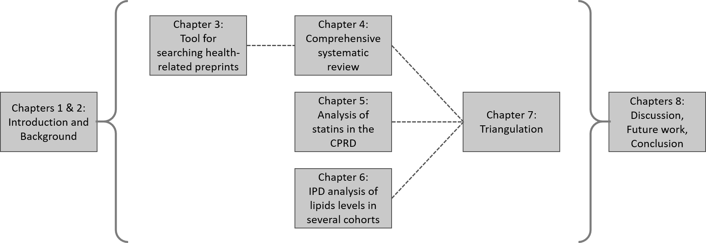
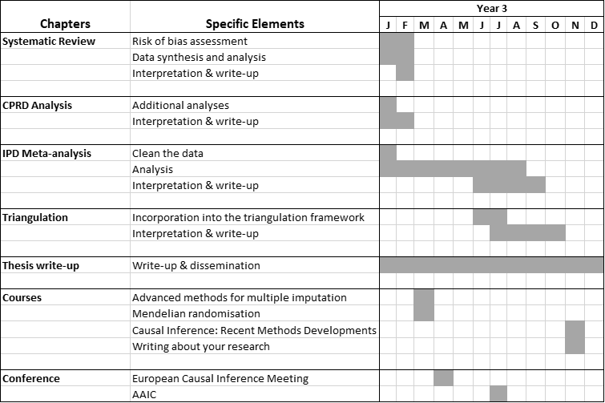
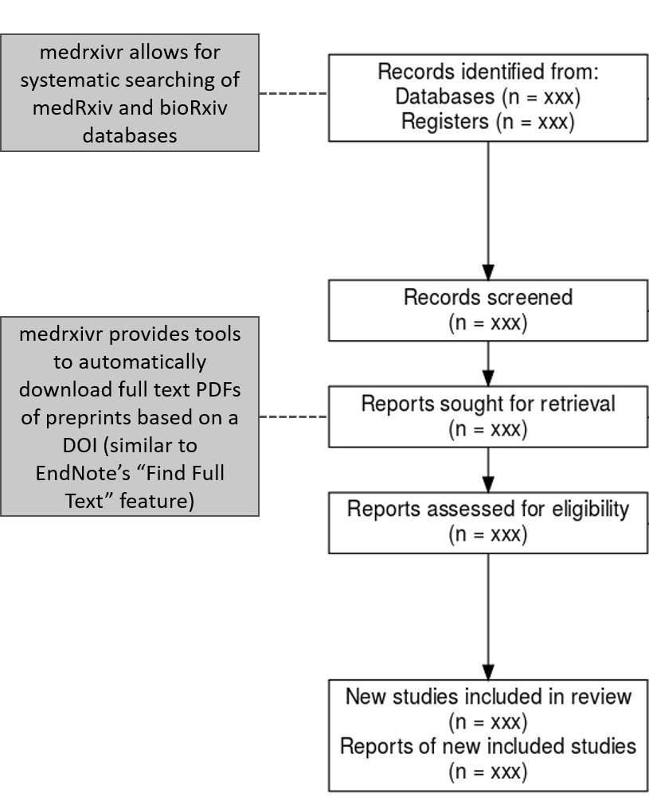
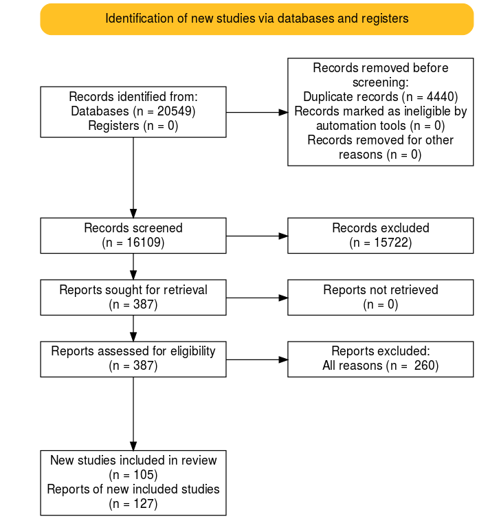
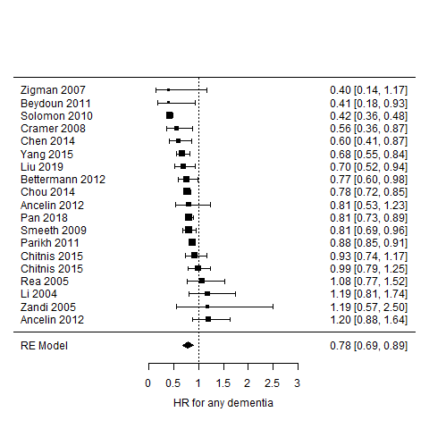
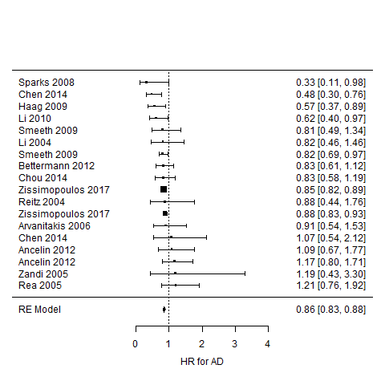
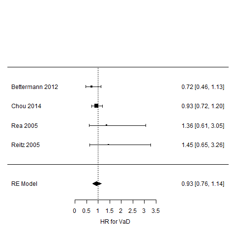

---
output:
  bookdown::word_document2:
    reference_docx: ../../templates/word-styles-reference-01.docx
bibliography: ../../bibliography/references.bib
csl: ../../bibliography/nature.csl
---

```{r include=FALSE}
## packages
library(tidyverse)
library(kableExtra)
library(flextable)

x = 0
y = 0
```

# Annual Review - Year 2 {-}

**Title**: Investigating the relationship between blood lipids levels, and interventions that modify blood lipid levels, and dementia outcomes.

&nbsp;

**Supervisors**:

* Julian Higgins (Primary)
* Yoav Ben-Shlomo
* Liz Coulthard
* George Davey-Smith

&nbsp;

**PhD start date**: 01/01/2019

&nbsp;

**Expected submission date**: 01/01/2022

&nbsp;

**Maximum submission date**: 01/01/2023

&nbsp;

**Note:** The content of this report represents a more comprehensive version of that entered into the STaR University of Bristol PGR reporting system.

\newpage

# Overview of PhD

## Aim {#aim}
The central aim of this thesis is: <br>

* **To investigate the relationship between blood lipid levels, and interventions that modify blood lipid levels, and dementia outcomes.**

&nbsp;

## Objectives {#objectives}
To achieve this aim, there are several smaller objectives, which map to the proposed chapters of my thesis outlined in Section \@ref(chapter-progress):

1. Identify all existing evidence on the effect of blood lipid levels (and interventions that affect blood lipid levels) on dementia risk, regardless of study design and including studies available solely as a preprint.

2. Examine the relationship between lipid-regulating agents and dementia in a large scale population-based cohort, the Clinical Practice Research Datalink.

3. Examine the relationship between blood lipid levels and dementia risk in several cohorts as part of a individual participant data meta-analysis.

4. Integrate the existing evidence identified by the review with the primary evidence produced as part of this thesis in a qualitative triangulation exercise.

&nbsp;

## Theoretical framework
The main theoretical framework used in this thesis is evidence synthesis - the identification, critical assessment, and integration of all available evidence on a research question in order to either: a) provide a more definitive answer to that question; or b) highlight gaps in the existing evidence base.

While this thesis does include a primary evidence generation element (Chapter 5 - observational analysis of CPRD data), this was performed with the intention of providing a further source of evidence for the evidence synthesis/triangulation aspects.

&nbsp;

\newpage

# Chapter progress {#chapter-progress}

The thesis is laid out in a similar manner to that successfully defended by [Sam Abbott of the MRC IEU](https://www.samabbott.co.uk/thesis). Each chapter is self-contained, presenting the relevant methods and results for that particular analysis, and so there are no dedicated methods chapters.

An overview of the proposed thesis chapters and the way they link together is shown in Figure 1. The exact order in which chapters should be presented (particularly Chapters 4, 5 & 6) is yet to be confirmed. Any advice from reviewers on this would be appreciated.

&nbsp;


&nbsp;

__Figure `r (x <- x + 1)`: Overview of thesis chapters and the relationship between them.__ 

&nbsp;

{width=450}
&nbsp;

__Figure `r (x <- x + 1)`: Gantt chart showing research milestones, training courses and conferences for the last 12 months of my PhD thesis.__ 
&nbsp;
&nbsp;

## Chapter 1: Introduction

**Overview**

This short chapter presents the aims and objectives of the thesis, an overview of each chapter, an introduction to evidence synthesis as the theoretical framework underlying the thesis, and a summary of thesis outputs (papers/software).

&nbsp;

**Progress**

A preliminary draft of this chapter is complete. Additional outputs will be added if/when they arise.

&nbsp;
&nbsp;

<!----------------------------------------------------------------->
## Chapter 2: Background

**Overview**

This chapter provides an overview of the main topics covered in the thesis, including dementia (prevalence and impact, clinical presentation, diagnostic criteria, treatments), blood lipids fractions (fractions of interest (TC, HDL, LDL, TG), accepted ranges for each), and lipid regulating agents (type (statin vs non-statin), mechanism of action, indications for use).

&nbsp;

**Progress**

This descriptive chapter is approximately 70% complete.

&nbsp;
&nbsp;

<!----------------------------------------------------------------->
## Chapter 3: Tool for systematically searching health-related preprints (medrxivr)

**Overview**

This chapter introduces a tool built in R to allow for systematic searching of the [medRxiv](https://www.medrxiv.org/) and [bioRxiv](https://www.biorxiv.org/) preprint repositories. Preprints represent an important source of grey literature and so should be included as part of a systematic review. However, the native search interface on preprint websites do not allow for complex search strategies (e.g., those using Boolean operators or wildcards) and are not transparent or reproducible, with the same search producing wildly different numbers of records over time. 

To allow for easy systematic searching of this literature source as part of the systematic review described in Chapter 4, the `medrxivr` tool was developed.

__Note:__ Evidence synthesis software development has been a key component of my work during my Fellowship. At my last progress review, Tom Gaunt (PGR Director) flagged in his comments that I should consider including some of this work as a chapter in my thesis, if I could tie it in with the thesis as whole. Based on this, I am keen to include the medrxivr tool, as it was designed and developed specifically to help with the review described in Chapter 4. However, I would be very glad to hear your opinion on whether the inclusion of this work as a chapter makes sense in terms of the thesis as a whole.

&nbsp;

**Progress**

* Paper: 100% (published)
* Chapter: 100% (draft)

The code underlying the tool underwent peer review via the rOpenSci review process (you can see the discussion between myself and the reviewers [here](https://github.com/ropensci/software-review/issues/380)), following which a short paper describing the tool was [published in the Journal of Open Source Software](https://joss.theoj.org/papers/10.21105/joss.02651).

This chapter represents an expanded version of the published paper, discussing the motivation, key functionality, reception and planned future development of the tool. A draft of this chapter is complete.

&nbsp;

<!----------------------------------------------------------------------------->

{width=350}

__Figure `r (x <- x + 1)` - Role of medrxivr in the systematic review process:__ medrxivr contributes to the review process at two key stages: (i) searching of literature sources, and (ii) accessing full text records.

&nbsp;
&nbsp;

<!----------------------------------------------------------------->
## Chapter 4: Systematic review

**Overview**

This chapter will present the methods and findings of a comprehensive systematic review into the relationship between blood lipids levels/blood lipids interventions (e.g., statins) and dementia. The review included all types of study design including randomised controlled trials, Mendelian randomization analyses, and non-randomised studies of exposures and interventions (NRSI/NRSE).
  
&nbsp;  
  
**Progress**

In terms of the different stages of the review, progress currently stands as:

* Literature search: 100%
* Title and abstract/Full-text screening: 100%
* Data extraction: 100%
* Risk of bias assessment: 75%
* Analysis: 60%
* Writing: 50%

&nbsp;
&nbsp;

<!----------------------------------------------------------------->

{width=350}    

__Figure `r (x <- x + 1)` - PRISMA flow diagram showing the movement of records through the systematic review.__

&nbsp;
<!----------------------------------------------------------------->

First, in response to issues flagged at last year's progress review (comprehensiveness of search/is screening a 10% sample in duplicate sufficient if inter-rater reliability is low), searching the bibliographies of published reviews on this topic demonstrated that the search was sufficiently comprehensive to capture all previously identified studies in addition some studies that had not been included in any previous review. Additionally, inter-rater agreement on a random 10% subsample of records was high for both the title/abstract and full-text screening stages of the review. 

For the sake of space, the full methods and results of the review are not presented here, but the protocol is [available online](https://doi.org/10.17605/OSF.IO/VTW5Y). As a short summary, 127 reports describing 105 primary studies were included in the review (see the PRISMA flow diagram above for an overview of the movement of records through the review). The majority of studies identified by the review are non-randomised studies, with only two randomised controlled trails and eight Mendelian randomization studies identified. Data extraction has been completed for all studies, and risk-of-bias assessments for each are almost complete.

To enable comparison with the results of the observational analysis presented as part of Chapter 5, the results of a meta-analysis examining the effect of statins on dementia outcomes in included NRSI is presented. Statin use was associated with a reduced risk of all-cause dementia (HR: 0.86, 95%CI 0.83-0.88) and Alzheimer's disease (HR: 0.78, 95%CI 0.69-0.89), but were not found to have an effect on the risk of vascular dementia (HR: 0.93, 95%CI 0.76-1.14).

{width=350}    

__Figure `r (x <- x + 1)` - Results of a random-effects meta-analysis of non-randomised studies examining the effect of statin use on the risk of all-cause dementia.__

{width=350}


__Figure `r (x <- x + 1)` - Results of a random-effects meta-analysis of non-randomised studies examining the effect of statin use on the risk of Alzheimer's disease.__

{width=350}  
   

__Figure `r (x <- x + 1)` - Results of a random-effects meta-analysis of non-randomised studies examining the effect of statin use on the risk of vascular dementia.__

&nbsp;

In terms of the meta-analysis of the non-intervention studies, this was complicated by the different ways in which lipid fractions were quantified in different studies (e.g., grouped based on clinical guidelines or quantiles, or dichotomized into a hypercholesterolemia variable). However, following discussion with my supervisors who pointed me towards useful material on this subject, this element of the analysis is almost complete.

One interesting discussion point highlighted by the review is the absence of data on vascular dementia as an outcome. As illustrated in the meta-analysis above, there were substantially fewer non-randomised studies reporting vascular dementia as an outcome compared with those reporting all-cause dementia or Alzheimer's disease outcomes. This is reflected in the available randomised controlled trials and Mendelian randomization studies (as no genetic consortia data are available for the vascular dementia outcome, MR studies of this condition are precluded). This will restrict the triangulation exercise for this outcome, as it will have to rely on different analytical strategies within a single study design (non-randomised studies) rather than incorporating fundamentally different study designs.

A final point on the progress of the review is that, due to the need for dual screening and data extraction, a number of external researchers became involved in this review. I found the people-management aspect particularly challenging and could definitely have improved the process through better communication of deadlines, but it has provided good experience of leading a review team.

&nbsp;

**Added value**

One of the take-aways from my last progress review was to make the "added value" of this work beyond existing reviews clear. I believe there are three aspects where this review is distinct from those reviews already available in the published literature:

* _Comprehensiveness:_ While several reviews of this research topic exist,[@chu2018b; @yang2020; @muangpaisan2010; @poly2020b] the overlap between the list of studies included in each is not 100%. As part of this review, I have not only performed a original search of primary literature databases, but have also screened the reference lists of comparable reviews to ensure no study has been omitted.
* _Structured risk of bias assessment:_ The majority of the highly cited reviews on this topic either do not formally consider the risk of bias in the observational studies they include or do not use an appropriate domain-based assessment tool (e.g., ROBINS-I/E). This is important area in which this thesis can add value, as based on the risk-of-bias assessments I have performed to date, several primary studies are at high risk of bias and this should be reflected in the findings of any  review on this topic.
* _Inclusion of preprints:_ Unlike other available reviews and enabled by the tool described in Chapter 3, this review systematically searched  preprinted health-related manuscripts as a source of grey literature. As part of this chapter, I plan to examine the extent of the additional information provided to the review by the inclusion of preprints.

&nbsp;
&nbsp;

<!----------------------------------------------------------------->
## Chapter 5: Observational analysis

**Overview**

This chapter uses data from the Clinical Practice Research Datalink (CPRD) to investigate the relationship between statin use and dementia. 

Rather than reproduce the methods/findings of this chapter here, I have attached the initial draft of the paper this chapter is based on at the end of this report.

&nbsp;

**Progress**

* Paper: 80%
* Chapter: 80%

In relation to the results presented in the attached paper, there are two key discussion points. The first is that while statins are associated with a slight reduction in the risk of probable (HR: 0.91, 95%CI: 0.88-0.95) and possible Alzheimer's Disease (HR: 0.95, 95%CI: 0.92-0.99), there is an increased risk of vascular dementia (HR: 1.7, 95%CI: 1.62-1.77) and other dementia (HR: 1.13, 95%CI: 1.09-1.18) in those using statins. This reflects the initial findings of this analysis presented at the last progress review, and was not attenuated even after using multiple imputation to account for potential selection bias caused by the original complete case analysis and after accounting for several potentially important confounders.

Secondly, following circulation of the draft, a co-author recommended that I use the same analysis strategy with a known control (coronary heart disease; CHD). However, when running this analysis, I found that statins appeared to increase the risk of CHD, in contrast to the results of published large RCTs. This finding suggests the presence of substantial confounding by indication in this analysis, in that those who go on to take a statin are fundamentally different from those who do not, and this has been seen in other standard multivariable HR analyses of the effect of statins on CHD.[@danaei2013a] A suggested approach to frame this (possible insurmountable) issue has been to rewrite the paper as an example of the dangers of using EHR in cases where strong confounding by indication is likely. However, it would be particularly useful to get reviewers feedback on any further analytical strategies I could attempt to address this issue.

In terms of the broader thesis, while these concerns mean I have low confidence in the accuracy of the result, it presents a good opportunity for comparison with other published papers that used different analytical strategies where the source and direction of bias is different (e.g., confounding by indication in our analysis likely makes statin use look worse but immortal time bias in other papers likely makes statin use look better).

Finally, in an attempt to assess whether these unexpected findings for vascular dementia are a product of the CPRD data or our analytical strategy, I recently attempted to replicate an analysis performed by Smeeth et al. which used the THIN EHR database and found a protective effect of statins on dementia risk (HR 0.81, 99% CI 0.69-0.96).[@smeeth2009a] However, following correspondence with the author team to acquire the code-list they used to define dementia cases, I confirmed that it was substantially different from that used in our study. This fact, coupled with concerns over their analytical strategy (which seemed to adjust for covariates on the causal pathway), limited the value of this attempted replication.

&nbsp;

**Added value**

Similar to the systematic review presented in Chapter 4, feedback from my last progress review suggested that the "added value" of this study above those that already exist should be made clearer. There are two particular motivations for this analysis above those already available in the published literature:

* _Size of the CPRD and length of follow-up:_ Having reviewed the other studies identified by the systematic review in Chapter 4, this analysis of 1.7 million participants is one of the largest studies of this research question.
* _Addressing the limitations of other observational analyses:_ Analyzing this data has provided the opportunity to use a separate analytical technique to many of the studies identified in the systematic review, As an example, the Hippsley-Cox BMJ paper examining the effect of statins, which makes use of the THIN EHR database, likely suffers from immortal time bias as exposed and unexposed participants are not followed up from a common time point.[@hippisley-cox2010] As touched on in the section above, this provides an additional evidence point with a different source and direction of bias, which is useful for the triangulation aspect of the thesis.

&nbsp;
&nbsp;

<!----------------------------------------------------------------->
## Chapter 6: Individual patient data meta-analysis

**Overview**

This chapter will use data from several Dementia Platform cohorts (plus some of the cohorts identified through the systematic review) to investigate the relationship between blood lipids levels and dementia outcomes. This analysis has not yet started, but data access has been secured.

&nbsp;

**Progress**

This analysis has not yet formally started, though access to several DPUK cohorts has been secured. Cohorts identified through the systematic review have also been invited to participate (though I am sceptical about the chance of response).[@nevitt2017]

&nbsp;
&nbsp;

<!----------------------------------------------------------------->
## Chapter 7: Triangulation

**Overview**

This chapter will draw together different sources of information (including the primary analysis performed as part of this thesis), along with a consideration of the key sources/direction of bias in each, in a qualitative triangulation framework.[@lawlor2016a] 

As flagged in my last progress review, this chapter will make very clear that "triangulation" in the context of my thesis is a qualitative integration of the distinct evidence sources available (systematic review, CPRD study, IPD meta-analysis).

&nbsp;

**Progress**

Not started.

&nbsp;
&nbsp;

<!----------------------------------------------------------------->
## Chapter 8: Discussion/limitations/conclusion
**Overview**

This chapter a summary of the main findings of the thesis, a discussion of the strengths and limitations of the work presented, a roadmap for future work, and a conclusion.

&nbsp;

**Progress**

Not started.

\newpage

<!----------------------------------------------------------------->
# Other
## Courses

All training courses planned for the past year have either been cancelled or postponed due to the pandemic. As a result, in the review period, I have not taken part in any courses related to my thesis. 

However, in the coming year, I have secured places on the  "Mendelian randomization" and "Advanced methods for multiple imputation" short courses at the University of Bristol, in addition to the "Causal Inference in Epidemiology: Recent Methodological Developments" short course at LSHTM and the "Writing about your research" course at the Royal Society. 

&nbsp;

<!----------------------------------------------------------------->
## Conferences/ presentations

In the review period, I presented on the preprint search tool described in Chapter 3 at the Bristol  "Auto-synthesis Club" and "Methods in Evidence Synthesis" seminars.

It's only in writing this report that I realized that I am yet to present on the other parts of my thesis, and so this is a particular aspect of my PhD that I would like to develop further in the coming year. As such, I aim to present at more diverse events in the coming year, including at an IEU monthly meeting and the Faculty of Health Sciences research showcase.
 
In addition, I plan to submit an abstract to the Alzheimer's Association International Conference in July (deadline 25th January).

&nbsp;

<!----------------------------------------------------------------->
## Teaching

In the review period, I have gained the following teaching experience:

* MSc Epidemiology/Public Health "Clinical Epidemiology" module
    * Tutored a small group for several weeks
    * Marked the end-of-module assessments
* "Introduction to R" short course for new PhD students, Bristol Medical School short course
    * Presented a lecture on advanced R topics (data visualisation, literate programming and web applications)
* "Introduction to Data Visualisation and Web Applications using R", Bristol Medical School short course
    * Designed and delivered the web applications aspects of the course
    * Tutor helping on practicals on data visualisations and literate programming with Rmarkdown
* Drop-in "Intro to R" sessions
    * Organised and ran an hour long session each Friday in the autumn term to help answer new PGR students' questions about R.

I have also had a proposal accepted to supervise an MSc student for the summer term. The project aims to examine the overlap between the set of primary studies included in the several existing systematic reviews of blood lipid levels and dementia (as mentioned in the description of Chapter 4, above).

\newpage

<!----------------------------------------------------------------->
# Other work

__COVID-related work__

* *Living review:* In early March, I developed and deployed an integrated literature searching and screening pipeline to help a team of national experts produce the first iteration of a living systematic review on the impact of COVID-19 on suicide and self-harm (now published: [https://doi.org/10.12688/f1000research.24274.1](https://doi.org/10.12688/f1000research.24274.1)). Maintenance of this pipeline took up a lot of my time - however, following discussions with my primary supervisory, in late summer, I handed over responsibility to another member of the team.

* *Rapid review of symptoms:* Through my work on medrxivr (the preprint search tool described in Chapter 2), I was involved in developing and running preprint searches for a rapid systematic review of COVID-19 symptoms (now published: [https://dx.doi.org/10.2139/ssrn.3582819](https://dx.doi.org/10.2139/ssrn.3582819))

__Evidence synthesis methods__

* *robvis:* A paper describing the risk-of-bias visualisation tool I developed was published as part of special issue of "Research Synthesis Methods" ([https://doi.org/10.1002/jrsm.1411](https://doi.org/10.1002/jrsm.1411)). The tool has now been used ~100 published reviews. 

* *PRISMA2020:* I contributed to the updated PRISMA2020 guidelines on the preferred reporting items for systematic reviews and meta-analyses, and am a co-author on two papers describing the new version of this reporting checklist which have been accepted for publication in the BMJ.

__Primary research__

* *Comparison of data availability statements:*
Using medrxivr (the preprint search tool described in Chapter 2), fellow PhD student and I compared the availability of data for the same manuscript when published under two different data-sharing policies (i.e. that of the preprint repository vs. the peer-reviewed journal). The preprint of the study is available [here](https://doi.org/10.31222/osf.io/p75xe).

* *Making primary research synthesis-ready:* I am last author on a commentary describing the best practice and advantages for primary researchers in the field of prevention science to ensure that their research is "synthesis-ready" (i.e. can be easily found and integrated into an evidence synthesis project). This commentary is under consideration at "Prevention Science" and a preprint is available [here](https://doi.org/10.31222/osf.io/ptg9j).

\newpage

## Report references

<div id="refs"></div>

\newpage

## Draft of CPRD paper
